# statassist-py

Python port of [R STATassist](https://github.com/hiows/STATassist).


**STATassist** runs every method that applies to a question in one call and returns standardised tables. A comparison reports parametric, rank-based and robust tests side by side, with fold changes, intervals and multiplicity-adjusted p-values. A model reports one row per term with its estimate and whatever inference that model honestly supports. A dimension reduction reports one row per point with its coordinates. A feature selection reports one row per candidate with what it was ranked by and whether it survived. A contingency table reports one row per cell under the null the test was read against. A performance evaluation reports one row per model on the same held-out rows. A clustering reports one row per point with the label it was assigned. Seven result contracts, and everything downstream reads them rather than the engine underneath.

Two groups, three or more groups and a single sample all return the same object, so `draw_forest_plot()`, `estimate_significance()` and anything else that reads a result works across them without being told which scenario produced it. Five models — linear, logistic, penalized, forest and kernel — return the same object too, so `coef()` and `predict(model, newdata = )` are one line each whichever of them was fitted, and `perform_rfe()` and `perform_stepwise()` hand the predictors they kept straight to any of the five.

Every example below runs on simulated data whose answer was planted on purpose, so a verdict can be **scored** rather than trusted: `simulate_two_groups()`, `simulate_multiple_groups()`, `simulate_factorial_groups()`, `simulate_categorical_groups()`, `simulate_regression()` and `simulate_classification()` hand back the effects and coefficients they put in.

Core dependencies are **SciPy**, **statsmodels**, **scikit-learn**, and **matplotlib**. Optional **`umap-learn`** and **`openTSNE`** power `perform_umap()` and `perform_tsne()` (install with `pip install "statassist-py[reduce]"`). Density-based clustering uses **scikit-learn** DBSCAN.

## Example

The volcano plot below is what **§1–§2** produce on 30 simulated genes, eight of them planted up and eight planted down in `case`. Since the answer is known, **§3** scores the plot against it: 13 of the 16 planted genes are called, and none of the 14 null ones.

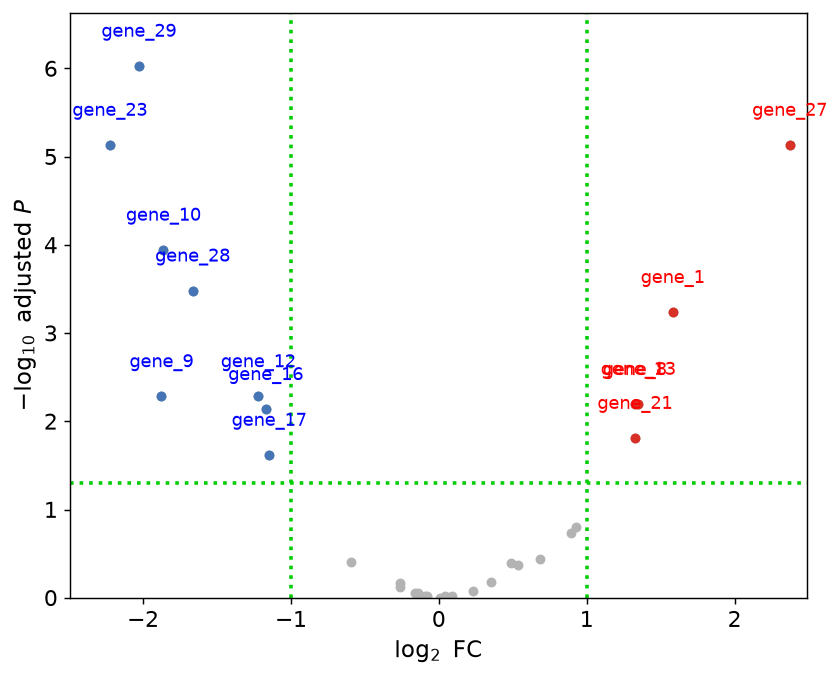

`draw_forest_plot()` on the same result draws either the estimates against their intervals or the p-values against the threshold, from the same table:

| `type = "estimate"` | `type = "pvalue"` |
| --- | --- |
| 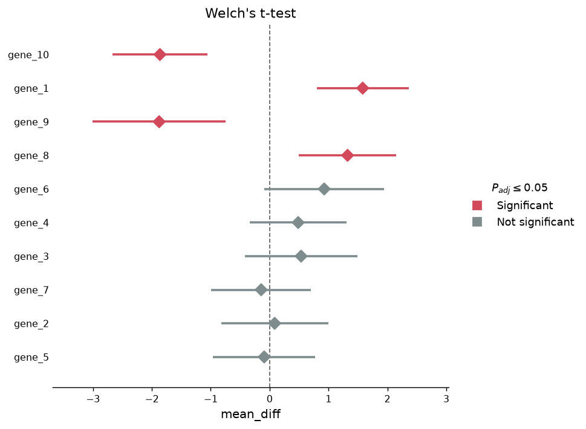 | 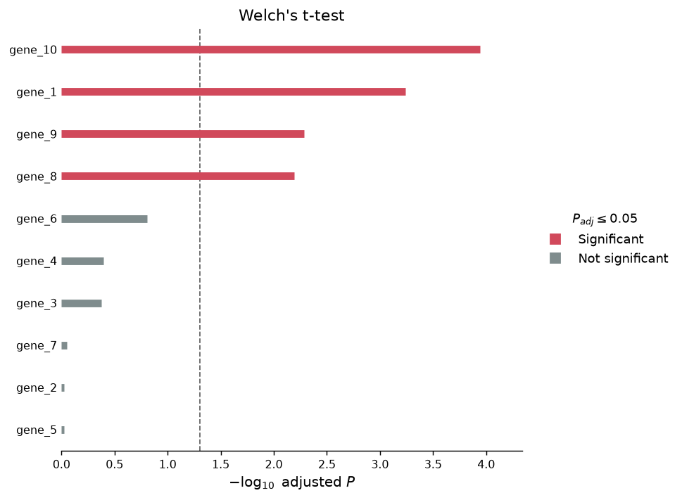 |

And the same wide input feeds the plots that look at the data instead of at a result:

| Grouped boxplot | Back-to-back histogram |
| --- | --- |
| 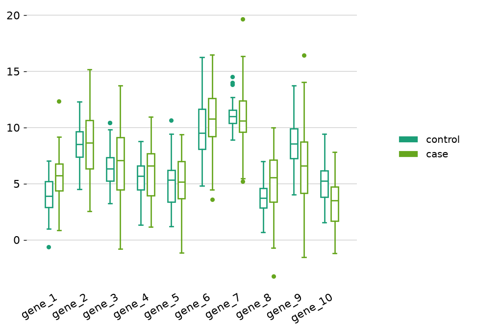 | 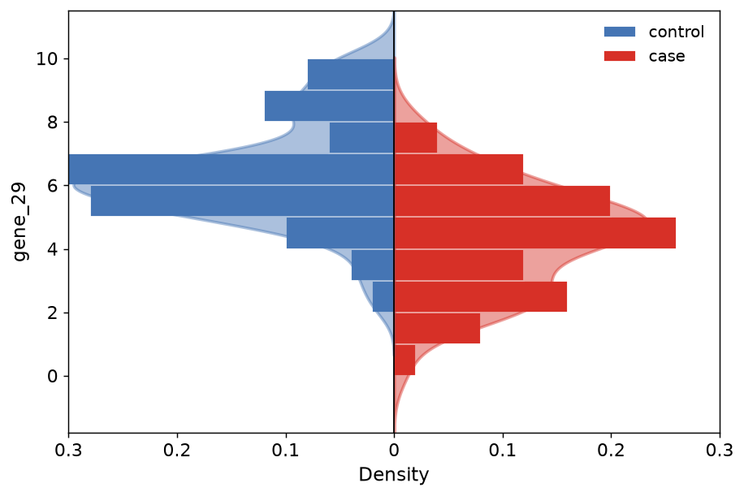 |

---

## Installation

```bash
pip install statassist-py
pip install "statassist-py[reduce]"   # t-SNE / UMAP
pip install "statassist-py[all]"      # reduce + dev extras
```

For cross-validation against R, install the pinned release:

```python
# pip install git+https://github.com/hiows/STATassist@v1.0.0  # R cross-check only
```

The package is not on CRAN yet. When it is submitted, this README will note the CRAN line as well.

---

# Part 1 — Comparison

```python
import statassist as sa
```

### 1. Compare two groups (all applicable tests)

Wide `DataFrame`: one row per observation, numeric columns are features. Direction is fixed by `group_lv`, whose first level is the reference: differences read `group_lv[2] - group_lv[1]` and fold changes `group_lv[2] / group_lv[1]`. The same rule holds for three or more groups, so a control named first stays the reference whichever function reads it.

`simulate_two_groups()` returns data in exactly that shape along with the effects it planted. Thirty features, eight moved up and eight moved down in `case`, the other fourteen null. Its `args` element is named after the arguments of `compare_two_groups()`, so it can be spread out as below, or handed over whole with `sa.compare_two_groups(**sim["args"])`.

```python
sim = sa.simulate_two_groups(n_feats = 30, n_up = 8, n_down = 8, seed = 2026)

comp_res = sa.compare_two_groups(
  data        = sim["args"]["data"],
  feats       = sim["args"]["feats"],
  group       = sim["args"]["group"],
  group_lv    = sim["args"]["group_lv"],
  input_scale = sim["args"]["input_scale"]
)

comp_res
comp_res.effect          # fold_change, log2fc per feature
comp_res.tests["t_test"]    # Welch or paired t, depending on paired =
comp_res.tests["wilcox_test"]
comp_res.tests["robust_test"]
``````
<sa_two_group> two_group_comparison
  groups   : control vs case (independent)
  features : 30
  settings : alternative = two.sided, conf_level = 0.95, p_adjust = BH

  tests
    $t_test       13 of 30 at pval_adj <= 0.05
                 Welch's t-test
    $wilcox_test  11 of 30 at pval_adj <= 0.05
                 Wilcoxon rank sum test (Mann-Whitney U test)
    $robust_test  12 of 30 at pval_adj <= 0.05
                 Brunner-Munzel test

  $diagnostics attached

features     x_center     y_center  fold_change    log2fc
0    gene_1   116.645989   580.265253     0.201022 -2.314576
1    gene_2   273.339540   210.363380     1.299368  0.377811
2    gene_3     5.534795     9.386638     0.589646 -0.762079
3    gene_4   106.679403    37.811073     2.821380  1.496401
4    gene_5    46.069733   162.511616     0.283486 -1.818652
5    gene_6    10.134518     4.338220     2.336101  1.224102
6    gene_7    92.391969    94.945528     0.973105 -0.039333
7    gene_8  5735.220846  1293.801887     4.432843  2.148232
8    gene_9    26.594695    21.778229     1.221160  0.288252
9   gene_10   252.595802   202.335430     1.248401  0.320082
10  gene_11     5.490763     3.986194     1.377445  0.461995
11  gene_12   329.571950   432.258135     0.762442 -0.391300
12  gene_13    14.319932    21.254991     0.673721 -0.569777
13  gene_14  1905.509413  1325.787901     1.437266  0.523327
14  gene_15    11.511050    11.987089     0.960287 -0.058462
15  gene_16   151.953681    50.513795     3.008162  1.588882
16  gene_17    77.881122   175.206784     0.444510 -1.169713
17  gene_18     3.192106     4.104034     0.777797 -0.362534
18  gene_19     9.665371    39.242728     0.246297 -2.021528
19  gene_20     1.178024     7.139984     0.164990 -2.599552
20  gene_21    48.399797    44.126028     1.096854  0.133371
21  gene_22    20.067690    49.447560     0.405838 -1.301025
22  gene_23     7.679717    13.852653     0.554386 -0.851037
23  gene_24    15.492539     5.374759     2.882462  1.527302
24  gene_25    47.996455    59.205734     0.810672 -0.302809
25  gene_26    17.757568    11.931957     1.488236  0.573603
26  gene_27   180.607048    46.611823     3.874705  1.954086
27  gene_28     9.647022     9.898802     0.974565 -0.037170
28  gene_29    21.757918     3.871085     5.620625  2.490730
29  gene_30   309.933546   222.452174     1.393259  0.478464

features   n_x   n_y  n_used  ...          pval  pval_adj  lower_conf  upper_conf
0    gene_1  50.0  50.0   100.0  ...  4.343159e-05  0.000186         NaN         NaN
1    gene_2  50.0  50.0   100.0  ...  3.849841e-01  0.502153         NaN         NaN
2    gene_3  50.0  50.0   100.0  ...  9.393639e-02  0.201292         NaN         NaN
3    gene_4  50.0  50.0   100.0  ...  1.631251e-05  0.000098         NaN         NaN
4    gene_5  50.0  50.0   100.0  ...  2.118601e-05  0.000106         NaN         NaN
5    gene_6  50.0  50.0   100.0  ...  2.939975e-03  0.008018         NaN         NaN
6    gene_7  50.0  50.0   100.0  ...  9.186618e-01  0.930163         NaN         NaN
7    gene_8  50.0  50.0   100.0  ...  3.672762e-06  0.000028         NaN         NaN
8    gene_9  50.0  50.0   100.0  ...  5.946296e-01  0.686111         NaN         NaN
9   gene_10  50.0  50.0   100.0  ...  4.502308e-01  0.562789         NaN         NaN
10  gene_11  50.0  50.0   100.0  ...  2.661883e-01  0.420297         NaN         NaN
11  gene_12  50.0  50.0   100.0  ...  3.574218e-01  0.487393         NaN         NaN
12  gene_13  50.0  50.0   100.0  ...  2.080266e-01  0.367106         NaN         NaN
13  gene_14  50.0  50.0   100.0  ...  2.238890e-01  0.373148         NaN         NaN
14  gene_15  50.0  50.0   100.0  ...  8.686299e-01  0.930163         NaN         NaN
15  gene_16  50.0  50.0   100.0  ...  4.618053e-04  0.001539         NaN         NaN
16  gene_17  50.0  50.0   100.0  ...  1.975059e-02  0.045578         NaN         NaN
17  gene_18  50.0  50.0   100.0  ...  3.538364e-01  0.487393         NaN         NaN
18  gene_19  50.0  50.0   100.0  ...  2.127893e-06  0.000021         NaN         NaN
19  gene_20  50.0  50.0   100.0  ...  4.645458e-08  0.000001         NaN         NaN
20  gene_21  50.0  50.0   100.0  ...  7.788774e-01  0.865419         NaN         NaN
21  gene_22  50.0  50.0   100.0  ...  1.526890e-02  0.038172         NaN         NaN
22  gene_23  50.0  50.0   100.0  ...  1.522903e-01  0.304581         NaN         NaN
23  gene_24  50.0  50.0   100.0  ...  1.665737e-03  0.004997         NaN         NaN
24  gene_25  50.0  50.0   100.0  ...  4.750769e-01  0.570092         NaN         NaN
25  gene_26  50.0  50.0   100.0  ...  3.163818e-01  0.474573         NaN         NaN
26  gene_27  50.0  50.0   100.0  ...  1.220832e-04  0.000458         NaN         NaN
27  gene_28  50.0  50.0   100.0  ...  9.301629e-01  0.930163         NaN         NaN
28  gene_29  50.0  50.0   100.0  ...  7.774226e-07  0.000012         NaN         NaN
29  gene_30  50.0  50.0   100.0  ...  1.749414e-01  0.328015         NaN         NaN

[30 rows x 14 columns]

features   n_x   n_y  n_used  ...          pval  pval_adj  lower_conf  upper_conf
0    gene_1  50.0  50.0   100.0  ...  2.228122e-04  0.000836   -3.204566   -1.946067
1    gene_2  50.0  50.0   100.0  ...  3.191739e-01  0.435237    0.005566    0.937771
2    gene_3  50.0  50.0   100.0  ...  6.030379e-02  0.129222   -1.288469   -0.426148
3    gene_4  50.0  50.0   100.0  ...  7.798508e-06  0.000047    1.180775    1.776540
4    gene_5  50.0  50.0   100.0  ...  1.115516e-04  0.000558   -2.264266   -1.404421
5    gene_6  50.0  50.0   100.0  ...  3.999898e-03  0.010909    1.024864    1.967280
6    gene_7  50.0  50.0   100.0  ...  7.800916e-01  0.835812   -0.269927    0.466815
7    gene_8  50.0  50.0   100.0  ...  1.745433e-06  0.000017    2.004300    2.745701
8    gene_9  50.0  50.0   100.0  ...  6.318529e-01  0.735069   -0.295315    0.883011
9   gene_10  50.0  50.0   100.0  ...  6.515967e-01  0.735069   -0.249263    0.688087
10  gene_11  50.0  50.0   100.0  ...  4.420946e-01  0.552618   -0.111058    0.753964
11  gene_12  50.0  50.0   100.0  ...  3.983940e-01  0.519644   -0.837522    0.051064
12  gene_13  50.0  50.0   100.0  ...  1.217036e-01  0.243407   -1.155086   -0.254224
13  gene_14  50.0  50.0   100.0  ...  2.133765e-01  0.336910    0.142936    1.017233
14  gene_15  50.0  50.0   100.0  ...  6.615620e-01  0.735069   -0.597119    0.177777
15  gene_16  50.0  50.0   100.0  ...  8.586496e-04  0.002862    1.100432    1.959928
16  gene_17  50.0  50.0   100.0  ...  2.439617e-02  0.056299   -1.595264   -0.630467
17  gene_18  50.0  50.0   100.0  ...  1.755337e-01  0.309765   -0.823870   -0.118922
18  gene_19  50.0  50.0   100.0  ...  2.293087e-06  0.000017   -2.497797   -1.714478
19  gene_20  50.0  50.0   100.0  ...  1.413912e-07  0.000004   -3.057668   -2.203798
20  gene_21  50.0  50.0   100.0  ...  8.985164e-01  0.898516   -0.438561    0.632189
21  gene_22  50.0  50.0   100.0  ...  2.229517e-02  0.055738   -1.848987   -0.688307
22  gene_23  50.0  50.0   100.0  ...  2.745385e-01  0.400914   -1.060464   -0.064428
23  gene_24  50.0  50.0   100.0  ...  3.745325e-03  0.010909    0.926193    1.984687
24  gene_25  50.0  50.0   100.0  ...  2.083476e-01  0.336910   -1.034436   -0.140841
25  gene_26  50.0  50.0   100.0  ...  2.806400e-01  0.400914    0.077051    1.264553
26  gene_27  50.0  50.0   100.0  ...  1.320395e-04  0.000566    1.601253    2.572720
27  gene_28  50.0  50.0   100.0  ...  8.821714e-01  0.898516   -0.492406    0.337636
28  gene_29  50.0  50.0   100.0  ...  4.586986e-07  0.000007    2.128388    2.997584
29  gene_30  50.0  50.0   100.0  ...  1.355650e-01  0.254184    0.195950    0.894548

[30 rows x 10 columns]

features   n_x   n_y  ...      pval_adj  lower_conf  upper_conf
0    gene_1  50.0  50.0  ...  1.401547e-03    0.172145    0.399055
1    gene_2  50.0  50.0  ...  4.432686e-01    0.441567    0.674433
2    gene_3  50.0  50.0  ...  1.323187e-01    0.276108    0.505492
3    gene_4  50.0  50.0  ...  3.650868e-06    0.664022    0.855178
4    gene_5  50.0  50.0  ...  1.723589e-04    0.173645    0.377555
5    gene_6  50.0  50.0  ...  1.870531e-02    0.547878    0.786522
6    gene_7  50.0  50.0  ...  8.444866e-01    0.395197    0.637603
7    gene_8  50.0  50.0  ...  9.740430e-06    0.673543    0.881657
8    gene_9  50.0  50.0  ...  7.494394e-01    0.406141    0.649859
9   gene_10  50.0  50.0  ...  7.494394e-01    0.409210    0.643590
10  gene_11  50.0  50.0  ...  5.568206e-01    0.428712    0.660888
11  gene_12  50.0  50.0  ...  5.339207e-01    0.332754    0.568846
12  gene_13  50.0  50.0  ...  2.432188e-01    0.295628    0.524372
13  gene_14  50.0  50.0  ...  3.560475e-01    0.457619    0.687181
14  gene_15  50.0  50.0  ...  7.494394e-01    0.353389    0.595411
15  gene_16  50.0  50.0  ...  1.685888e-03    0.586936    0.800264
16  gene_17  50.0  50.0  ...  5.025498e-02    0.257873    0.480527
17  gene_18  50.0  50.0  ...  3.165625e-01    0.305541    0.536859
18  gene_19  50.0  50.0  ...  1.852656e-06    0.130126    0.321074
19  gene_20  50.0  50.0  ...  2.608453e-08    0.105240    0.283560
20  gene_21  50.0  50.0  ...  9.036911e-01    0.382525    0.632675
21  gene_22  50.0  50.0  ...  4.830020e-02    0.256405    0.477995
22  gene_23  50.0  50.0  ...  4.041692e-01    0.320613    0.552187
23  gene_24  50.0  50.0  ...  7.996326e-03    0.560127    0.776673
24  gene_25  50.0  50.0  ...  3.609415e-01    0.306555    0.547045
25  gene_26  50.0  50.0  ...  4.041692e-01    0.447339    0.678261
26  gene_27  50.0  50.0  ...  2.592739e-04    0.617652    0.826348
27  gene_28  50.0  50.0  ...  9.036911e-01    0.374795    0.607605
28  gene_29  50.0  50.0  ...  2.808763e-07    0.700537    0.885063
29  gene_30  50.0  50.0  ...  2.575149e-01    0.471794    0.701806

[30 rows x 11 columns]
```

```python
# comp_res.analysis, comp_res.design, comp_res.tests keys
comp_res.tests["t_test"].head()
``````
features   n_x   n_y  n_used  ...      pval  pval_adj  lower_conf  upper_conf
0   gene_1  50.0  50.0   100.0  ...  0.000043  0.000186         NaN         NaN
1   gene_2  50.0  50.0   100.0  ...  0.384984  0.502153         NaN         NaN
2   gene_3  50.0  50.0   100.0  ...  0.093936  0.201292         NaN         NaN
3   gene_4  50.0  50.0   100.0  ...  0.000016  0.000098         NaN         NaN
4   gene_5  50.0  50.0   100.0  ...  0.000021  0.000106         NaN         NaN

[5 rows x 14 columns]
```

`group_lv` is `["control", "case"]`, so `control` is the reference and a positive `log2fc` means higher in `case`, which is where the effects were planted.

```python
comp_res.effect.head(4)
``````
features    x_center    y_center  fold_change    log2fc
0   gene_1  116.645989  580.265253     0.201022 -2.314576
1   gene_2  273.339540  210.363380     1.299368  0.377811
2   gene_3    5.534795    9.386638     0.589646 -0.762079
3   gene_4  106.679403   37.811073     2.821380  1.496401
```

```
  features   x_center   y_center fold_change     log2fc
1   gene_1 116.645989 580.265253   0.2010218 -2.3145758
2   gene_2 273.339540 210.363380   1.2993685  0.3778106
3   gene_3   5.534795   9.386638   0.5896461 -0.7620787
4   gene_4 106.679403  37.811073   2.8213799  1.4964010
```

The centres are in the hundreds while the features themselves run from about 1 to 15, because the data is on the log2 scale, as gene expression usually is, which is what `input_scale = "log2"` says. Dividing two means of logged values is not a fold change and can even come out with the wrong sign: log2 centres of -1 and -2 are a two-fold increase, but their ratio reads as a two-fold decrease. Each observation is raised back through `2^x` before the centres are taken, and `fc_mean` then defaults to `"geom"`, which makes `log2fc` the difference of the two log2 means.

Only `comp_res$effect` is converted. The tests still run on the log2 values, which is the reason for logging them in the first place.

```python
# The same quantity reached from the raw side, since exp(mean(log(2^v)))
# is 2^mean(v).
sim_raw = sim["args"]["data"]
sim_raw = 2 ** sim_raw

res_geom = sa.compare_two_groups(
  data     = sim_raw,
  feats    = sim["args"]["feats"],
  group    = sim["args"]["group"],
  group_lv = sim["args"]["group_lv"],
  fc_mean  = "geom"
)

np.allclose(comp_res.effect["log2fc"], res_geom.effect["log2fc"])
``````
True
```

Note that this is the geometric mean fold change. On raw data `"arith"`, the default there, is a different centre and gives a different number.

Paired example (simulated repeated measures, same subjects under two conditions):

```python
import numpy as np
import pandas as pd
from statassist.utils.rng_r import get_rng, sa_r_seed

with sa_r_seed(2026):
    rng = get_rng()
    n = 20
    base = rng.rnorm(n, 5, 1)
    paired_data = pd.DataFrame(
        {"value": np.concatenate([base, base + rng.rnorm(n, -0.8, 0.5)])}
    )
subjects = np.tile(np.arange(1, n + 1), 2)
paired_res = sa.compare_two_groups(
    data=paired_data,
    feats=["value"],
    group=np.repeat(["before", "after"], n),
    group_lv=["before", "after"],
    id=subjects,
    paired=True,
    alternative="less",
    diagnose=False,
)
paired_res.tests["t_test"]
``````
features   n_x   n_y  n_used  ...      pval  pval_adj  lower_conf  upper_conf
0    value  20.0  20.0    20.0  ...  0.000003  0.000003        -inf   -0.465265

[1 rows x 14 columns]
```

### 2. Significance and volcano plot

`estimate_significance()` takes the comparison object and applies cutoffs to `log2fc` and p-values. `adj_type = None`, the default, uses the adjusted p-values already stored in the result and so avoids double adjustment; naming a method re-adjusts from `pval`.

```python
sig = sa.estimate_significance(
  comp_res,
  test          = "t_test",
  log2fc_cutoff = 1,
  pval_cutoff   = 0.05,
  adj_type      = "BH"
)
sig

verdict = sig.significance   # one row per feature
sa.draw_volcano_plot(sig, xlim = [-3, 3])
``````
<sa_significance> two_group_comparison
  test     : t_test  (Welch's t-test)
  cutoffs  : abs(log2fc) >= 1, adj_pvalue <= 0.05  (BH)
  verdict  : 13 of 30 significant
```

```python
sig
``````
<sa_significance> two_group_comparison
  test     : t_test  (Welch's t-test)
  cutoffs  : abs(log2fc) >= 1, adj_pvalue <= 0.05  (BH)
  verdict  : 13 of 30 significant
```

The verdict comes back as `$significance`, a data.frame of `features`, `log2fc`, `pvalue`, `adj_pvalue` and `is_signif`, beside the `$analysis_type` it was read from. The scenario name travels with the table because `log2fc` does not mean the same thing in all three: with two groups it is the second level over the reference, with three or more it is the level furthest from the reference, which is why a multi-group volcano plot says so on its x axis.

Pass `test = "wilcox_test"` or `test = "robust_test"` to threshold on a different family; `log2fc` stays the same because it comes from `comp_res$effect`.

### 3. Score the verdict against the planted answer

The comparison above ran on data whose answer is known, so the verdict can be scored rather than trusted. Unplanted features have a true fold change of exactly zero, which makes anything called among them a false positive by definition.

```python
planted = sim["truth"]["direction"] != "none"
pd.crosstab(planted, verdict["is_signif"].astype(bool), rownames=["planted"], colnames=["called"])
``````
called   False  True 
planted              
False       14      0
True         3     13
```

```
       called
planted FALSE TRUE
  FALSE    14    0
  TRUE      3   13
```

Thirteen of the sixteen planted features come back and none of the fourteen null ones is called. The three that were missed are worth looking up rather than guessing at, which is what the rest of `truth` is for:

```python
missed = planted & ~verdict["is_signif"].astype(bool)
sim["truth"][missed]
verdict[missed]
``````
features direction    log2fc  baseline   sd_case  sd_control
2    gene_3      down -1.091246  3.401400  2.823662    1.879291
22  gene_23      down -1.849667  4.325627  3.141577    2.138058
25  gene_26        up  1.212882  3.855122  2.802282    2.373063

features    log2fc    pvalue  adj_pvalue  is_signif
2    gene_3 -0.762079  0.093936    0.201292      False
22  gene_23 -0.851037  0.152290    0.304581      False
25  gene_26  0.573603  0.316382    0.474573      False
```

```
   features direction    log2fc baseline  sd_case sd_control
3    gene_3      down -1.091246 3.401400 2.823662   1.879291
23  gene_23      down -1.849667 4.325627 3.141577   2.138058
26  gene_26        up  1.212882 3.855122 2.802282   2.373063
   features     log2fc     pvalue adj_pvalue is_signif
3    gene_3 -0.7620787 0.09393639  0.2012923     FALSE
23  gene_23 -0.8510372 0.15229026  0.3045805     FALSE
26  gene_26  0.5736033 0.31638180  0.4745727     FALSE
```

`gene_3` and `gene_26` were planted at about 1.1 and 1.2, barely over the cutoff, and both were estimated under 0.8. Nothing went wrong: an estimate carries a sampling error of its own, so a feature planted near the cutoff lands below it a good share of the time, and the same noise keeps its p-value from clearing 0.05 either. That is the third reason a real volcano plot loses features, next to the p-value cutoff and the multiplicity adjustment, and it is the one a simulation that recovers everything would hide.

`gene_23` is the more interesting miss. It was planted at 1.85, well clear of the cutoff, and still came back at 0.85 — and its `sd_case` of 3.14 against a `sd_control` of 2.14 is why. A group whose spread was widened along with its centre is harder to distinguish, not easier, and `truth` records both so the two can be read together.

```python
## Recall differs between the three families on the same data and the same truth
{
  nm: sa.estimate_significance(comp_res, test=nm).significance["is_signif"][planted].mean()
  for nm in comp_res.tests
}
``````
{'t_test': np.float64(0.8125), 'wilcox_test': np.float64(0.6875), 'robust_test': np.float64(0.75)}
```

```
     t_test wilcox_test robust_test 
     0.8125      0.6875      0.7500
```

### 4. Grouped boxplot and back-to-back histogram

Both read the same wide input the comparison took, and both draw the levels in the order `group_lv` gives them, so the reference lands on the left.

```python
first_ten = [f"gene_{i}" for i in range(1, 11)]

sa.draw_grouped_boxplot(
  data     = sim["args"]["data"],
  feats    = first_ten,
  group    = sim["args"]["group"],
  group_lv = sim["args"]["group_lv"],
  ylim     = [-5, 20]
)
``````
{'box_summary_stats': {'gene_1':                control       case
min           5.216993   1.297873
lower_bound   5.102075  -4.422796
Q1            8.193155   4.027417
median        9.041129   6.453943
Q3           10.253875   9.660892
upper_bound  13.344955  18.111105
max          12.586300  14.746544, 'gene_2':                control       case
min           3.579105   4.008591
lower_bound   1.424449   3.681011
Q1            6.192020   7.030150
median        7.444037   8.254550
Q3            9.370401   9.262910
upper_bound  14.137972  12.612049
max          13.116519  12.962802, 'gene_3':               control      case
min         -0.515853 -2.938381
lower_bound -2.165300 -4.245919
Q1           1.858299  0.723502
median       3.236987  2.120508
Q3           4.540698  4.036449
upper_bound  8.564297  9.005870
max          7.968426  8.467161, 'gene_4':               control       case
min          0.014625   1.849220
lower_bound  1.516954   2.794507
Q1           4.300340   5.762688
median       5.099253   6.696819
Q3           6.155930   7.741475
upper_bound  8.939315  10.709657
max          9.149657  10.409833, 'gene_5':                control       case
min           3.835094   0.230920
lower_bound   2.800354  -1.040621
Q1            6.279638   3.788455
median        7.073112   5.099221
Q3            8.599160   7.007840
upper_bound  12.078444  11.836916
max          11.199933   9.826053, 'gene_6':               control       case
min          0.093262  -2.094393
lower_bound  0.072404  -3.692926
Q1           1.575459   1.671675
median       2.146148   3.755932
Q3           2.577496   5.248076
upper_bound  4.080551  10.612677
max          4.706462   7.760930, 'gene_7':                control       case
min           2.155903   1.716999
lower_bound   3.586160  -0.126646
Q1            5.773310   4.634854
median        6.623461   6.962688
Q3            7.231410   7.809187
upper_bound   9.418561  12.570686
max          10.784255  11.091960, 'gene_8':                control       case
min           5.939601   6.528890
lower_bound   6.509322   7.568047
Q1            9.461326  11.489627
median       10.372606  12.724514
Q3           11.429328  14.104015
upper_bound  14.381332  18.025595
max          13.818778  19.530430, 'gene_9':               control       case
min          1.028944  -2.653495
lower_bound -0.010732  -5.530368
Q1           3.301501   2.266856
median       4.390271   4.785013
Q3           5.509657   7.465006
upper_bound  8.821890  15.262230
max          9.300807  11.218210, 'gene_10':                control       case
min           3.326836   3.285355
lower_bound   3.399034   1.400935
Q1            6.775043   6.148238
median        7.519645   7.843703
Q3            9.025716   9.313107
upper_bound  12.401725  14.060410
max          12.017196  14.020817}, 'median_confidence_stats': {'gene_1':               control       case
n           50.000000  50.000000
lower_conf   8.580670   5.195167
upper_conf   9.501588   7.712720, 'gene_2':               control       case
n           50.000000  50.000000
lower_conf   6.733841   7.755649
upper_conf   8.154232   8.753450, 'gene_3':               control       case
n           50.000000  50.000000
lower_conf   2.637616   1.380244
upper_conf   3.836358   2.860772, 'gene_4':               control       case
n           50.000000  50.000000
lower_conf   4.684630   6.254667
upper_conf   5.513877   7.138970, 'gene_5':               control       case
n           50.000000  50.000000
lower_conf   6.554824   4.379863
upper_conf   7.591399   5.818578, 'gene_6':               control       case
n           50.000000  50.000000
lower_conf   1.922247   2.956800
upper_conf   2.370049   4.555063, 'gene_7':               control       case
n           50.000000  50.000000
lower_conf   6.297655   6.253397
upper_conf   6.949268   7.671979, 'gene_8':               control       case
n           50.000000  50.000000
lower_conf   9.932864  12.140340
upper_conf  10.812348  13.308688, 'gene_9':               control       case
n           50.000000  50.000000
lower_conf   3.896868   3.623508
upper_conf   4.883674   5.946517, 'gene_10':               control       case
n           50.000000  50.000000
lower_conf   7.016742   7.136527
upper_conf   8.022548   8.550880}}
```


```python
sa.draw_butterfly_hist(
  data     = sim["args"]["data"],
  feat     = "gene_8",
  group    = sim["args"]["group"],
  group_lv = sim["args"]["group_lv"],
  breaks   = list(range(-5, 21)),
  type     = "both"        # or "freq" for bars only, "dens" for the curve only
)
```


The call returns bin summaries and per-group `histogram` objects for further plotting, plus per-group `density` objects when a density is drawn. A density and a bar can only be read against one axis when the bar is a density too: a count or a proportion per bin scales with the bin width, which the curve knows nothing about. So `type = "dens"` and `type = "both"` move `scale` to `"density"`, and reject a `scale` that was asked for explicitly and says otherwise rather than drawing two incomparable shapes.

```python
drawn = sa.draw_butterfly_hist(
  data        = sim["args"]["data"],
  feat        = "gene_8",
  group       = sim["args"]["group"],
  group_lv    = sim["args"]["group_lv"],
  breaks      = list(range(-5, 21)),
  type        = "both",
  dens_adjust = 1.8,                      # smooth the shape further
  dens_col    = ["#08306B", "#67000D"],  # one outline colour per level
  dens_alpha  = 0.45                      # fill opacity, so the bars show through
)
```

### 5. `draw_forest_plot()`: one function for every scenario

`draw_forest_plot()` reads only the columns the result contract guarantees, which is why one function covers all three scenarios. `type = "auto"`, the default, picks the first view the chosen table can support. `plot()` on a `sa_comparison` is the same function under the name R users reach for first, so the first two lines below are interchangeable.

```python
sa.draw_forest_plot(comp_res)                       # estimates with intervals
sa.draw_forest_plot(comp_res)                                   # the same call

sa.draw_forest_plot(comp_res, test = "wilcox_test", sort_by = "pvalue")
sa.draw_forest_plot(comp_res, dark = True)
``````
features   n_x   n_y  n_used  ...          pval  pval_adj  lower_conf  upper_conf
0    gene_1  50.0  50.0   100.0  ...  4.343159e-05  0.000186         NaN         NaN
1    gene_2  50.0  50.0   100.0  ...  3.849841e-01  0.502153         NaN         NaN
2    gene_3  50.0  50.0   100.0  ...  9.393639e-02  0.201292         NaN         NaN
3    gene_4  50.0  50.0   100.0  ...  1.631251e-05  0.000098         NaN         NaN
4    gene_5  50.0  50.0   100.0  ...  2.118601e-05  0.000106         NaN         NaN
5    gene_6  50.0  50.0   100.0  ...  2.939975e-03  0.008018         NaN         NaN
6    gene_7  50.0  50.0   100.0  ...  9.186618e-01  0.930163         NaN         NaN
7    gene_8  50.0  50.0   100.0  ...  3.672762e-06  0.000028         NaN         NaN
8    gene_9  50.0  50.0   100.0  ...  5.946296e-01  0.686111         NaN         NaN
9   gene_10  50.0  50.0   100.0  ...  4.502308e-01  0.562789         NaN         NaN
10  gene_11  50.0  50.0   100.0  ...  2.661883e-01  0.420297         NaN         NaN
11  gene_12  50.0  50.0   100.0  ...  3.574218e-01  0.487393         NaN         NaN
12  gene_13  50.0  50.0   100.0  ...  2.080266e-01  0.367106         NaN         NaN
13  gene_14  50.0  50.0   100.0  ...  2.238890e-01  0.373148         NaN         NaN
14  gene_15  50.0  50.0   100.0  ...  8.686299e-01  0.930163         NaN         NaN
15  gene_16  50.0  50.0   100.0  ...  4.618053e-04  0.001539         NaN         NaN
16  gene_17  50.0  50.0   100.0  ...  1.975059e-02  0.045578         NaN         NaN
17  gene_18  50.0  50.0   100.0  ...  3.538364e-01  0.487393         NaN         NaN
18  gene_19  50.0  50.0   100.0  ...  2.127893e-06  0.000021         NaN         NaN
19  gene_20  50.0  50.0   100.0  ...  4.645458e-08  0.000001         NaN         NaN
20  gene_21  50.0  50.0   100.0  ...  7.788774e-01  0.865419         NaN         NaN
21  gene_22  50.0  50.0   100.0  ...  1.526890e-02  0.038172         NaN         NaN
22  gene_23  50.0  50.0   100.0  ...  1.522903e-01  0.304581         NaN         NaN
23  gene_24  50.0  50.0   100.0  ...  1.665737e-03  0.004997         NaN         NaN
24  gene_25  50.0  50.0   100.0  ...  4.750769e-01  0.570092         NaN         NaN
25  gene_26  50.0  50.0   100.0  ...  3.163818e-01  0.474573         NaN         NaN
26  gene_27  50.0  50.0   100.0  ...  1.220832e-04  0.000458         NaN         NaN
27  gene_28  50.0  50.0   100.0  ...  9.301629e-01  0.930163         NaN         NaN
28  gene_29  50.0  50.0   100.0  ...  7.774226e-07  0.000012         NaN         NaN
29  gene_30  50.0  50.0   100.0  ...  1.749414e-01  0.328015         NaN         NaN

[30 rows x 14 columns]

features   n_x   n_y  n_used  ...          pval  pval_adj  lower_conf  upper_conf
0    gene_1  50.0  50.0   100.0  ...  4.343159e-05  0.000186         NaN         NaN
1    gene_2  50.0  50.0   100.0  ...  3.849841e-01  0.502153         NaN         NaN
2    gene_3  50.0  50.0   100.0  ...  9.393639e-02  0.201292         NaN         NaN
3    gene_4  50.0  50.0   100.0  ...  1.631251e-05  0.000098         NaN         NaN
4    gene_5  50.0  50.0   100.0  ...  2.118601e-05  0.000106         NaN         NaN
5    gene_6  50.0  50.0   100.0  ...  2.939975e-03  0.008018         NaN         NaN
6    gene_7  50.0  50.0   100.0  ...  9.186618e-01  0.930163         NaN         NaN
7    gene_8  50.0  50.0   100.0  ...  3.672762e-06  0.000028         NaN         NaN
8    gene_9  50.0  50.0   100.0  ...  5.946296e-01  0.686111         NaN         NaN
9   gene_10  50.0  50.0   100.0  ...  4.502308e-01  0.562789         NaN         NaN
10  gene_11  50.0  50.0   100.0  ...  2.661883e-01  0.420297         NaN         NaN
11  gene_12  50.0  50.0   100.0  ...  3.574218e-01  0.487393         NaN         NaN
12  gene_13  50.0  50.0   100.0  ...  2.080266e-01  0.367106         NaN         NaN
13  gene_14  50.0  50.0   100.0  ...  2.238890e-01  0.373148         NaN         NaN
14  gene_15  50.0  50.0   100.0  ...  8.686299e-01  0.930163         NaN         NaN
15  gene_16  50.0  50.0   100.0  ...  4.618053e-04  0.001539         NaN         NaN
16  gene_17  50.0  50.0   100.0  ...  1.975059e-02  0.045578         NaN         NaN
17  gene_18  50.0  50.0   100.0  ...  3.538364e-01  0.487393         NaN         NaN
18  gene_19  50.0  50.0   100.0  ...  2.127893e-06  0.000021         NaN         NaN
19  gene_20  50.0  50.0   100.0  ...  4.645458e-08  0.000001         NaN         NaN
20  gene_21  50.0  50.0   100.0  ...  7.788774e-01  0.865419         NaN         NaN
21  gene_22  50.0  50.0   100.0  ...  1.526890e-02  0.038172         NaN         NaN
22  gene_23  50.0  50.0   100.0  ...  1.522903e-01  0.304581         NaN         NaN
23  gene_24  50.0  50.0   100.0  ...  1.665737e-03  0.004997         NaN         NaN
24  gene_25  50.0  50.0   100.0  ...  4.750769e-01  0.570092         NaN         NaN
25  gene_26  50.0  50.0   100.0  ...  3.163818e-01  0.474573         NaN         NaN
26  gene_27  50.0  50.0   100.0  ...  1.220832e-04  0.000458         NaN         NaN
27  gene_28  50.0  50.0   100.0  ...  9.301629e-01  0.930163         NaN         NaN
28  gene_29  50.0  50.0   100.0  ...  7.774226e-07  0.000012         NaN         NaN
29  gene_30  50.0  50.0   100.0  ...  1.749414e-01  0.328015         NaN         NaN

[30 rows x 14 columns]

features   n_x   n_y  n_used  ...          pval  pval_adj  lower_conf  upper_conf
0    gene_1  50.0  50.0   100.0  ...  2.228122e-04  0.000836   -3.204566   -1.946067
1    gene_2  50.0  50.0   100.0  ...  3.191739e-01  0.435237    0.005566    0.937771
2    gene_3  50.0  50.0   100.0  ...  6.030379e-02  0.129222   -1.288469   -0.426148
3    gene_4  50.0  50.0   100.0  ...  7.798508e-06  0.000047    1.180775    1.776540
4    gene_5  50.0  50.0   100.0  ...  1.115516e-04  0.000558   -2.264266   -1.404421
5    gene_6  50.0  50.0   100.0  ...  3.999898e-03  0.010909    1.024864    1.967280
6    gene_7  50.0  50.0   100.0  ...  7.800916e-01  0.835812   -0.269927    0.466815
7    gene_8  50.0  50.0   100.0  ...  1.745433e-06  0.000017    2.004300    2.745701
8    gene_9  50.0  50.0   100.0  ...  6.318529e-01  0.735069   -0.295315    0.883011
9   gene_10  50.0  50.0   100.0  ...  6.515967e-01  0.735069   -0.249263    0.688087
10  gene_11  50.0  50.0   100.0  ...  4.420946e-01  0.552618   -0.111058    0.753964
11  gene_12  50.0  50.0   100.0  ...  3.983940e-01  0.519644   -0.837522    0.051064
12  gene_13  50.0  50.0   100.0  ...  1.217036e-01  0.243407   -1.155086   -0.254224
13  gene_14  50.0  50.0   100.0  ...  2.133765e-01  0.336910    0.142936    1.017233
14  gene_15  50.0  50.0   100.0  ...  6.615620e-01  0.735069   -0.597119    0.177777
15  gene_16  50.0  50.0   100.0  ...  8.586496e-04  0.002862    1.100432    1.959928
16  gene_17  50.0  50.0   100.0  ...  2.439617e-02  0.056299   -1.595264   -0.630467
17  gene_18  50.0  50.0   100.0  ...  1.755337e-01  0.309765   -0.823870   -0.118922
18  gene_19  50.0  50.0   100.0  ...  2.293087e-06  0.000017   -2.497797   -1.714478
19  gene_20  50.0  50.0   100.0  ...  1.413912e-07  0.000004   -3.057668   -2.203798
20  gene_21  50.0  50.0   100.0  ...  8.985164e-01  0.898516   -0.438561    0.632189
21  gene_22  50.0  50.0   100.0  ...  2.229517e-02  0.055738   -1.848987   -0.688307
22  gene_23  50.0  50.0   100.0  ...  2.745385e-01  0.400914   -1.060464   -0.064428
23  gene_24  50.0  50.0   100.0  ...  3.745325e-03  0.010909    0.926193    1.984687
24  gene_25  50.0  50.0   100.0  ...  2.083476e-01  0.336910   -1.034436   -0.140841
25  gene_26  50.0  50.0   100.0  ...  2.806400e-01  0.400914    0.077051    1.264553
26  gene_27  50.0  50.0   100.0  ...  1.320395e-04  0.000566    1.601253    2.572720
27  gene_28  50.0  50.0   100.0  ...  8.821714e-01  0.898516   -0.492406    0.337636
28  gene_29  50.0  50.0   100.0  ...  4.586986e-07  0.000007    2.128388    2.997584
29  gene_30  50.0  50.0   100.0  ...  1.355650e-01  0.254184    0.195950    0.894548

[30 rows x 10 columns]

features   n_x   n_y  n_used  ...          pval  pval_adj  lower_conf  upper_conf
0    gene_1  50.0  50.0   100.0  ...  4.343159e-05  0.000186         NaN         NaN
1    gene_2  50.0  50.0   100.0  ...  3.849841e-01  0.502153         NaN         NaN
2    gene_3  50.0  50.0   100.0  ...  9.393639e-02  0.201292         NaN         NaN
3    gene_4  50.0  50.0   100.0  ...  1.631251e-05  0.000098         NaN         NaN
4    gene_5  50.0  50.0   100.0  ...  2.118601e-05  0.000106         NaN         NaN
5    gene_6  50.0  50.0   100.0  ...  2.939975e-03  0.008018         NaN         NaN
6    gene_7  50.0  50.0   100.0  ...  9.186618e-01  0.930163         NaN         NaN
7    gene_8  50.0  50.0   100.0  ...  3.672762e-06  0.000028         NaN         NaN
8    gene_9  50.0  50.0   100.0  ...  5.946296e-01  0.686111         NaN         NaN
9   gene_10  50.0  50.0   100.0  ...  4.502308e-01  0.562789         NaN         NaN
10  gene_11  50.0  50.0   100.0  ...  2.661883e-01  0.420297         NaN         NaN
11  gene_12  50.0  50.0   100.0  ...  3.574218e-01  0.487393         NaN         NaN
12  gene_13  50.0  50.0   100.0  ...  2.080266e-01  0.367106         NaN         NaN
13  gene_14  50.0  50.0   100.0  ...  2.238890e-01  0.373148         NaN         NaN
14  gene_15  50.0  50.0   100.0  ...  8.686299e-01  0.930163         NaN         NaN
15  gene_16  50.0  50.0   100.0  ...  4.618053e-04  0.001539         NaN         NaN
16  gene_17  50.0  50.0   100.0  ...  1.975059e-02  0.045578         NaN         NaN
17  gene_18  50.0  50.0   100.0  ...  3.538364e-01  0.487393         NaN         NaN
18  gene_19  50.0  50.0   100.0  ...  2.127893e-06  0.000021         NaN         NaN
19  gene_20  50.0  50.0   100.0  ...  4.645458e-08  0.000001         NaN         NaN
20  gene_21  50.0  50.0   100.0  ...  7.788774e-01  0.865419         NaN         NaN
21  gene_22  50.0  50.0   100.0  ...  1.526890e-02  0.038172         NaN         NaN
22  gene_23  50.0  50.0   100.0  ...  1.522903e-01  0.304581         NaN         NaN
23  gene_24  50.0  50.0   100.0  ...  1.665737e-03  0.004997         NaN         NaN
24  gene_25  50.0  50.0   100.0  ...  4.750769e-01  0.570092         NaN         NaN
25  gene_26  50.0  50.0   100.0  ...  3.163818e-01  0.474573         NaN         NaN
26  gene_27  50.0  50.0   100.0  ...  1.220832e-04  0.000458         NaN         NaN
27  gene_28  50.0  50.0   100.0  ...  9.301629e-01  0.930163         NaN         NaN
28  gene_29  50.0  50.0   100.0  ...  7.774226e-07  0.000012         NaN         NaN
29  gene_30  50.0  50.0   100.0  ...  1.749414e-01  0.328015         NaN         NaN

[30 rows x 14 columns]
```

`feats` picks the features to draw and the order to draw them in, from the top of the plot down, and `sort_by` reorders whatever `feats` selected. `xlim` fixes the axis instead of deriving it, so two plots can be read against each other.

```python
sa.draw_forest_plot(
  comp_res, test = "t_test", type = "estimate",
  feats = first_ten, sort_by = "pvalue", xlim = [-6, 6]
)
``````
features   n_x   n_y  n_used  ...      pval  pval_adj  lower_conf  upper_conf
0   gene_1  50.0  50.0   100.0  ...  0.000043  0.000186         NaN         NaN
1   gene_2  50.0  50.0   100.0  ...  0.384984  0.502153         NaN         NaN
2   gene_3  50.0  50.0   100.0  ...  0.093936  0.201292         NaN         NaN
3   gene_4  50.0  50.0   100.0  ...  0.000016  0.000098         NaN         NaN
4   gene_5  50.0  50.0   100.0  ...  0.000021  0.000106         NaN         NaN
5   gene_6  50.0  50.0   100.0  ...  0.002940  0.008018         NaN         NaN
6   gene_7  50.0  50.0   100.0  ...  0.918662  0.930163         NaN         NaN
7   gene_8  50.0  50.0   100.0  ...  0.000004  0.000028         NaN         NaN
8   gene_9  50.0  50.0   100.0  ...  0.594630  0.686111         NaN         NaN
9  gene_10  50.0  50.0   100.0  ...  0.450231  0.562789         NaN         NaN

[10 rows x 14 columns]
```


The p-value view is the fallback for a table with no interval to draw, and marks the `alpha` threshold. It is also worth asking for on purpose, since it puts the whole selection on one scale:

```python
sa.draw_forest_plot(
  comp_res, test = "t_test", type = "pvalue",
  feats = first_ten, sort_by = "pvalue"
)
``````
features   n_x   n_y  n_used  ...      pval  pval_adj  lower_conf  upper_conf
0   gene_1  50.0  50.0   100.0  ...  0.000043  0.000186         NaN         NaN
1   gene_2  50.0  50.0   100.0  ...  0.384984  0.502153         NaN         NaN
2   gene_3  50.0  50.0   100.0  ...  0.093936  0.201292         NaN         NaN
3   gene_4  50.0  50.0   100.0  ...  0.000016  0.000098         NaN         NaN
4   gene_5  50.0  50.0   100.0  ...  0.000021  0.000106         NaN         NaN
5   gene_6  50.0  50.0   100.0  ...  0.002940  0.008018         NaN         NaN
6   gene_7  50.0  50.0   100.0  ...  0.918662  0.930163         NaN         NaN
7   gene_8  50.0  50.0   100.0  ...  0.000004  0.000028         NaN         NaN
8   gene_9  50.0  50.0   100.0  ...  0.594630  0.686111         NaN         NaN
9  gene_10  50.0  50.0   100.0  ...  0.450231  0.562789         NaN         NaN

[10 rows x 14 columns]
```


`use_adjusted = FALSE` reads the `pval` column instead of `pval_adj`. The colouring, the sorting, the p-value view and the legend all follow it, so the plot always names the p-value it actually used.

### 6. Clustered heatmap

The same wide input, transposed so that features run down the rows. `group` labels the samples, which become the columns, and the strip above them is drawn from it. `stats::heatmap()` draws the cells, the strip and the trees; the upright colour key and the group legend beside it are added afterwards, since it draws none:

```python
drawn = sa.draw_heatmap(
  data              = sim["args"]["data"],   # a matrix works too
  group             = sim["args"]["group"],
  group_lv          = sim["args"]["group_lv"],
  scale             = "feature",       # or "sample" / "none"
  hclust_method     = "ward.D2",
  show_sample_names = False            # 100 samples, no room for 100 labels
)
```

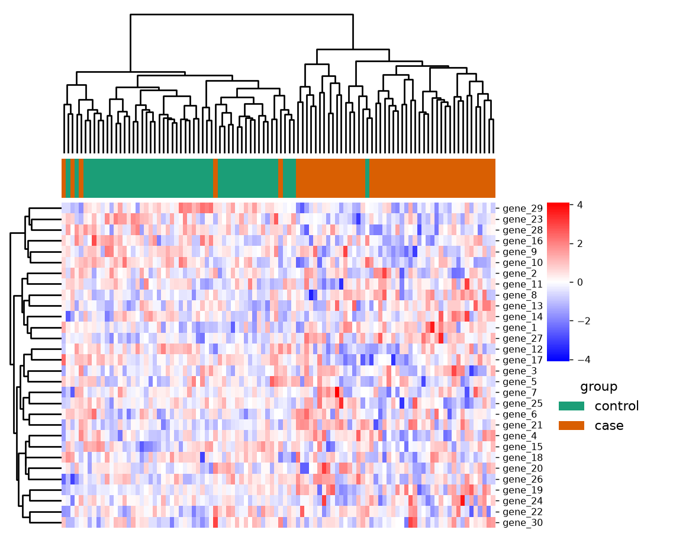

Nothing in the plot was told where the groups are, and it still puts the 17 leftmost columns in `control` and 29 of the 50 `case` samples together in one run. It is not two clean blocks, and it should not be: fourteen of these genes were planted with no effect at all, and the planted half carries enough noise that **§3** misses three of them.

Features are z-scored across the samples by default. One colour scale is shared by every cell and features are not measured on a common scale, so without it a single high-abundance feature takes the whole range and the rest of the plot is left white. The plot does not name which `scale` ran, but the numbers beside the colour key are whatever it produced, and `matrix` on the result is the scaled data.

`feats` picks the features to draw, and their order when they are not clustered:

```python
planted_feats = sim["truth"]["features"][sim["truth"]["direction"] != "none"]
sa.draw_heatmap(
  data              = sim["args"]["data"],
  group             = sim["args"]["group"],
  group_lv          = sim["args"]["group_lv"],
  feats             = planted_feats,
  cluster_feats     = False,           # keep the order named by feats
  dist_method       = "correlation",   # group samples by profile shape
  hclust_method     = "ward.D2",
  show_sample_names = False
)
``````
{'matrix':                57        82        79  ...        68         0        21
gene_1   0.686426  0.159756 -0.118284  ...  1.435104  1.294372  1.509247
gene_3  -1.021580  0.296093  0.742236  ...  0.010475 -0.359719  0.012372
gene_4   0.172767  0.131374  0.802399  ...  0.300070 -0.164953 -0.450205
gene_5   0.110035  0.777857  0.841058  ...  0.715345  1.668229  1.447984
gene_6   0.430116 -0.242777  0.066874  ... -0.581365 -0.948551 -0.765294
gene_8   1.830150  0.951947  1.398031  ...  1.844202  1.303038  1.094987
gene_16  1.301291  0.823502  1.020465  ...  1.305071  0.184389  1.359745
gene_17 -0.081846  1.080386  0.509594  ...  0.803289  0.826200  0.695070
gene_19 -0.015654  0.335472 -2.009003  ... -0.717603 -0.557502  0.225344
gene_20 -1.381946 -2.383145 -1.863679  ... -1.254012 -0.895121 -0.953171
gene_22 -1.321886 -1.413772 -1.108558  ... -0.328792  0.689091  0.195800
gene_23 -1.019891 -0.506569 -0.523970  ... -0.875051 -0.531741 -1.468210
gene_24  0.815223  0.547636  0.056626  ... -1.270302 -0.609058 -1.031024
gene_26 -0.864956 -1.222211 -0.629150  ... -0.914074 -1.480122 -1.124657
gene_27  1.189088  1.166556  0.607172  ...  0.367551  0.920279  0.148059
gene_29 -0.827335 -0.502104  0.208189  ... -0.839907 -1.338832 -0.896047

[16 rows x 100 columns], 'feat_order': [0, 1, 2, 3, 4, 5, 6, 7, 8, 9, 10, 11, 12, 13, 14, 15], 'sample_order': [np.int32(57), np.int32(82), np.int32(79), np.int32(92), np.int32(70), np.int32(83), np.int32(55), np.int32(77), np.int32(50), np.int32(61), np.int32(97), np.int32(69), np.int32(93), np.int32(51), np.int32(90), np.int32(67), np.int32(81), np.int32(95), np.int32(98), np.int32(53), np.int32(62), np.int32(85), np.int32(25), np.int32(9), np.int32(16), np.int32(37), np.int32(71), np.int32(88), np.int32(30), np.int32(38), np.int32(76), np.int32(94), np.int32(52), np.int32(91), np.int32(59), np.int32(78), np.int32(56), np.int32(65), np.int32(72), np.int32(75), np.int32(80), np.int32(73), np.int32(96), np.int32(2), np.int32(11), np.int32(3), np.int32(14), np.int32(64), np.int32(43), np.int32(15), np.int32(54), np.int32(17), np.int32(33), np.int32(4), np.int32(22), np.int32(46), np.int32(48), np.int32(19), np.int32(26), np.int32(8), np.int32(35), np.int32(74), np.int32(29), np.int32(58), np.int32(99), np.int32(84), np.int32(87), np.int32(89), np.int32(60), np.int32(66), np.int32(63), np.int32(86), np.int32(5), np.int32(45), np.int32(6), np.int32(24), np.int32(28), np.int32(44), np.int32(40), np.int32(49), np.int32(18), np.int32(23), np.int32(10), np.int32(34), np.int32(7), np.int32(20), np.int32(42), np.int32(36), np.int32(41), np.int32(39), np.int32(31), np.int32(32), np.int32(1), np.int32(13), np.int32(27), np.int32(12), np.int32(47), np.int32(68), np.int32(0), np.int32(21)], 'feat_hclust': None, 'sample_hclust': array([[3.00000000e+00, 1.40000000e+01, 3.02716776e-02, 2.00000000e+00],
       [1.80000000e+01, 2.30000000e+01, 5.48377836e-02, 2.00000000e+00],
       [3.00000000e+01, 3.80000000e+01, 6.01809136e-02, 2.00000000e+00],
       [4.70000000e+01, 6.80000000e+01, 7.82810968e-02, 2.00000000e+00],
       [1.60000000e+01, 3.70000000e+01, 7.91621416e-02, 2.00000000e+00],
       [4.90000000e+01, 1.01000000e+02, 8.24320170e-02, 3.00000000e+00],
       [9.50000000e+01, 9.80000000e+01, 1.08770297e-01, 2.00000000e+00],
       [6.00000000e+00, 2.40000000e+01, 1.13313614e-01, 2.00000000e+00],
       [1.50000000e+01, 5.40000000e+01, 1.14255298e-01, 2.00000000e+00],
       [4.00000000e+00, 2.20000000e+01, 1.16755742e-01, 2.00000000e+00],
       [5.90000000e+01, 7.80000000e+01, 1.24765453e-01, 2.00000000e+00],
       [4.60000000e+01, 4.80000000e+01, 1.25432128e-01, 2.00000000e+00],
       [5.50000000e+01, 7.70000000e+01, 1.30113227e-01, 2.00000000e+00],
       [5.20000000e+01, 9.10000000e+01, 1.36500132e-01, 2.00000000e+00],
       [5.60000000e+01, 6.50000000e+01, 1.40610585e-01, 2.00000000e+00],
       [1.90000000e+01, 2.60000000e+01, 1.44438581e-01, 2.00000000e+00],
       [1.10000000e+01, 1.00000000e+02, 1.50559649e-01, 3.00000000e+00],
       [9.00000000e+00, 1.04000000e+02, 1.50958873e-01, 3.00000000e+00],
       [6.20000000e+01, 8.50000000e+01, 1.51377736e-01, 2.00000000e+00],
       [0.00000000e+00, 2.10000000e+01, 1.54111482e-01, 2.00000000e+00],
       [7.60000000e+01, 9.40000000e+01, 1.55231312e-01, 2.00000000e+00],
       [6.70000000e+01, 8.10000000e+01, 1.57339845e-01, 2.00000000e+00],
       [3.10000000e+01, 3.20000000e+01, 1.62378800e-01, 2.00000000e+00],
       [5.80000000e+01, 9.90000000e+01, 1.66838366e-01, 2.00000000e+00],
       [5.00000000e+01, 6.10000000e+01, 1.69987016e-01, 2.00000000e+00],
       [6.30000000e+01, 8.60000000e+01, 1.73215737e-01, 2.00000000e+00],
       [4.50000000e+01, 1.07000000e+02, 1.76430954e-01, 3.00000000e+00],
       [1.00000000e+01, 3.40000000e+01, 1.77167044e-01, 2.00000000e+00],
       [1.03000000e+02, 1.19000000e+02, 1.77202787e-01, 4.00000000e+00],
       [3.60000000e+01, 4.10000000e+01, 1.80854101e-01, 2.00000000e+00],
       [2.80000000e+01, 4.40000000e+01, 1.81339136e-01, 2.00000000e+00],
       [8.00000000e+00, 3.50000000e+01, 1.82875214e-01, 2.00000000e+00],
       [1.09000000e+02, 1.11000000e+02, 1.88010606e-01, 4.00000000e+00],
       [6.90000000e+01, 9.30000000e+01, 2.07804318e-01, 2.00000000e+00],
       [2.90000000e+01, 1.23000000e+02, 2.07840655e-01, 3.00000000e+00],
       [4.30000000e+01, 1.08000000e+02, 2.14768643e-01, 3.00000000e+00],
       [1.70000000e+01, 3.30000000e+01, 2.15614857e-01, 2.00000000e+00],
       [7.50000000e+01, 8.00000000e+01, 2.21062151e-01, 2.00000000e+00],
       [8.70000000e+01, 8.90000000e+01, 2.21519161e-01, 2.00000000e+00],
       [9.00000000e+01, 1.21000000e+02, 2.24039107e-01, 3.00000000e+00],
       [7.10000000e+01, 8.80000000e+01, 2.25056448e-01, 2.00000000e+00],
       [1.10000000e+02, 1.14000000e+02, 2.29363953e-01, 4.00000000e+00],
       [5.70000000e+01, 8.20000000e+01, 2.32252809e-01, 2.00000000e+00],
       [7.00000000e+01, 8.30000000e+01, 2.37073495e-01, 2.00000000e+00],
       [2.00000000e+00, 1.16000000e+02, 2.42005476e-01, 4.00000000e+00],
       [7.90000000e+01, 9.20000000e+01, 2.43610690e-01, 2.00000000e+00],
       [5.30000000e+01, 1.18000000e+02, 2.46065836e-01, 3.00000000e+00],
       [1.26000000e+02, 1.30000000e+02, 2.52768908e-01, 5.00000000e+00],
       [1.20000000e+01, 1.28000000e+02, 2.56191121e-01, 5.00000000e+00],
       [1.02000000e+02, 1.20000000e+02, 2.62834824e-01, 4.00000000e+00],
       [3.90000000e+01, 1.22000000e+02, 2.65763541e-01, 3.00000000e+00],
       [1.12000000e+02, 1.24000000e+02, 2.67894406e-01, 4.00000000e+00],
       [1.05000000e+02, 1.27000000e+02, 2.80746840e-01, 5.00000000e+00],
       [5.10000000e+01, 1.39000000e+02, 2.83563951e-01, 4.00000000e+00],
       [2.00000000e+01, 4.20000000e+01, 2.87435861e-01, 2.00000000e+00],
       [2.50000000e+01, 1.17000000e+02, 2.89473899e-01, 4.00000000e+00],
       [1.00000000e+00, 1.30000000e+01, 2.92289695e-01, 2.00000000e+00],
       [7.30000000e+01, 9.60000000e+01, 2.96150804e-01, 2.00000000e+00],
       [1.15000000e+02, 1.31000000e+02, 3.15700839e-01, 4.00000000e+00],
       [2.70000000e+01, 1.48000000e+02, 3.19745810e-01, 6.00000000e+00],
       [5.00000000e+00, 1.47000000e+02, 3.29122435e-01, 6.00000000e+00],
       [1.06000000e+02, 1.46000000e+02, 3.33487159e-01, 5.00000000e+00],
       [1.13000000e+02, 1.41000000e+02, 3.47324548e-01, 6.00000000e+00],
       [8.40000000e+01, 1.38000000e+02, 3.53453959e-01, 3.00000000e+00],
       [4.00000000e+01, 1.52000000e+02, 3.55561735e-01, 6.00000000e+00],
       [9.70000000e+01, 1.33000000e+02, 3.64581942e-01, 3.00000000e+00],
       [1.32000000e+02, 1.58000000e+02, 3.75975548e-01, 8.00000000e+00],
       [1.29000000e+02, 1.50000000e+02, 3.77577322e-01, 5.00000000e+00],
       [1.42000000e+02, 1.45000000e+02, 3.78431012e-01, 4.00000000e+00],
       [1.40000000e+02, 1.49000000e+02, 3.82912719e-01, 6.00000000e+00],
       [1.56000000e+02, 1.59000000e+02, 3.85756710e-01, 8.00000000e+00],
       [1.36000000e+02, 1.66000000e+02, 3.91706639e-01, 1.00000000e+01],
       [6.60000000e+01, 1.25000000e+02, 4.25771226e-01, 3.00000000e+00],
       [7.00000000e+00, 1.54000000e+02, 4.43276068e-01, 3.00000000e+00],
       [1.43000000e+02, 1.51000000e+02, 4.67301919e-01, 6.00000000e+00],
       [1.35000000e+02, 1.71000000e+02, 4.73993093e-01, 1.30000000e+01],
       [6.00000000e+01, 1.72000000e+02, 4.85379480e-01, 4.00000000e+00],
       [7.20000000e+01, 1.37000000e+02, 4.95968155e-01, 3.00000000e+00],
       [6.40000000e+01, 1.75000000e+02, 5.25038330e-01, 1.40000000e+01],
       [1.55000000e+02, 1.69000000e+02, 5.27923202e-01, 1.00000000e+01],
       [1.60000000e+02, 1.64000000e+02, 5.41339503e-01, 1.20000000e+01],
       [1.53000000e+02, 1.61000000e+02, 5.59406958e-01, 9.00000000e+00],
       [7.40000000e+01, 1.34000000e+02, 5.76632492e-01, 4.00000000e+00],
       [1.67000000e+02, 1.70000000e+02, 6.66997342e-01, 1.30000000e+01],
       [1.62000000e+02, 1.77000000e+02, 6.90398651e-01, 9.00000000e+00],
       [1.63000000e+02, 1.76000000e+02, 6.94303944e-01, 7.00000000e+00],
       [1.44000000e+02, 1.78000000e+02, 7.01544891e-01, 1.80000000e+01],
       [1.68000000e+02, 1.74000000e+02, 7.09345933e-01, 1.00000000e+01],
       [1.65000000e+02, 1.81000000e+02, 7.45187937e-01, 1.20000000e+01],
       [1.73000000e+02, 1.83000000e+02, 7.51361177e-01, 1.60000000e+01],
       [1.80000000e+02, 1.89000000e+02, 8.44649960e-01, 2.80000000e+01],
       [1.87000000e+02, 1.88000000e+02, 8.65074621e-01, 2.20000000e+01],
       [1.57000000e+02, 1.86000000e+02, 8.77956424e-01, 2.00000000e+01],
       [1.79000000e+02, 1.84000000e+02, 9.56455429e-01, 1.90000000e+01],
       [1.85000000e+02, 1.90000000e+02, 1.07858231e+00, 3.50000000e+01],
       [1.82000000e+02, 1.94000000e+02, 1.13908401e+00, 3.90000000e+01],
       [1.91000000e+02, 1.93000000e+02, 1.30446053e+00, 4.10000000e+01],
       [1.92000000e+02, 1.95000000e+02, 1.60420771e+00, 5.90000000e+01],
       [1.96000000e+02, 1.97000000e+02, 2.56336433e+00, 1.00000000e+02]]), 'zlim': (-3.0046113489532704, 3.0046113489532704), 'group_colors': {'control': '#1B9E77', 'case': '#D95F02'}, 'ax': <Axes: >, 'fig': <Figure size 1000x800 with 2 Axes>, 'im': <matplotlib.image.AxesImage object at 0x000001E16CE382D0>}
```

The clustering comes back on the result rather than staying inside the picture, so what the plot claims can be checked:

```python
drawn["matrix"].index.tolist()          # features, top to bottom as drawn
drawn["feat_hclust"]               # the hclust object behind the row dendrogram
pd.Series(sim["args"]["group"][drawn["sample_order"]]).value_counts()
``````
['gene_9', 'gene_26', 'gene_23', 'gene_19', 'gene_13', 'gene_15', 'gene_29', 'gene_28', 'gene_6', 'gene_24', 'gene_20', 'gene_3', 'gene_11', 'gene_18', 'gene_22', 'gene_21', 'gene_25', 'gene_27', 'gene_4', 'gene_16', 'gene_17', 'gene_5', 'gene_7', 'gene_8', 'gene_14', 'gene_1', 'gene_12', 'gene_10', 'gene_2', 'gene_30']

array([[ 3.        , 15.        ,  7.47300443,  2.        ],
       [10.        , 17.        ,  7.89674989,  2.        ],
       [ 1.        , 29.        ,  7.9147186 ,  2.        ],
       [ 5.        , 23.        ,  7.92873902,  2.        ],
       [12.        , 14.        ,  7.99238593,  2.        ],
       [20.        , 24.        ,  8.28384423,  2.        ],
       [ 9.        , 32.        ,  8.60830163,  3.        ],
       [ 4.        ,  6.        ,  8.61870017,  2.        ],
       [11.        , 36.        ,  8.8198525 ,  4.        ],
       [ 7.        , 13.        ,  8.8684436 ,  2.        ],
       [26.        , 30.        ,  9.06055578,  3.        ],
       [18.        , 34.        ,  9.06728422,  3.        ],
       [27.        , 33.        ,  9.18574972,  3.        ],
       [16.        , 37.        ,  9.31977629,  3.        ],
       [ 2.        , 31.        ,  9.380724  ,  3.        ],
       [28.        , 42.        ,  9.64934564,  4.        ],
       [21.        , 35.        , 10.00677792,  3.        ],
       [ 8.        , 25.        , 10.29075451,  2.        ],
       [19.        , 44.        , 10.35267287,  4.        ],
       [22.        , 41.        , 10.57621593,  4.        ],
       [ 0.        , 38.        , 11.21120117,  5.        ],
       [40.        , 43.        , 11.21987093,  6.        ],
       [47.        , 49.        , 12.31543914,  6.        ],
       [45.        , 48.        , 12.44812094,  8.        ],
       [46.        , 51.        , 12.61136896,  9.        ],
       [52.        , 53.        , 15.97047577, 14.        ],
       [39.        , 50.        , 17.01314493,  7.        ],
       [54.        , 56.        , 24.67872677, 16.        ],
       [55.        , 57.        , 48.02550518, 30.        ]])

case       50
control    50
Name: count, dtype: int64
```

Missing values are drawn as grey cells rather than dropped, and a feature with no variance is centred instead of divided by zero. When a pair of features shares no observed sample there is no distance between them at all, in which case that axis keeps its input order and says so rather than failing.

### 7. Compare three or more groups, with the matching post-hoc stage

Four omnibus tests run side by side, each paired with the pairwise procedure that shares its assumptions: ANOVA with Tukey HSD, Welch's ANOVA with Games-Howell, Yuen's trimmed-mean ANOVA with pairwise Yuen, Kruskal-Wallis with Dunn's test. Pairing them in the result is what makes it impossible to follow a rank-based omnibus test with a parametric comparison by accident.

`simulate_multiple_groups()` builds one control group and any number of treatment groups, and `n_treat` states how many by its length.

```python
sim_multi = sa.simulate_multiple_groups(
  n_feats   = 10,
  n_control = 50,
  n_treat   = [50, 50, 50],
  n_up      = 3,
  n_down    = 3,
  seed      = 2026
)

multi = sa.compare_multiple_groups(
  data        = sim_multi["args"]["data"],
  feats       = sim_multi["args"]["feats"],
  group       = sim_multi["args"]["group"],
  group_lv    = sim_multi["args"]["group_lv"],
  input_scale = sim_multi["args"]["input_scale"]
)

multi
multi.tests["anova_test"].loc[:, ["features", "n_used", "f_stat", "eta_sq", "pval_adj"]]
``````
<sa_multi_group> multi_group_comparison
  groups   : control vs treat_1 vs treat_2 vs treat_3 (independent)
  features : 10
  settings : alternative = two.sided, conf_level = 0.95, p_adjust = BH

  tests
    $anova_test    5 of 10 at pval_adj <= 0.05
                  One-way ANOVA
                  post-hoc: 14 of 30 contrast(s) over 5 feature(s), Tukey HSD
    $welch_test    5 of 10 at pval_adj <= 0.05
                  Welch's one-way ANOVA
                  post-hoc: 15 of 30 contrast(s) over 5 feature(s), Games-Howell post-hoc test
    $robust_test   5 of 10 at pval_adj <= 0.05
                  Yuen's trimmed mean one-way ANOVA
                  post-hoc: 13 of 30 contrast(s) over 5 feature(s), Pairwise Yuen tests
    $kruskal_test  5 of 10 at pval_adj <= 0.05
                  Kruskal-Wallis test
                  post-hoc: 14 of 30 contrast(s) over 5 feature(s), Dunn's post-hoc test

  $diagnostics attached

features  n_used     f_stat    eta_sq      pval_adj
0   prot_1   200.0  15.570948  0.192461  4.007090e-08
1   prot_2   200.0   5.365315  0.075890  3.575055e-03
2   prot_3   200.0   4.370428  0.062700  1.054867e-02
3   prot_4   200.0   0.197725  0.003017  8.978535e-01
4   prot_5   200.0   0.490696  0.007455  7.657082e-01
5   prot_6   200.0   1.287607  0.019327  3.498056e-01
6   prot_7   200.0  13.321869  0.169370  2.988271e-07
7   prot_8   200.0   1.341398  0.020119  3.498056e-01
8   prot_9   200.0   2.546663  0.037517  9.533879e-02
9  prot_10   200.0  10.550687  0.139037  6.104458e-06
```

```
   features n_used     f_stat      eta_sq     pval_adj
1    prot_1    200 15.5709484 0.192461364 4.007090e-08
2    prot_2    200  5.3653151 0.075889925 3.575055e-03
3    prot_3    200  4.3704284 0.062700036 1.054867e-02
4    prot_4    200  0.1977247 0.003017267 8.978535e-01
5    prot_5    200  0.4906963 0.007454669 7.657082e-01
6    prot_6    200  1.2876072 0.019327364 3.498056e-01
7    prot_7    200 13.3218691 0.169370477 2.988271e-07
8    prot_8    200  1.3413981 0.020118538 3.498056e-01
9    prot_9    200  2.5466629 0.037517133 9.533879e-02
10  prot_10    200 10.5506865 0.139037001 6.104458e-06
```

An omnibus test reports that the levels are not all alike, not by how much, so its `lower_conf` and `upper_conf` are `NA` throughout and the intervals live in `$posthoc` instead. `estimate` there reads as `group1 - group2`, and the reference is the level being subtracted, so a contrast against it points the same way the fold change does:

```python
ph = multi.posthoc["anova_test"]
ph.loc[ph["features"] == "prot_1", ["features", "contrast", "estimate", "pval_adj"]]
``````
features           contrast  estimate      pval_adj
0   prot_1  treat_1 - control  0.895019  1.524659e-01
1   prot_1  treat_2 - control  0.264750  9.239116e-01
2   prot_1  treat_3 - control  2.627615  1.918364e-08
3   prot_1  treat_2 - treat_1 -0.630269  4.465873e-01
4   prot_1  treat_3 - treat_1  1.732596  3.630417e-04
5   prot_1  treat_3 - treat_2  2.362865  4.752954e-07
```

```
  features          contrast   estimate     pval_adj
1   prot_1 treat_1 - control  0.8950192 1.524659e-01
2   prot_1 treat_2 - control  0.2647502 9.239116e-01
3   prot_1 treat_3 - control  2.6276154 1.918369e-08
4   prot_1 treat_2 - treat_1 -0.6302689 4.465873e-01
5   prot_1 treat_3 - treat_1  1.7325962 3.630417e-04
6   prot_1 treat_3 - treat_2  2.3628651 4.752954e-07
```

`draw_forest_plot()` reaches the same rows with `type = "posthoc"`, which is what `type = "auto"` falls through to on an omnibus table:

```python
sa.draw_forest_plot(multi, test = "anova_test", type = "posthoc", feats = "prot_1",
                 sort_by = "pvalue")
``````
features           contrast   group1  ...      pval_adj  lower_conf  upper_conf
0   prot_1  treat_1 - control  treat_1  ...  1.524659e-01   -0.202412    1.992450
1   prot_1  treat_2 - control  treat_2  ...  9.239116e-01   -0.832681    1.362181
2   prot_1  treat_3 - control  treat_3  ...  1.918364e-08    1.530184    3.725046
3   prot_1  treat_2 - treat_1  treat_2  ...  4.465873e-01   -1.727700    0.467162
4   prot_1  treat_3 - treat_1  treat_3  ...  3.630417e-04    0.635165    2.830027
5   prot_1  treat_3 - treat_2  treat_3  ...  4.752954e-07    1.265434    3.460296

[6 rows x 14 columns]
```

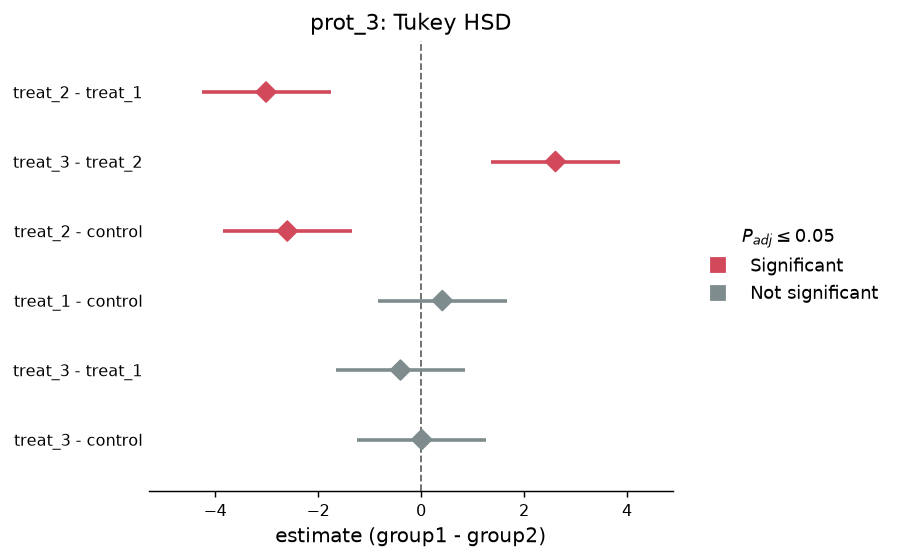

Only `treat_3` moved this feature, which is one of the three shapes `simulate_multiple_groups()` plants: `"all"` moves every treatment group alike, `"gradient"` moves them in a ramp, and `"single"` moves one and leaves the rest at exactly zero. They are recovered at visibly different rates by the same omnibus test, which is the point of planting more than one.

The pairwise stage runs only for features whose omnibus test cleared `posthoc_alpha`. A feature that did not qualify is **absent** from the post-hoc table rather than present with `NA`, because "never asked" and "asked and unanswerable" are different facts; `multi$parameters$n_posthoc` records how many features entered.

`$pairwise` holds the same numbers one contrast at a time, keyed by test and then by contrast label:

```python
list(multi.pairwise["anova_test"].keys())
multi.pairwise["anova_test"]["treat_3 - control"].loc[:, ["features", "log2fc", "estimate", "pval_adj"]]
``````
['treat_1 - control', 'treat_2 - control', 'treat_3 - control', 'treat_2 - treat_1', 'treat_3 - treat_1', 'treat_3 - treat_2']

features    log2fc  estimate      pval_adj
0   prot_1  2.627615  2.627615  1.918364e-08
1   prot_2  1.562214  1.562214  4.409768e-03
2   prot_3 -1.459509 -1.459509  9.464962e-03
3   prot_4 -0.269499       NaN           NaN
4   prot_5  0.007238       NaN           NaN
5   prot_6 -0.383242       NaN           NaN
6   prot_7 -1.743105 -1.743105  1.463146e-04
7   prot_8 -0.610918       NaN           NaN
8   prot_9  1.147412       NaN           NaN
9  prot_10  0.178636  0.178636  9.701071e-01
```

```
[1] "treat_1 - control" "treat_2 - control" "treat_3 - control"
[4] "treat_2 - treat_1" "treat_3 - treat_1" "treat_3 - treat_2"
   features       log2fc   estimate     pval_adj
1    prot_1  2.627615364  2.6276154 1.918369e-08
2    prot_2  1.562213521  1.5622135 4.409768e-03
3    prot_3 -1.459508771 -1.4595088 9.464962e-03
4    prot_4 -0.269499199         NA           NA
5    prot_5  0.007238073         NA           NA
6    prot_6 -0.383242425         NA           NA
7    prot_7 -1.743104602 -1.7431046 1.463146e-04
8    prot_8 -0.610917723         NA           NA
9    prot_9  1.147411959         NA           NA
10  prot_10  0.178635827  0.1786358 9.701071e-01
```

These tables are rectangular where `$posthoc` is ragged: each holds every feature, in the order the rest of the object uses, so a feature that did not qualify is present with its inference columns `NA`. They add `log2fc`, which no post-hoc procedure reports, being the ratio of the two group centres rather than anything a test produced. It divides `group1` by `group2`, so it agrees in sign with the `estimate` beside it, and it is filled even where the test was never run.

The omnibus verdict and its volcano plot work the same way they did with two groups, except that `log2fc` is now the level furthest from the reference, which the x axis says:

```python
sig_multi = sa.estimate_significance(multi, test = "anova_test",
                                   pval_cutoff = 0.05, adj_type = "BH")
sa.draw_volcano_plot(sig_multi, xlim = [-4, 4])

sa.draw_grouped_boxplot(
  data     = sim_multi["args"]["data"],
  feats    = sim_multi["args"]["feats"],
  group    = sim_multi["args"]["group"],
  group_lv = sim_multi["args"]["group_lv"],
  ylim     = [-10, 20]
)
``````
{'box_summary_stats': {'prot_1':                control    treat_1    treat_2    treat_3
min           6.814004   6.156607   2.417903   5.717732
lower_bound   5.090582   4.648540   1.329330   5.007350
Q1            7.835904   8.307717   6.972539   9.932901
median        8.742300   9.722887   9.092148  11.391943
Q3            9.666119  10.747168  10.734678  13.216602
upper_bound  12.411441  14.406344  16.377887  18.142154
max          11.551250  14.821994  16.408420  16.689097, 'prot_2':                control    treat_1    treat_2    treat_3
min           3.589056   4.255796   4.847628   3.712410
lower_bound   0.844953   2.931647   3.365733   1.246631
Q1            6.046722   6.568156   7.482472   7.499977
median        7.341307   7.658601   8.843388   8.996443
Q3            9.514567   8.992495  10.226965  11.668875
upper_bound  14.716336  12.629004  14.343704  17.922221
max          12.922512  14.468139  12.445817  14.647612, 'prot_3':               control   treat_1   treat_2   treat_3
min          0.655348 -2.693230 -4.369390 -3.302082
lower_bound -0.070712 -2.813538 -4.858992 -6.182141
Q1           2.542778  0.922900  0.506350 -0.171643
median       3.692701  1.920059  2.190464  2.120581
Q3           4.285105  3.413858  4.083244  3.835356
upper_bound  6.898595  7.150296  9.448586  9.845854
max          5.619838  6.920449  8.783643  7.595757, 'prot_4':                control   treat_1   treat_2    treat_3
min          -0.766502  0.854763 -0.588763   0.139928
lower_bound  -0.184554 -0.143665  0.527327  -0.799739
Q1            3.701526  3.615078  3.945169   3.321444
median        4.981577  5.189331  5.199238   4.783158
Q3            6.292246  6.120906  6.223730   6.068899
upper_bound  10.178326  9.879649  9.641572  10.190082
max           9.694112  9.285338  9.341675  10.795204, 'prot_5':                control    treat_1    treat_2    treat_3
min           4.413009   3.819572   2.420066   2.244929
lower_bound   4.524009   2.157276  -0.421092   2.798417
Q1            6.899335   6.186862   5.451111   6.669033
median        7.621953   7.664029   6.806659   7.751243
Q3            8.482886   8.873253   9.365914   9.249444
upper_bound  10.858212  12.902839  15.238117  13.120059
max          10.394312  11.619290  13.153163  11.710986, 'prot_6':               control   treat_1   treat_2   treat_3
min         -1.552599 -2.270236 -4.353677 -1.093670
lower_bound -2.914316 -3.611452 -5.041939 -1.916834
Q1           0.933494  0.859790 -0.026285  0.752631
median       2.164020  1.844168  1.574115  1.747256
Q3           3.498701  3.840618  3.317485  2.532275
upper_bound  7.346511  8.311860  8.333139  5.201741
max          5.144053  9.288293  6.799926  6.264200, 'prot_7':                control   treat_1   treat_2    treat_3
min           2.767160 -2.425732  1.152891   0.604459
lower_bound   1.754962 -0.268950 -0.754074   0.674172
Q1            5.364646  3.254592  3.062987   3.778428
median        7.034603  4.707932  4.752233   5.221891
Q3            7.771103  5.603619  5.607694   5.847932
upper_bound  11.380787  9.127161  9.424755   8.952188
max          10.583495  9.929764  7.924372  10.688303, 'prot_8':                control    treat_1    treat_2    treat_3
min           7.773658   4.694303   5.045821   4.732790
lower_bound   7.118584   5.661137   4.840345   5.785604
Q1            9.741359   9.592846   9.269125   8.978533
median       10.721289  10.669576  10.472173  10.054075
Q3           11.489876  12.213985  12.221645  11.107153
upper_bound  14.112651  16.145694  16.650425  14.300082
max          13.150680  14.960318  16.485965  15.271359, 'prot_9':                control    treat_1    treat_2    treat_3
min           0.551264   2.307014   0.533894   1.144710
lower_bound  -1.378484   2.493972  -2.520474  -0.270281
Q1            3.064421   4.727527   3.472960   4.245595
median        5.072046   5.600116   5.514298   5.839003
Q3            6.026358   6.216563   7.468582   7.256179
upper_bound  10.469263   8.450119  13.462015  11.772055
max           9.495899  10.298203  13.376135  12.222560, 'prot_10':                control    treat_1    treat_2    treat_3
min           5.331342   1.768380   1.268203   4.416894
lower_bound   4.310980  -0.590515   2.607401   3.668962
Q1            7.001852   4.436382   6.650871   6.939689
median        7.754884   6.197886   7.941709   8.142525
Q3            8.795767   7.787647   9.346518   9.120174
upper_bound  11.486639  12.814544  13.389988  12.390901
max          10.401036  12.372161  12.127678  12.304765}, 'median_confidence_stats': {'prot_1':               control    treat_1    treat_2    treat_3
n           50.000000  50.000000  50.000000  50.000000
lower_conf   8.333346   9.177802   8.251514  10.658214
upper_conf   9.151253  10.267972   9.932782  12.125672, 'prot_2':               control    treat_1    treat_2    treat_3
n           50.000000  50.000000  50.000000  50.000000
lower_conf   6.566431   7.116893   8.230143   8.064921
upper_conf   8.116182   8.200309   9.456633   9.927966, 'prot_3':               control    treat_1    treat_2    treat_3
n           50.000000  50.000000  50.000000  50.000000
lower_conf   3.303385   1.363465   1.391222   1.225234
upper_conf   4.082016   2.476653   2.989706   3.015927, 'prot_4':               control    treat_1    treat_2    treat_3
n           50.000000  50.000000  50.000000  50.000000
lower_conf   4.402691   4.629415   4.690103   4.169251
upper_conf   5.560462   5.749248   5.708372   5.397065, 'prot_5':               control    treat_1    treat_2    treat_3
n           50.000000  50.000000  50.000000  50.000000
lower_conf   7.268115   7.063766   5.931913   7.174661
upper_conf   7.975791   8.264291   7.681404   8.327825, 'prot_6':               control    treat_1    treat_2    treat_3
n           50.000000  50.000000  50.000000  50.000000
lower_conf   1.590836   1.178115   0.826964   1.349603
upper_conf   2.737205   2.510222   2.321266   2.144910, 'prot_7':               control    treat_1    treat_2    treat_3
n           50.000000  50.000000  50.000000  50.000000
lower_conf   6.496891   4.183052   4.183629   4.759469
upper_conf   7.572315   5.232812   5.320837   5.684312, 'prot_8':               control    treat_1    treat_2    treat_3
n           50.000000  50.000000  50.000000  50.000000
lower_conf  10.330591  10.083893   9.812445   9.578444
upper_conf  11.111988  11.255258  11.131901  10.529706, 'prot_9':               control    treat_1    treat_2    treat_3
n           50.000000  50.000000  50.000000  50.000000
lower_conf   4.410213   5.267397   4.621493   5.166301
upper_conf   5.733878   5.932835   6.407103   6.511706, 'prot_10':               control    treat_1    treat_2    treat_3
n           50.000000  50.000000  50.000000  50.000000
lower_conf   7.354042   5.449060   7.339379   7.655305
upper_conf   8.155727   6.946712   8.544040   8.629745}}
```

| Volcano plot, four groups | Boxplot, four groups |
| --- | --- |
| 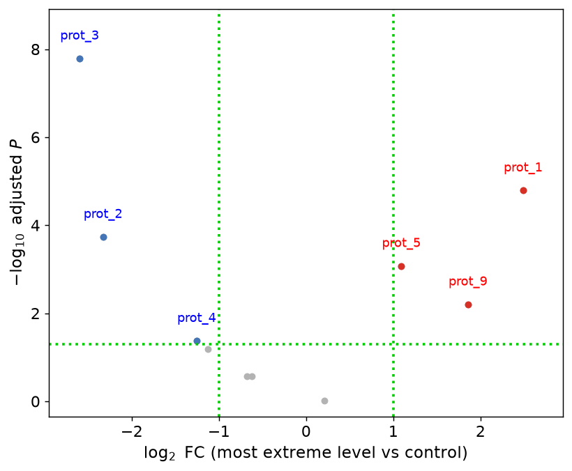 | 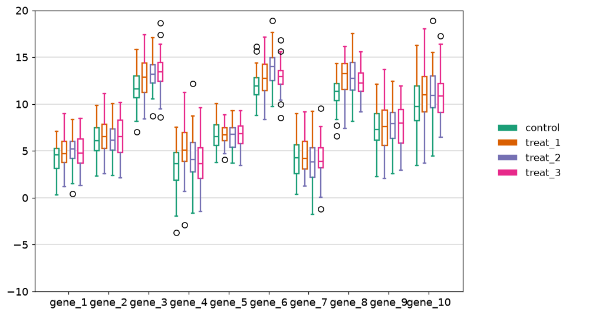 |

`estimate_significance(multi, by = "contrast")` reads the `$pairwise` tables instead, and its `$significance` is then one verdict table per contrast: `sig$significance[["treat_3 - control"]]` is what `draw_volcano_plot()` takes.

Repeated conditions need `id` and a complete rectangle; `simulate_multiple_groups(paired = TRUE)` builds one, and subjects missing any condition are dropped whole and listed in `design$unmatched_ids`.

```python
sim_paired = sa.simulate_multiple_groups(
  n_feats = 10, n_control = 50, n_treat = [50, 50, 50],
  n_up = 3, n_down = 3, seed = 2026, paired = True
)

rm_res = sa.compare_multiple_groups(
  data        = sim_paired["args"]["data"],
  feats       = sim_paired["args"]["feats"],
  group       = sim_paired["args"]["group"],
  group_lv    = sim_paired["args"]["group_lv"],
  id          = sim_paired["args"]["id"],
  input_scale = sim_paired["args"]["input_scale"],
  paired      = True
)

# Mauchly's sphericity test and both epsilon corrections sit on the same row
rm_res.tests["anova_test"].loc[0:3, ["features", "f_stat", "pval", "mauchly_pval",
                               "gg_eps", "pval_gg"]]
``````
features     f_stat          pval  mauchly_pval    gg_eps       pval_gg
0   prot_1  21.124390  1.958421e-11      0.000139  0.734662  5.518760e-09
1   prot_2   0.950108  4.181613e-01      0.000399  0.759724  3.995928e-01
2   prot_3  11.618266  7.062201e-07      0.084385  0.890682  2.394895e-06
3   prot_4  17.595901  8.179172e-10      0.464775  0.944212  2.184990e-09
```

```
  features     f_stat         pval mauchly_pval    gg_eps      pval_gg
1   prot_1 21.1243904 1.958421e-11 0.0001389954 0.7346618 5.518760e-09
2   prot_2  0.9501076 4.181613e-01 0.0003986818 0.7597238 3.995928e-01
3   prot_3 11.6182657 7.062201e-07 0.0843851300 0.8906821 2.394895e-06
```

Sphericity is violated for the first two features here, which is exactly why the corrected p-value is reported next to the uncorrected one rather than instead of it. Repeated measures also swap in Friedman as `$tests$kruskal_test`, with Conover's pairwise comparisons behind it.

### 8. Factorial crossed design

Crossing two factors asks three questions at once — each main effect and their interaction — and the answer is planted **per model term**, not per cell. `simulate_factorial_groups()` returns `truth_term` beside the wide data so each row of the ANOVA table can be scored.

**Port note (§8):** A repeated (within-subject) factor raises the same error as in R — that term needs its own error stratum, and this function fits one model at a time.

```python
sim_fact = sa.simulate_factorial_groups(seed = 2026)

fact_comp = sa.compare_factorial_groups(
  data          = sim_fact["args"]["data"],
  feats         = sim_fact["args"]["feats"],
  factors       = sim_fact["args"]["factors"],
  factor_lv     = sim_fact["args"]["factor_lv"],
  control_label = {"treatment": "control", "sex": "male"},
  input_scale   = sim_fact["args"]["input_scale"]
)

fact_comp
fact_comp.effect.head(3)
fact_comp.terms[fact_comp.terms["features"] == "prot_1"]
``````
<sa_factorial> factorial_comparison
  factors  : treatment (4) x sex (2)  (8 cells, independent)
  anova    : two-way, Type III sums of squares
  features : 100
  settings : alternative = two.sided, conf_level = 0.95, p_adjust = BH

  tests
    $anova_test  22 of 100 at pval_adj <= 0.05
                Two-way ANOVA (Type III sums of squares)
                post-hoc: 65 of 167 contrast(s) over 22 feature(s), Tukey HSD on marginal means and simple effects

  terms
    treatment      13 of 100 at pval_adj <= 0.05
    sex            9 of 100 at pval_adj <= 0.05
    treatment:sex  5 of 100 at pval_adj <= 0.05

  $diagnostics attached

features  n_used  n_cells  ...  extreme_center fold_change    log2fc
0   prot_1   160.0      8.0  ...      221.608393    0.314183 -1.670321
1   prot_2   160.0      8.0  ...       19.960963    0.105817 -3.240362
2   prot_3   160.0      8.0  ...       18.070129    2.051472  1.036659

[3 rows x 8 columns]

features          terms  term_order  ...  log2_effect      pval  pval_adj
0   prot_1      treatment           1  ...    -0.782357  0.013915  0.099392
1   prot_1            sex           1  ...     0.490061  0.006278  0.059254
2   prot_1  treatment:sex           2  ...     0.420129  0.577485  0.934235

[3 rows x 14 columns]
```

```python
fact_comp
``````
<sa_factorial> factorial_comparison
  factors  : treatment (4) x sex (2)  (8 cells, independent)
  anova    : two-way, Type III sums of squares
  features : 100
  settings : alternative = two.sided, conf_level = 0.95, p_adjust = BH

  tests
    $anova_test  22 of 100 at pval_adj <= 0.05
                Two-way ANOVA (Type III sums of squares)
                post-hoc: 65 of 167 contrast(s) over 22 feature(s), Tukey HSD on marginal means and simple effects

  terms
    treatment      13 of 100 at pval_adj <= 0.05
    sex            9 of 100 at pval_adj <= 0.05
    treatment:sex  5 of 100 at pval_adj <= 0.05

  $diagnostics attached
```

```
  features n_used n_cells ref_center   extreme_cell extreme_center fold_change
1   prot_1    160       8 705.347026 treat_C.female      221.60839   0.3141835
2   prot_2    160       8 188.637301 treat_A.female       19.96096   0.1058166
3   prot_3    160       8   8.808372 treat_C.female       18.07013   2.0514720
     log2fc
1 -1.670321
2 -3.240362
3  1.036659
```

The whole-model F in `$tests$anova_test` is the same test `estimate_significance()` and `draw_forest_plot()` already know from multi-group comparisons. Term-wise inference lives in `$terms`, one row per feature and model term, with `pval_adj` corrected **across features within each term** rather than across terms.

`control_label` names the reference level of each factor without rewriting every level list. Here `treatment = "control"` and `sex = "male"` move those levels first, which is what `$effect` uses as the reference cell and what the volcano x-axis names as `most extreme cell vs control.male`.

```python
sig_fact = sa.estimate_significance(fact_comp)
sig_fact

sig_fact_term = sa.estimate_significance(fact_comp, by = "term")
sa.draw_volcano_plot(sig_fact_term)

sa.draw_forest_plot(
  fact_comp, type = "pvalue",
  feats = [f"prot_{i}" for i in range(1, 20 + 1)], sort_by = "pvalue"
)
``````
<sa_significance> factorial_comparison
  test     : anova_test  (Two-way ANOVA (Type III sums of squares))
  cutoffs  : abs(log2fc) >= 1.0, adj_pvalue <= 0.05  (BH)
  verdict  : 22 of 100 significant

[<Axes: title={'center': 'treatment'}, xlabel='log2 FC', ylabel='-log10(p) (adj)'>, <Axes: title={'center': 'sex'}, xlabel='log2 FC', ylabel='-log10(p) (adj)'>, <Axes: title={'center': 'treatment:sex'}, xlabel='log2 FC', ylabel='-log10(p) (adj)'>]

features  n_used  n_cells  ...      pval_adj  lower_conf  upper_conf
0    prot_1   160.0      8.0  ...  3.022090e-02         NaN         NaN
1    prot_2   160.0      8.0  ...  7.907582e-06         NaN         NaN
2    prot_3   160.0      8.0  ...  9.269369e-01         NaN         NaN
3    prot_4   160.0      8.0  ...  9.269369e-01         NaN         NaN
4    prot_5   160.0      8.0  ...  9.269369e-01         NaN         NaN
5    prot_6   160.0      8.0  ...  8.742873e-03         NaN         NaN
6    prot_7   160.0      8.0  ...  3.718080e-01         NaN         NaN
7    prot_8   160.0      8.0  ...  4.961657e-01         NaN         NaN
8    prot_9   160.0      8.0  ...  1.031922e-10         NaN         NaN
9   prot_10   160.0      8.0  ...  8.684334e-01         NaN         NaN
10  prot_11   160.0      8.0  ...  7.269404e-03         NaN         NaN
11  prot_12   160.0      8.0  ...  4.974298e-01         NaN         NaN
12  prot_13   160.0      8.0  ...  8.117733e-01         NaN         NaN
13  prot_14   160.0      8.0  ...  3.442600e-05         NaN         NaN
14  prot_15   160.0      8.0  ...  2.796228e-03         NaN         NaN
15  prot_16   160.0      8.0  ...  9.269369e-01         NaN         NaN
16  prot_17   160.0      8.0  ...  9.269369e-01         NaN         NaN
17  prot_18   160.0      8.0  ...  9.363713e-01         NaN         NaN
18  prot_19   160.0      8.0  ...  8.020537e-01         NaN         NaN
19  prot_20   160.0      8.0  ...  4.988593e-01         NaN         NaN

[20 rows x 12 columns]
```

```python
sig_fact_term
``````
<sa_significance> factorial_comparison
  test     : anova_test  (Two-way ANOVA (Type III sums of squares))
  cutoffs  : abs(log2fc) >= 1.0, adj_pvalue <= 0.05  (BH)

  $significance, one table per term
    treatment      10 of 100 significant
    sex            4 of 100 significant
    treatment:sex  5 of 100 significant
```

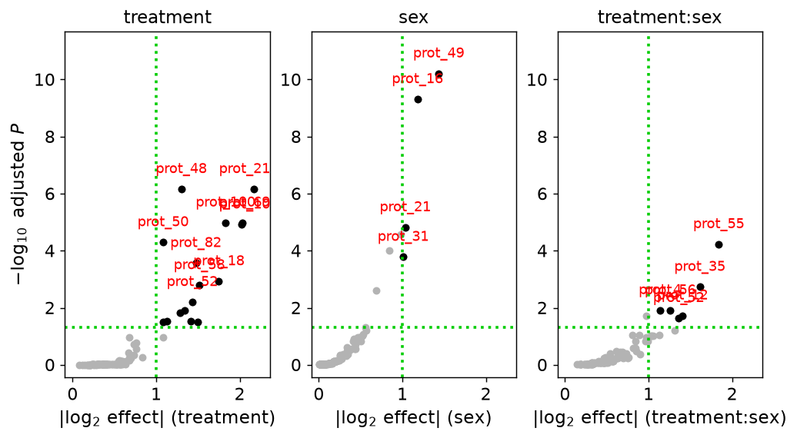

| Omnibus p-values, twenty features | Tukey contrasts for prot_14 |
| --- | --- |
| 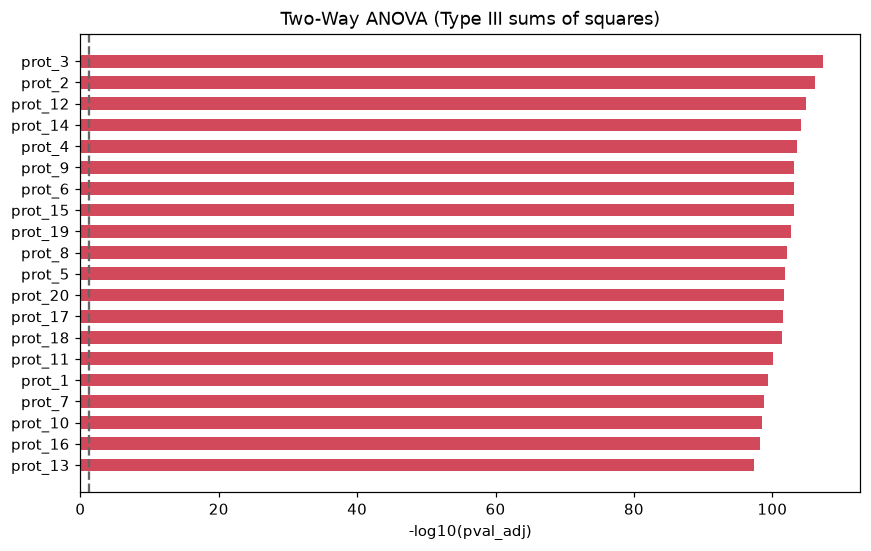 | 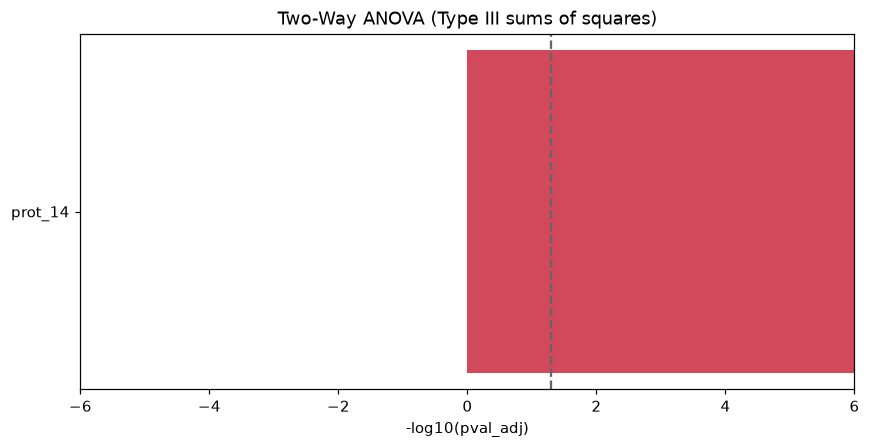 |

`prot_14` was planted as a **crossover**: its treatment and sex main effects are exactly zero and only the interaction was moved. That is invisible in a one-factor read of treatment alone, and visible the moment the lines cross:

```python
sim_fact["truth_term"].loc[sim_fact["truth_term"]["features"] == "prot_14"]

sa.draw_interaction_plot(fact_comp, feat = "prot_14", factor = "treatment", line_factor = "sex")
``````
features          terms  term_order  is_within  max_abs_delta  is_effect
39  prot_14      treatment           1      False       1.511294       True
40  prot_14            sex           1      False       0.000000      False
41  prot_14  treatment:sex           2      False       0.000000      False
```

```
   features         terms term_order is_within max_abs_delta is_effect
40  prot_14     treatment          1     FALSE      1.682590      TRUE
41  prot_14           sex          1     FALSE      0.000000     FALSE
42  prot_14 treatment:sex          2     FALSE      1.346072      TRUE
```

| Interaction plot, prot_14 | Boxplot, prot_14 across eight cells |
| --- | --- |
| 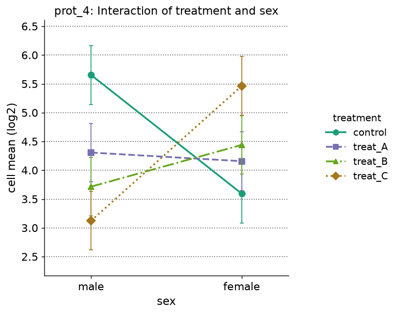 | 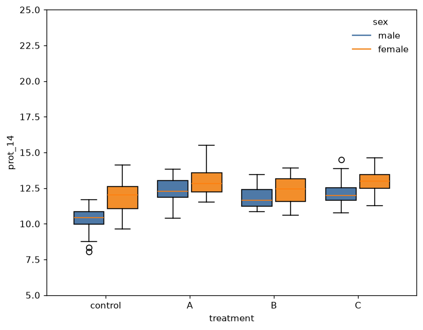 |

The interaction panel is the place to read a crossover: the treatment profile runs one way in `male` and the opposite way in `female`, inside a single feature panel rather than by comparing panels across the page.

### 9. Categorical contingency tables

A contingency table has no feature axis. The question is about the **table as a whole**, or about one cell at a time, and the result is `sa_categorical` rather than `sa_comparison`. `design$null` names the hypothesis the expected counts and residuals were read under — independence here — and every downstream function reads that same null.

```python
sim_cat = sa.simulate_categorical_groups(seed = 2026)

cat_comp = sa.compare_categorical_groups(
  data          = sim_cat["args"]["data"],
  category_lv   = sim_cat["args"]["category_lv"],
  control_label = {"cat_1": "n", "cat_2": "mid"},
  paired        = sim_cat["args"]["paired"]
)

cat_comp
cat_comp.association
cat_comp.tests
``````
<sa_categorical> categorical_comparison
  table    : cat_1 (2) x cat_2 (3)  (6 cells, independent)
  null     : independence -- a cell is expected at the product of its margins
  observed : 200 row(s)
  settings : conf_level = 0.95, correct = True

  tests
    $chisq_test  pval = 5.52e-07  (null rejected at 0.05)
                Chi-square test of independence

  association
    cramers_v                0.38
    contingency_coefficient  0.355

measure  estimate  lower_conf  upper_conf
0                cramers_v  0.379611         NaN         NaN
1  contingency_coefficient  0.354900         NaN         NaN

{'chisq_test':    n_used  statistic   df          pval  lower_conf  upper_conf
0     200   28.82095  2.0  5.515821e-07         NaN         NaN}
```

```python
cat_comp
``````
<sa_categorical> categorical_comparison
  table    : cat_1 (2) x cat_2 (3)  (6 cells, independent)
  null     : independence -- a cell is expected at the product of its margins
  observed : 200 row(s)
  settings : conf_level = 0.95, correct = True

  tests
    $chisq_test  pval = 5.52e-07  (null rejected at 0.05)
                Chi-square test of independence

  association
    cramers_v                0.38
    contingency_coefficient  0.355
```

```
                  measure  estimate lower_conf upper_conf
1               cramers_v 0.3796113         NA         NA
2 contingency_coefficient 0.3549002         NA         NA
```

```
$chisq_test
  n_used statistic df         pval lower_conf upper_conf
1    200  28.82095  2 5.515821e-07         NA         NA

$fisher_test
  n_used statistic df         pval lower_conf upper_conf odds_ratio_cond
1    200        NA NA 3.507415e-07         NA         NA              NA
```

`estimate_significance()` is refused here with a pointer to `estimate_categorical_significance()`, for the same reason `diagnose_distribution()` refuses a comparison it cannot read. The cell reading scores each `(row_level, col_level)` pair by how far `observed / expected` sits from one, with p-values from the Pearson residual:

```python
sig_cell = sa.estimate_categorical_significance(cat_comp, by = "cell")
sig_cell.significance.head(4)

sig_table = sa.estimate_categorical_significance(
  cat_comp, by = "table", test = "chisq_test"
)
sig_table
``````
row_level col_level  observed  ...        pvalue  adj_pvalue  is_signif
0         n       mid      42.0  ...  1.430340e-05    0.000021      False
1         n      high      20.0  ...  7.429824e-07    0.000002      False
2         n       low      33.0  ...  3.485771e-01    0.348577      False
3         y       mid      17.0  ...  1.430340e-05    0.000021      False

[4 rows x 10 columns]

<sa_categorical_significance> categorical_comparison
  reading  : table  (2 x 3 table)
  null     : independence -- a cell is expected at the product of its margins
  test     : chisq_test  (Chi-square test of independence)
  cutoffs  : pvalue <= 0.05
  verdict  : cramers_v = 0.38  (significant)
```

```
  row_level col_level observed expected      lift  log2_lift std_residual
1         n       mid       42   28.025 1.4986619  0.5836750     4.339151
2         y       mid       17   30.975 0.5488297 -0.8655695    -4.339151
3         n      high       20   37.050 0.5398111 -0.8894735    -4.949778
4         y      high       58   40.950 1.4163614  0.5021894     4.949778
        pvalue   adj_pvalue is_signif
1 1.430340e-05 2.145510e-05     FALSE
2 1.430340e-05 2.145510e-05     FALSE
3 7.429824e-07 2.228947e-06     FALSE
4 7.429824e-07 2.228947e-06     FALSE
```

```python
sig_cell
``````
<sa_categorical_significance> categorical_comparison
  reading  : cell  (2 x 3 table)
  null     : independence -- a cell is expected at the product of its margins
  cutoffs  : abs(log2_lift) >= 1.0, adj_pvalue <= 0.05  (BH)
  verdict  : 0 of 6 cell(s) significant
```

At the default cutoffs every cell misses — the omnibus test already rejected independence, but no single cell clears both a fold-change and an adjusted p-value at once. That is a different verdict from the table reading, which is one row and one association measure.

`draw_mosaic_plot()` shades each tile by the residual under the same null, and draws the expected conditional proportion as a dashed line inside each strip so the eye reads distance from the null rather than distance from the neighbouring strip:

```python
sa.draw_mosaic_plot(cat_comp)
```

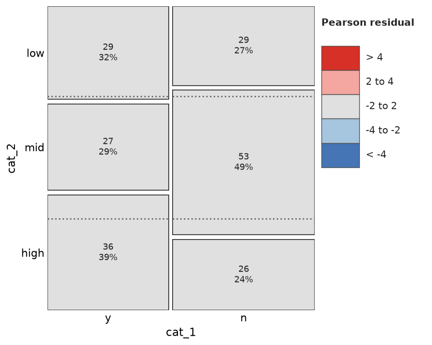

`plot()` on an `sa_categorical` is the same function under the name R users reach for first.

### 10. Compare one sample against a hypothesised value

```python
one = sa.compare_one_sample(sim["args"]["data"], "gene_8", mu = 8)
one.tests["t_test"]
``````
features  n_used     center  ...      pval_adj  lower_conf  upper_conf
0   gene_8   100.0  11.411517  ...  9.163982e-26    2.937209    3.885825

[1 rows x 13 columns]
```

```
  features n_used   center mu     diff    stderr   t_stat df cohens_d
1   gene_8    100 11.41152  8 3.411517 0.2390404 14.27172 99 1.427172
          pval     pval_adj lower_conf upper_conf
1 9.163982e-26 9.163982e-26   10.93721   11.88583
```

`$tests$wilcox_test` adds the signed-rank test with a Hodges-Lehmann pseudo-median, and `$tests$prop_test` a score test with a Wilson interval for binary features. `gene_8` is not binary, so the call above also emits one named warning and leaves that row `NA` rather than coercing a number out of it:

```python
flag = pd.DataFrame({"is_case": (sim["args"]["group"] == "case").astype(int)})
sa.compare_one_sample(flag, "is_case", mu = 0.5, p = 0.5).tests["prop_test"]
``````
features  n_used  n_success  ...  pval_adj  lower_conf  upper_conf
0  is_case   100.0       50.0  ...       1.0    0.398321    0.601679

[1 rows x 13 columns]
```

```
  features n_used n_success proportion   p diff chi_sq df cohens_h pval
1  is_case    100        50        0.5 0.5    0      0  1        0    1
  pval_adj lower_conf upper_conf
1        1  0.4038315  0.5961685
```

### 11. Check the assumptions before choosing a test

Each assumption is checked twice, by tests that fail differently: Shapiro-Wilk against Kolmogorov-Smirnov for normality, median-centred Levene against Bartlett for homogeneity of variance.

```python
d = sa.diagnose_distribution(sim["args"]["data"], sim["args"]["feats"], sim["args"]["group"])
d
d.normality   # one row per feature and level
d.variance    # one row per feature
d.summary     # normal_ok / variance_ok flags per feature
``````
<sa_diagnosis> distribution_diagnosis
  features : 30
  groups   : case, control
  settings : alpha = 0.05, outlier criterion = iqr

  checks
    normality  2 of 30 feature(s) have a group failing Shapiro-Wilk at 0.05
    variance   15 of 30 feature(s) fail Levene at 0.05
    outliers   47 observation(s) flagged across 17 feature(s)

  A failed check never changes which tests run. It changes which of
  them deserves the most weight, and that judgement stays with you.

features    group  n_used  ...   ks_pval  skewness  excess_kurtosis
0    gene_1     case      50  ...  0.596146  0.336619        -0.787551
1    gene_1  control      50  ...  0.429859  0.098597         0.319319
2    gene_2     case      50  ...  0.835354  0.196388         0.153546
3    gene_2  control      50  ...  0.943594  0.322123        -0.568930
4    gene_3     case      50  ...  0.704643  0.235293        -0.111980
5    gene_3  control      50  ...  0.979099  0.201257        -0.354310
6    gene_4     case      50  ...  0.764162 -0.378869         1.227880
7    gene_4  control      50  ...  0.879557 -0.390518         1.310885
8    gene_5     case      50  ...  0.760475 -0.008883        -0.558423
9    gene_5  control      50  ...  0.515728  0.328057        -0.388370
10   gene_6     case      50  ...  0.511252 -0.349183        -0.710905
11   gene_6  control      50  ...  0.879328  0.147492         0.224749
12   gene_7     case      50  ...  0.724509 -0.033240        -0.492399
13   gene_7  control      50  ...  0.296813  0.082559         1.798308
14   gene_8     case      50  ...  0.512269 -0.162276         0.364020
15   gene_8  control      50  ...  0.890497 -0.272466         1.100076
16   gene_9     case      50  ...  0.971200 -0.058750        -0.724375
17   gene_9  control      50  ...  0.949283  0.345091         0.007377
18  gene_10     case      50  ...  0.741887  0.385615        -0.210522
19  gene_10  control      50  ...  0.838702  0.018010        -0.089681
20  gene_11     case      50  ...  0.822551  0.577262         0.913443
21  gene_11  control      50  ...  0.890432 -0.342956        -0.160842
22  gene_12     case      50  ...  0.984668  0.182229        -0.209099
23  gene_12  control      50  ...  0.880390  0.258952        -0.414128
24  gene_13     case      50  ...  0.677626  0.048448         0.108834
25  gene_13  control      50  ...  0.185734 -0.682546        -0.124585
26  gene_14     case      50  ...  0.998538  0.066576        -0.076387
27  gene_14  control      50  ...  0.670302  0.253881        -0.524506
28  gene_15     case      50  ...  0.897868  0.537606         0.327913
29  gene_15  control      50  ...  0.961264 -0.426502         0.280512
30  gene_16     case      50  ...  0.293633 -0.057016         0.977715
31  gene_16  control      50  ...  0.962854 -0.484302         0.697324
32  gene_17     case      50  ...  0.910142 -0.205657        -0.231865
33  gene_17  control      50  ...  0.651219 -0.332889        -0.511697
34  gene_18     case      50  ...  0.798309 -0.089365         0.851922
35  gene_18  control      50  ...  0.635845 -0.471452         1.193007
36  gene_19     case      50  ...  0.987571  0.465673         0.043343
37  gene_19  control      50  ...  0.850356  0.085516        -0.144630
38  gene_20     case      50  ...  0.582219  0.380657         0.526599
39  gene_20  control      50  ...  0.969912 -0.103697        -0.264496
40  gene_21     case      50  ...  0.627969  0.142794        -0.719766
41  gene_21  control      50  ...  0.929563 -0.173662         0.606855
42  gene_22     case      50  ...  0.991766 -0.172313        -0.226953
43  gene_22  control      50  ...  0.937561 -0.118236        -0.787529
44  gene_23     case      50  ...  0.411735 -0.679210         0.824292
45  gene_23  control      50  ...  0.965125 -0.012163         0.313716
46  gene_24     case      50  ...  0.524764  0.107348        -0.768276
47  gene_24  control      50  ...  0.814943  0.509870         1.698767
48  gene_25     case      50  ...  0.607238  0.465825        -0.615672
49  gene_25  control      50  ...  0.908426  0.186208        -0.504526
50  gene_26     case      50  ...  0.985558 -0.178116        -0.424219
51  gene_26  control      50  ...  0.836880 -0.018224        -0.315092
52  gene_27     case      50  ...  0.878844 -0.252831        -0.378633
53  gene_27  control      50  ...  0.911853  0.051356        -0.452408
54  gene_28     case      50  ...  0.935558  0.424223        -0.110221
55  gene_28  control      50  ...  0.894660  0.054256        -0.352368
56  gene_29     case      50  ...  0.940332 -0.312352         0.977566
57  gene_29  control      50  ...  0.988925 -0.224982        -0.404958
58  gene_30     case      50  ...  0.992169 -0.087827        -0.731284
59  gene_30  control      50  ...  0.679525  0.505698         0.367899

[60 rows x 9 columns]

features  n_used  n_groups  ...  bartlett_stat  bartlett_df  bartlett_pval
0    gene_1     100         2  ...      32.477031          1.0   1.206096e-08
1    gene_2     100         2  ...       1.689943          1.0   1.936085e-01
2    gene_3     100         2  ...       5.246609          1.0   2.198958e-02
3    gene_4     100         2  ...       0.023872          1.0   8.772102e-01
4    gene_5     100         2  ...       2.761456          1.0   9.656031e-02
5    gene_6     100         2  ...      40.305175          1.0   2.172328e-10
6    gene_7     100         2  ...       7.923268          1.0   4.880303e-03
7    gene_8     100         2  ...      20.576481          1.0   5.729571e-06
8    gene_9     100         2  ...      19.013430          1.0   1.298016e-05
9   gene_10     100         2  ...       1.828016          1.0   1.763621e-01
10  gene_11     100         2  ...       0.071778          1.0   7.887652e-01
11  gene_12     100         2  ...       9.665590          1.0   1.877514e-03
12  gene_13     100         2  ...       0.360979          1.0   5.479628e-01
13  gene_14     100         2  ...       0.004664          1.0   9.455537e-01
14  gene_15     100         2  ...      14.725544          1.0   1.243501e-04
15  gene_16     100         2  ...       0.554537          1.0   4.564698e-01
16  gene_17     100         2  ...       2.522987          1.0   1.121978e-01
17  gene_18     100         2  ...       2.233414          1.0   1.350552e-01
18  gene_19     100         2  ...       7.714089          1.0   5.479149e-03
19  gene_20     100         2  ...       0.682998          1.0   4.085562e-01
20  gene_21     100         2  ...      28.135630          1.0   1.131044e-07
21  gene_22     100         2  ...       1.387167          1.0   2.388841e-01
22  gene_23     100         2  ...      11.246784          1.0   7.976110e-04
23  gene_24     100         2  ...       2.842516          1.0   9.180037e-02
24  gene_25     100         2  ...      18.311784          1.0   1.875435e-05
25  gene_26     100         2  ...       1.653579          1.0   1.984725e-01
26  gene_27     100         2  ...       5.148386          1.0   2.326799e-02
27  gene_28     100         2  ...       0.451921          1.0   5.014240e-01
28  gene_29     100         2  ...      15.234579          1.0   9.494887e-05
29  gene_30     100         2  ...       0.467296          1.0   4.942337e-01

[30 rows x 10 columns]

features  n_levels  n_outliers  min_shapiro_pval  normal_ok  variance_ok
0    gene_1         2           0          0.123609       True        False
1    gene_2         2           1          0.421913       True         True
2    gene_3         2           0          0.364579       True        False
3    gene_4         2           4          0.140852       True         True
4    gene_5         2           0          0.289173       True         True
5    gene_6         2           2          0.124699       True        False
6    gene_7         2           3          0.057985       True        False
7    gene_8         2           5          0.157736       True        False
8    gene_9         2           1          0.812088       True        False
9   gene_10         2           1          0.554437       True         True
10  gene_11         2           1          0.292167       True         True
11  gene_12         2           0          0.412518       True        False
12  gene_13         2           0          0.027858      False         True
13  gene_14         2           1          0.445075       True         True
14  gene_15         2           3          0.157008       True        False
15  gene_16         2           8          0.028858      False         True
16  gene_17         2           0          0.319581       True         True
17  gene_18         2           5          0.228145       True         True
18  gene_19         2           0          0.298971       True        False
19  gene_20         2           3          0.264946       True         True
20  gene_21         2           3          0.623347       True        False
21  gene_22         2           0          0.316217       True         True
22  gene_23         2           4          0.092495       True        False
23  gene_24         2           1          0.070866       True        False
24  gene_25         2           0          0.089678       True        False
25  gene_26         2           0          0.813576       True         True
26  gene_27         2           0          0.386965       True        False
27  gene_28         2           0          0.339929       True         True
28  gene_29         2           1          0.571116       True        False
29  gene_30         2           0          0.163479       True         True
```

```python
d
``````
<sa_diagnosis> distribution_diagnosis
  features : 30
  groups   : case, control
  settings : alpha = 0.05, outlier criterion = iqr

  checks
    normality  2 of 30 feature(s) have a group failing Shapiro-Wilk at 0.05
    variance   15 of 30 feature(s) fail Levene at 0.05
    outliers   47 observation(s) flagged across 17 feature(s)

  A failed check never changes which tests run. It changes which of
  them deserves the most weight, and that judgement stays with you.
```

Half of these features fail the variance check, which is not a flaw in the data: `simulate_two_groups()` widens the spread of a group along with its centre, and `gene_23` in **§3** is what that costs. A failed check never blocks an analysis and never swaps one test for another. It changes which member of the reported family deserves the most weight: skewed groups favour the rank-based and robust members, unequal variances favour Welch's and Brunner-Munzel's treatments of the same data.

`screen_outliers()` flags observations and **does not remove them**. `row` is the row number in the original `data`, so a flagged point can be looked up:

```python
sa.screen_outliers(sim["args"]["data"], first_ten, sim["args"]["group"])      # 1.5 x IQR fences
sa.screen_outliers(sim["args"]["data"], first_ten, criterion = "robust_z")
sa.screen_outliers(sim["args"]["data"], first_ten, criterion = "grubbs", alpha = 0.05)
``````
features    group  row      value     score
0    gene_2     case   69  12.962802  0.157094
1    gene_4     case   59   1.849220  0.477710
2    gene_4     case   74   2.335740  0.231842
3    gene_4  control   18   9.149657  0.113356
4    gene_4  control   36   0.014625  0.809623
5    gene_6  control    5   4.706462  0.624638
6    gene_6  control   23   4.123210  0.042573
7    gene_7  control   14  10.369974  0.652502
8    gene_7  control   36  10.784255  0.936626
9    gene_7  control   49   2.155903  0.980904
10   gene_8     case   65   7.513885  0.020717
11   gene_8     case   73   6.528890  0.397476
12   gene_8     case   75   7.479990  0.033682
13   gene_8     case   97  19.530430  0.575598
14   gene_8  control    2   5.939601  0.289492
15   gene_9  control    6   9.300807  0.216886
16  gene_10  control   22   3.326836  0.032078

Empty DataFrame
Columns: [features, group, row, value, score]
Index: []

features  group  row      value     score
0   gene_1    NaN   78   1.297873  2.339778
1   gene_2    NaN   32  13.116519  2.410456
2   gene_3    NaN   64  -2.938381  2.547911
3   gene_4    NaN   36   0.014625  3.309112
4   gene_5    NaN   98   0.230920  2.799246
5   gene_6    NaN   58   7.760930  2.440980
6   gene_7    NaN   80   1.716999  2.529386
7   gene_8    NaN   97  19.530430  3.396461
8   gene_9    NaN   59  -2.653495  2.695414
9  gene_10    NaN   75  14.020817  2.943599
```

```
  features   group row     value    score
1   gene_2    case  69 12.962802 1.657094
2   gene_4    case  59  1.849220 1.977710
3   gene_4    case  74  2.335740 1.731842
4   gene_4 control  18  9.149657 1.613356
```

The same checks are attached to every comparison as `$diagnostics` unless you pass `diagnose = FALSE`.

### 12. Descriptive statistics

```python
sa.summarize_descriptive_stats(sim["args"]["data"], [f"gene_{i}" for i in range(1, 4)])

# By group (one row per feature x level)
sa.summarize_descriptive_stats(sim["args"]["data"], "gene_8", sim["args"]["group"],
                            group_lv = sim["args"]["group_lv"])
``````
features      n  n_missing  ...       mad  skewness  excess_kurtosis
0   gene_1  100.0        0.0  ...  2.649838 -0.433373        -0.250652
1   gene_2  100.0        0.0  ...  2.264476  0.223396        -0.331110
2   gene_3  100.0        0.0  ...  2.446908  0.061712        -0.003874

[3 rows x 19 columns]

features    group     n  ...       mad  skewness  excess_kurtosis
0   gene_8  control  50.0  ...  1.514535 -0.272466         1.100076
1   gene_8     case  50.0  ...  2.036055 -0.162276         0.364020

[2 rows x 20 columns]
```

```
  features   group  n n_missing     mean       sd      var        se        cv
1   gene_8 control 50         0 10.33740 1.375964 1.893278 0.1945907 0.1331054
2   gene_8    case 50         0 12.48563 2.701269 7.296853 0.3820171 0.2163502
       min        q1   median       q3      max      iqr out_lower_bound
1 5.939601  9.461326 10.37261 11.42933 13.81878 1.968002        6.509322
2 6.528890 11.489627 12.72451 14.10401 19.53043 2.614387        7.568047
  out_upper_bound      mad   skewness excess_kurtosis
1        14.38133 1.514535 -0.2724662       1.1000757
2        18.02560 2.036055 -0.1622755       0.3640198
```

### 13. Grouped barplot

`draw_grouped_boxplot()` shows the spread a group's observations have. `draw_grouped_barplot()` shows one number standing for them — a mean, a median, or any column `summarize_descriptive_stats()` already computed — with an error bar whose meaning follows the height.

```python
sim_bar = sa.simulate_two_groups(
  n_feats = 10, n_up = 3, n_down = 3, seed = 2026
)

sa.draw_grouped_barplot(
  data          = sim_bar["args"]["data"],
  feats         = sim_bar["args"]["feats"],
  group         = sim_bar["args"]["group"],
  group_lv      = sim_bar["args"]["group_lv"],
  control_label = "control",
  errorbar      = "se"
)
``````
features    group     n      value      lower      upper
0    gene_1  control  50.0   9.299018   9.091636   9.506400
1    gene_1     case  50.0   8.919280   8.684391   9.154168
2    gene_2  control  50.0   7.699716   7.501986   7.897445
3    gene_2     case  50.0   7.538744   7.085118   7.992369
4    gene_3  control  50.0   3.008139   2.823922   3.192357
5    gene_3     case  50.0   2.074021   1.813918   2.334124
6    gene_4  control  50.0   4.892731   4.711188   5.074275
7    gene_4     case  50.0   3.844866   3.437767   4.251966
8    gene_5  control  50.0   7.747452   7.556842   7.938061
9    gene_5     case  50.0   9.400102   9.145885   9.654319
10   gene_6  control  50.0   2.156454   1.910642   2.402266
11   gene_6     case  50.0   2.196697   1.867426   2.525967
12   gene_7  control  50.0   6.544306   6.301792   6.786820
13   gene_7     case  50.0   4.394183   4.047588   4.740778
14   gene_8  control  50.0  10.561927  10.367292  10.756562
15   gene_8     case  50.0  11.914457  11.641367  12.187548
16   gene_9  control  50.0   4.454643   4.299147   4.610139
17   gene_9     case  50.0   5.136636   4.756294   5.516978
18  gene_10  control  50.0   7.706328   7.456933   7.955723
19  gene_10     case  50.0   9.825076   9.537271  10.112880
```

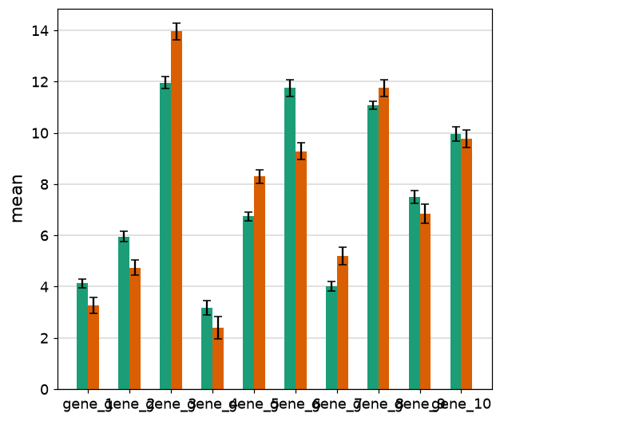

The bar and the table row are the same number because the heights are read from `summarize_descriptive_stats()` rather than recomputed. A median takes only a notch interval; a count or a spread takes none:

```python
sa.draw_grouped_barplot(
  data     = sim_bar["args"]["data"],
  feats    = sim_bar["args"]["feats"],
  group    = sim_bar["args"]["group"],
  group_lv = sim_bar["args"]["group_lv"],
  mainbar  = "median",
  errorbar = "ci"
)
``````
features    group     n      value      lower      upper
0    gene_1  control  50.0   9.298885   8.865322   9.732448
1    gene_1     case  50.0   8.902410   8.339038   9.465782
2    gene_2  control  50.0   7.681723   7.302326   8.061121
3    gene_2     case  50.0   6.889216   5.663408   8.115025
4    gene_3  control  50.0   2.913433   2.539707   3.287159
5    gene_3     case  50.0   2.338260   1.863457   2.813062
6    gene_4  control  50.0   4.979268   4.624645   5.333891
7    gene_4     case  50.0   3.610402   2.784832   4.435971
8    gene_5  control  50.0   7.850882   7.474316   8.227448
9    gene_5     case  50.0   9.284133   8.764113   9.804153
10   gene_6  control  50.0   1.802972   1.213793   2.392151
11   gene_6     case  50.0   1.964945   1.194863   2.735027
12   gene_7  control  50.0   6.406639   6.084472   6.728805
13   gene_7     case  50.0   4.861674   4.069048   5.654300
14   gene_8  control  50.0  10.583317  10.169626  10.997007
15   gene_8     case  50.0  12.228309  11.643975  12.812644
16   gene_9  control  50.0   4.386898   4.129398   4.644399
17   gene_9     case  50.0   5.311355   4.533077   6.089633
18  gene_10  control  50.0   7.775841   7.244334   8.307347
19  gene_10     case  50.0   9.586067   8.829027  10.343108
```

### 14. Feature-pair association

Nothing in Part 1 yet asked how **two** features move together. `summarize_association_stats()` is a screen, not a contract: Pearson, Spearman and Kendall come back side by side on the same pairs, each as four square matrices — coefficient, p-value, adjusted p-value and the observations the pair shared.

```python
assoc_cor = sa.make_block_cor(
  n_features = 10,
  blocks = [
    {"features": list(range(1, 4)), "cor": 0.9},
    {"features": [4, 5], "cor": 0.5, "against": [6, 7]},
  ]
)

assoc_sim = sa.simulate_regression(
  n_pred = 10, n_factor_pred = 0, cor_mat = assoc_cor, seed = 2026
)

assoc = sa.summarize_association_stats(
  data = assoc_sim["args"]["data"].iloc[:, 1:],
  feats = list(assoc_sim["args"]["data"].columns[1:])
)

assoc.design
assoc["pearson"]["corr"].iloc[0:3, 0:3]
```

```
$feats
 [1] "x_1"  "x_2"  "x_3"  "x_4"  "x_5"  "x_6"  "x_7"  "x_8"  "x_9"  "x_10"

$n_obs
[1] 200

$methods
[1] "pearson"  "spearman" "kendall" 

$adj_type
[1] "BH"

$use
[1] "pairwise.complete.obs"
```

```
          x_1       x_2       x_3
x_1 1.0000000 0.9169472 0.8981318
x_2 0.9169472 1.0000000 0.9275508
x_3 0.8981318 0.9275508 1.0000000
```

The `against` block planted a positive correlation inside `x_1`–`x_3` and `x_4`–`x_5`, and a negative one between those two sides, which is why the upper-left block reads near 0.9 and the cross-block cells read near -0.5.

`draw_corrplot()` is three decisions on top of `draw_heatmap()`: nothing is standardised, the colours are fixed at -1 to 1, and both axes share one clustering order so the diagonal stays diagonal.

```python
sa.draw_corrplot(assoc["pearson"]["corr"])

sa.draw_corrplot(
  assoc["pearson"]["corr"],
  pvalue = assoc["pearson"]["adj_pvalue"]
)
``````
{'matrix':            x_1       x_2       x_3  ...      x_10       x_4       x_5
x_1   1.000000  0.916947  0.898132  ... -0.024244  0.057951 -0.057988
x_2   0.916947  1.000000  0.927551  ... -0.043002  0.091018 -0.053209
x_3   0.898132  0.927551  1.000000  ... -0.013511  0.070215 -0.017377
x_6   0.079188  0.048102  0.008338  ...  0.006313 -0.476338 -0.503496
x_7   0.053184  0.038435  0.010917  ... -0.129298 -0.493336 -0.536470
x_9  -0.030861 -0.034253 -0.093064  ... -0.023411 -0.036800 -0.000781
x_8  -0.037026 -0.058324 -0.011254  ... -0.042588  0.048090  0.117600
x_10 -0.024244 -0.043002 -0.013511  ...  1.000000  0.114318  0.062865
x_4   0.057951  0.091018  0.070215  ...  0.114318  1.000000  0.488103
x_5  -0.057988 -0.053209 -0.017377  ...  0.062865  0.488103  1.000000

[10 rows x 10 columns], 'feat_order': [0, 1, 2, 3, 4, 5, 6, 7, 8, 9], 'sample_order': [0, 1, 2, 3, 4, 5, 6, 7, 8, 9], 'feat_hclust': None, 'sample_hclust': None, 'zlim': array([-1.,  1.]), 'group_colors': None, 'ax': <Axes: >, 'fig': <Figure size 1000x800 with 2 Axes>, 'im': <matplotlib.image.AxesImage object at 0x000001E16E646D50>, 'corr':            x_1       x_2       x_3  ...      x_10       x_4       x_5
x_1   1.000000  0.916947  0.898132  ... -0.024244  0.057951 -0.057988
x_2   0.916947  1.000000  0.927551  ... -0.043002  0.091018 -0.053209
x_3   0.898132  0.927551  1.000000  ... -0.013511  0.070215 -0.017377
x_6   0.079188  0.048102  0.008338  ...  0.006313 -0.476338 -0.503496
x_7   0.053184  0.038435  0.010917  ... -0.129298 -0.493336 -0.536470
x_9  -0.030861 -0.034253 -0.093064  ... -0.023411 -0.036800 -0.000781
x_8  -0.037026 -0.058324 -0.011254  ... -0.042588  0.048090  0.117600
x_10 -0.024244 -0.043002 -0.013511  ...  1.000000  0.114318  0.062865
x_4   0.057951  0.091018  0.070215  ...  0.114318  1.000000  0.488103
x_5  -0.057988 -0.053209 -0.017377  ...  0.062865  0.488103  1.000000

[10 rows x 10 columns], 'pvalue': None, 'order': [np.int32(0), np.int32(1), np.int32(2), np.int32(5), np.int32(6), np.int32(8), np.int32(7), np.int32(9), np.int32(3), np.int32(4)], 'hclust': array([[ 1.        ,  2.        ,  0.07244923,  2.        ],
       [ 0.        , 10.        ,  0.09246053,  3.        ],
       [ 5.        ,  6.        ,  0.45404199,  2.        ],
       [ 3.        ,  4.        ,  0.51189723,  2.        ],
       [ 9.        , 13.        ,  0.91140842,  3.        ],
       [ 7.        , 14.        ,  0.95896591,  4.        ],
       [11.        , 12.        ,  0.96030606,  5.        ],
       [ 8.        , 15.        ,  1.01769814,  5.        ],
       [16.        , 17.        ,  1.09843527, 10.        ]]), 'n_masked': 0, 'feats': ['x_1', 'x_2', 'x_3', 'x_4', 'x_5', 'x_6', 'x_7', 'x_8', 'x_9', 'x_10']}

{'matrix':            x_1       x_2       x_3       x_6  ...  x_8  x_10       x_4       x_5
x_1   1.000000  0.916947  0.898132       NaN  ...  NaN   NaN       NaN       NaN
x_2   0.916947  1.000000  0.927551       NaN  ...  NaN   NaN       NaN       NaN
x_3   0.898132  0.927551  1.000000       NaN  ...  NaN   NaN       NaN       NaN
x_6        NaN       NaN       NaN  1.000000  ...  NaN   NaN -0.476338 -0.503496
x_7        NaN       NaN       NaN  0.545958  ...  NaN   NaN -0.493336 -0.536470
x_9        NaN       NaN       NaN       NaN  ...  NaN   NaN       NaN       NaN
x_8        NaN       NaN       NaN       NaN  ...  1.0   NaN       NaN       NaN
x_10       NaN       NaN       NaN       NaN  ...  NaN   1.0       NaN       NaN
x_4        NaN       NaN       NaN -0.476338  ...  NaN   NaN  1.000000  0.488103
x_5        NaN       NaN       NaN -0.503496  ...  NaN   NaN  0.488103  1.000000

[10 rows x 10 columns], 'feat_order': [0, 1, 2, 3, 4, 5, 6, 7, 8, 9], 'sample_order': [0, 1, 2, 3, 4, 5, 6, 7, 8, 9], 'feat_hclust': None, 'sample_hclust': None, 'zlim': array([-1.,  1.]), 'group_colors': None, 'ax': <Axes: >, 'fig': <Figure size 1000x800 with 2 Axes>, 'im': <matplotlib.image.AxesImage object at 0x000001E16EA17D90>, 'corr':            x_1       x_2       x_3       x_6  ...  x_8  x_10       x_4       x_5
x_1   1.000000  0.916947  0.898132       NaN  ...  NaN   NaN       NaN       NaN
x_2   0.916947  1.000000  0.927551       NaN  ...  NaN   NaN       NaN       NaN
x_3   0.898132  0.927551  1.000000       NaN  ...  NaN   NaN       NaN       NaN
x_6        NaN       NaN       NaN  1.000000  ...  NaN   NaN -0.476338 -0.503496
x_7        NaN       NaN       NaN  0.545958  ...  NaN   NaN -0.493336 -0.536470
x_9        NaN       NaN       NaN       NaN  ...  NaN   NaN       NaN       NaN
x_8        NaN       NaN       NaN       NaN  ...  1.0   NaN       NaN       NaN
x_10       NaN       NaN       NaN       NaN  ...  NaN   1.0       NaN       NaN
x_4        NaN       NaN       NaN -0.476338  ...  NaN   NaN  1.000000  0.488103
x_5        NaN       NaN       NaN -0.503496  ...  NaN   NaN  0.488103  1.000000

[10 rows x 10 columns], 'pvalue':                x_1           x_2  ...           x_4           x_5
x_1            NaN  1.370834e-79  ...  8.488933e-01  8.488933e-01
x_2   1.370834e-79           NaN  ...  6.425921e-01  8.501443e-01
x_3   2.115617e-71  6.273405e-85  ...  8.488933e-01  9.488957e-01
x_6   7.950345e-01  8.501443e-01  ...  5.040274e-12  2.235685e-13
x_7   8.501443e-01  8.501443e-01  ...  7.419706e-13  2.399565e-15
x_9   8.542700e-01  8.501443e-01  ...  8.501443e-01  9.912481e-01
x_8   8.501443e-01  8.488933e-01  ...  8.501443e-01  3.977480e-01
x_10  9.025771e-01  8.501443e-01  ...  4.012269e-01  8.488933e-01
x_4   8.488933e-01  6.425921e-01  ...           NaN  1.281555e-12
x_5   8.488933e-01  8.501443e-01  ...  1.281555e-12           NaN

[10 rows x 10 columns], 'order': [np.int32(0), np.int32(1), np.int32(2), np.int32(5), np.int32(6), np.int32(8), np.int32(7), np.int32(9), np.int32(3), np.int32(4)], 'hclust': array([[ 1.        ,  2.        ,  0.07244923,  2.        ],
       [ 0.        , 10.        ,  0.09246053,  3.        ],
       [ 5.        ,  6.        ,  0.45404199,  2.        ],
       [ 3.        ,  4.        ,  0.51189723,  2.        ],
       [ 9.        , 13.        ,  0.91140842,  3.        ],
       [ 7.        , 14.        ,  0.95896591,  4.        ],
       [11.        , 12.        ,  0.96030606,  5.        ],
       [ 8.        , 15.        ,  1.01769814,  5.        ],
       [16.        , 17.        ,  1.09843527, 10.        ]]), 'n_masked': 72, 'feats': ['x_1', 'x_2', 'x_3', 'x_4', 'x_5', 'x_6', 'x_7', 'x_8', 'x_9', 'x_10']}
```

| All pairs | Pairs that cleared BH at 0.05 |
| --- | --- |
| 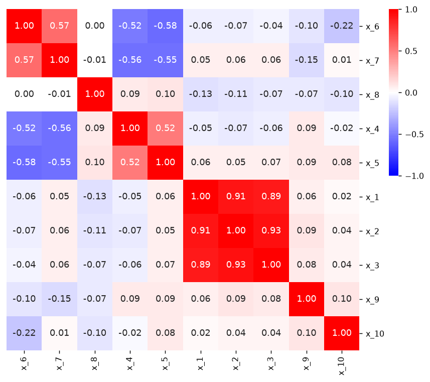 | 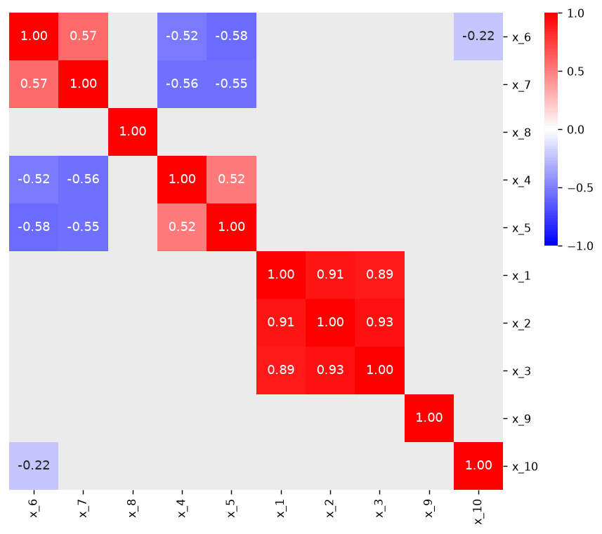 |

Blanking happens **after** clustering, so the tree is built on the full matrix the reader is being shown. The distance is `1 - cor()`, the same rule `cluster_hclust()` and `draw_heatmap(dist_method = "correlation")` use.

---

# Part 2 — Modelling

A model has no feature axis. Every table in Part 1 repeats `features` in the same order; a model has one outcome and a set of **terms**, and the terms are not the columns that were handed in, since one factor predictor becomes several. `terms` takes the place of `features`, `coefficients$terms` repeats that order, and the eleven slots of an `sa_model` are the same eleven whichever of the five models produced it. §18 and §19 are the two sections here that are searches rather than fits, and they have an axis of their own again: `candidates`, the columns they were asked to choose between. §23 and §24 are the first sections that **score** fitted models on held-out rows rather than fit or search on training ones.

### 15. Data whose coefficients are known, and a split that does not leak

`make_block_cor()` builds the correlation the predictors are drawn with. Blocks may not overlap, and a matrix that is symmetric with a unit diagonal but describes no data that could exist is refused here rather than inside an engine. A block whose predictors do not all move the same way names the other side as `against`, which is how a negative correlation below `-1/(k - 1)` gets written down at all: that is the floor on one value shared by `k` predictors, so three of them cannot disagree past -0.5 while a split block has no such limit.

```python
cor_mat = sa.make_block_cor(
  n_features = 8,
  blocks = [
    {"features": [1, 2], "cor": 0.8},
    {"features": [3, 4, 5], "cor": 0.5},
  ]
)

sim_reg = sa.simulate_regression(cor_mat = cor_mat, seed = 2026)
sim_reg["truth"].loc[sim_reg["truth"]["role"] == "signal"]
``````
predictors    role      beta direction  value_mean  value_sd  max_cor_signal
0        x_1  signal  1.199346        up         0.0       1.0             0.0
4        x_5  signal  0.537697        up         0.0       1.0             0.0
6        x_7  signal -1.791516      down         0.0       1.0             0.0
7        x_8  signal -0.878752      down         0.0       1.0             0.0
```

```
  predictors   role       beta direction value_mean value_sd max_cor_signal
1        x_1 signal  1.1993458        up          0        1              0
5        x_5 signal  0.5376967        up          0        1              0
7        x_7 signal -1.7915160      down          0        1              0
8        x_8 signal -0.8787518      down          0        1              0
```

Four predictors carry a coefficient and the other four are exactly zero, so a false positive is a count rather than an estimate. `max_cor_signal` is why the correlation blocks are there at all: `x_2` is null but correlates with the planted `x_1` at 0.8, and a null predictor that correlates with a planted one is pulled off zero by data alone. No number of rows fixes that, and every section below runs into it.

`truth` has one row per predictor; `truth_term` has one row per term, aligned with `coefficients` by position, since a three-level factor is two terms and a constant predictor is none.

`split_data()` defines what "the training half" means, and closes the two ways a training set learns what it must not. `stratified` keeps the balance of the whole data on both sides, and `id` sends every row of one sampling unit to the same side.

```python
dataset = sa.split_data(
  data       = sim_reg["args"]["data"],
  stratified = sim_reg["args"]["data"]["x_cat_1"],
  p_train    = 0.75,
  times      = 1,
  seed       = 2026
)
dataset

train_data = dataset["datasets"][0]["train_data"]
test_data  = dataset["datasets"][0]["test_data"]
``````
<sa_split> train/test partition
  rows     : 200
  stratify : <vector>
             high 66, low 67, mid 67
  settings : p_train = 0.75, times = 1, seed = 2026

  splits
    $Resample1  train 150 / test 50  (p = 0.75)
```

```python
dataset
``````
<sa_split> train/test partition
  rows     : 200
  stratify : <vector>
             high 66, low 67, mid 67
  settings : p_train = 0.75, times = 1, seed = 2026

  splits
    $Resample1  train 150 / test 50  (p = 0.75)
```

`p_train` is a proportion of rows, or of units when `id` is given, and the row proportion actually reached is reported as `p` above and stored in `parameters$achieved_p`. The shape does not depend on `times`: `datasets` is a list of one when one split was asked for.

`sim_reg$split_args` is named after the arguments of `split_data()` for the same reason `args` is named after the arguments of the model, so either can be handed over with `do.call()`.

### 16. Linear regression

Every model takes `data`, `outcome` and `predictors`, and every one resamples the same way. Cross-validation here scores the fit and does not choose it: the final model is fitted on all usable rows either way, so `cv = TRUE` and `cv = FALSE` give identical coefficients and differ only in `performance` and `resampling`.

```python
lin = sa.fit_linear_regression(
  data       = train_data,
  outcome    = sim_reg["args"]["outcome"],
  predictors = sim_reg["args"]["predictors"],
  cv         = True,
  cv_method  = "repeated_kfold",
  n_fold     = 10,
  n_repeat   = 3,
  seed       = 2026
)

lin
```

```python
lin
```

`coef()` on the result is the whole table. `coef()` on `$fit` is the named vector `lm` would have given, for indexing and multiplying:

```python
sa.coef(lin).loc[:, ["terms", "estimate", "pval"]]
```

```
         terms    estimate         pval
1  (Intercept) -1.03596473 1.250653e-02
2          x_1  0.46894277 2.743564e-01
3          x_2  0.72456532 9.476519e-02
4          x_3  0.20519712 4.907838e-01
5          x_4 -0.38610825 1.582901e-01
6          x_5  0.94533612 4.510358e-04
7          x_6  0.08831122 7.030701e-01
8          x_7 -1.44197889 1.479616e-09
9          x_8 -1.19679727 1.431263e-05
10  x_cat_1mid  3.13513207 3.711674e-07
11 x_cat_1high -0.18221871 7.500329e-01
```

Three of the four planted coefficients are picked out at any usual threshold, and `x_1` is not: it is the one that correlates with `x_2` at 0.8, and the pair splits the effect between them at p = 0.27 and p = 0.09. This is `max_cor_signal` doing exactly what it records, and no amount of `n_fold` changes it.

Refit on the terms that survived a threshold, predict the held-out half, and read the two against each other. A factor has to be named as its column again, since `x_cat_1mid` is a term and `x_cat_1` is a predictor:

```python
terms_kept = sa.coef(lin)["terms"].iloc[1:][sa.coef(lin)["pval"].iloc[1:] < 0.01]
kept = list(dict.fromkeys(re.sub(r"high$", "", re.sub(r"mid$", "", t)) for t in terms_kept))
kept
#> [1] "x_5"     "x_7"     "x_8"     "x_cat_1"

lin_kept = sa.fit_linear_regression(
  data       = train_data,
  outcome    = sim_reg["args"]["outcome"],
  predictors = kept,
  cv         = True, cv_method = "repeated_kfold",
  n_fold     = 10, n_repeat = 3, seed = 2026
)

y_hat = sa.predict(lin_kept, newdata = test_data)
round(float(np.corrcoef(test_data["y"], y_hat)[0, 1]), 3)
#> [1] 0.827
```

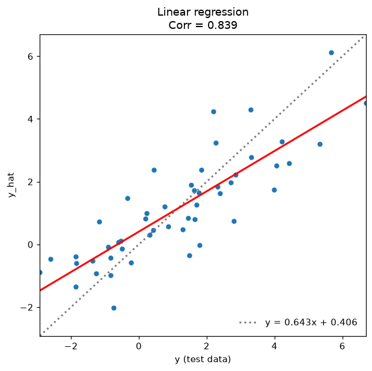

Dropping five predictors, one of them planted, cost 0.008 of correlation on the held-out half: 0.835 with all nine against 0.827 with four. The predictor that was lost was the one whose effect its correlated neighbour was already carrying.

`fit_stats` is a named list rather than a table, because these are quantities per model and not per term: `r_squared`, `adj_r_squared`, `sigma`, the F test, `aic` and `bic`.

### 17. Logistic regression

The same call with a two-class outcome. `outcome_lv` follows the `group_lv` rule — the first level is the reference — so the coefficients describe the odds of `outcome_lv[2]`, and a vector handed to both `compare_two_groups()` and this function points the same way in both.

```python
sim_cls = sa.simulate_classification(cor_mat = cor_mat, seed = 2026)

cls = sa.split_data(
  data       = sim_cls["args"]["data"],
  stratified = sim_cls["args"]["data"]["y"],   # about one row in four is an event
  p_train    = 0.75,
  times      = 1,
  seed       = 2026
)
cls_train = cls["datasets"][0]["train_data"]
cls_test  = cls["datasets"][0]["test_data"]

log_fit = sa.fit_logistic_regression(
  data       = cls_train,
  outcome    = sim_cls["args"]["outcome"],
  predictors = sim_cls["args"]["predictors"],
  outcome_lv = sim_cls["args"]["outcome_lv"],
  cv         = True, cv_method = "repeated_kfold",
  n_fold     = 10, n_repeat = 3, seed = 2026
)

log_fit
sa.coef(log_fit).loc[:, ["terms", "odds_ratio", "pval"]]
```

```python
log_fit
```

```
         terms  odds_ratio         pval
1  (Intercept)  0.04637071 4.276342e-05
2          x_1  8.01038947 2.394441e-03
3          x_2  0.99701067 9.957929e-01
4          x_3  0.80444965 5.716053e-01
5          x_4  0.93032378 8.516444e-01
6          x_5  2.64318666 2.022411e-02
7          x_6  1.37075135 3.670408e-01
8          x_7  0.09286615 4.231261e-06
9          x_8  0.47711976 2.054874e-02
10  x_cat_1mid 15.73809479 1.706532e-03
11 x_cat_1high  0.33968065 1.743603e-01
```

All four planted predictors clear 0.05 here, and the two that were planted `down` come back with an odds ratio under one. The interval columns are `or_lower_conf` and `or_upper_conf`, exponentiated from the Wald interval on the log-odds scale rather than profiled, so the two numbers always agree with the standard error in the same row.

`predict(model, newdata = , type = "response")` is the probability of `outcome_lv[2]`, which is the second column of `type = "prob"` and the class in `type = "raw"`. Fitting the significant terms and the rest separately and drawing all three against the held-out half is what the figure below does:

```python
prob_all = sa.predict(log_fit, newdata = cls_test, type = "response")
# AUC on held-out rows is shown in the ROC figure.
```

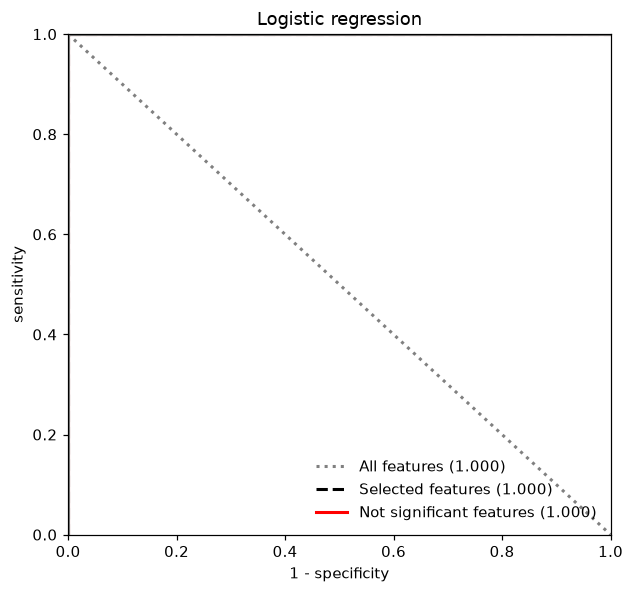

The five predictors behind the significant terms reach 0.911 against 0.917 for all nine, and the predictors behind the terms that were **not** significant still reach 0.844 — because `x_cat_1` appears in both sets. One of its two levels cleared the threshold and the other did not, so naming the columns behind the terms puts the factor on both sides. A term is not a predictor, and this is where the difference shows.

### 18. Recursive feature elimination

The paragraph above selected predictors, and it did it the way most analyses do: fit once, read the p-values, keep what cleared 0.05. Two things are wrong with that even when the answer comes out right. The threshold is arbitrary, and the p-values that chose the predictors came from all 150 training rows, so the resampled score of the model that follows describes a fit whose predictors were already chosen — the choosing sits outside the resampling that reports on it. `perform_rfe()` asks the same question with the elimination **inside** the resampling: rank the candidates, drop the weakest, score what is left, and repeat until one predictor is standing. There is no `cv` argument, because an elimination with nothing held out has no score to choose a size by.

```python
rfe = sa.perform_rfe(
  data          = cls_train,
  outcome       = sim_cls["args"]["outcome"],
  predictors    = sim_cls["args"]["predictors"],
  outcome_lv    = sim_cls["args"]["outcome_lv"],
  control_label = "control",
  model         = "logistic",
  seed          = 2026
)

rfe
```

```python
rfe
```

This is `sa_selection`, the fourth result contract. `candidates` takes the place `features` holds in a comparison, `terms` in a model and `points` in a reduction, and two tables hang off it because "which predictors" and "how many" are two different answers: `ranking` has one row per candidate, `profile` one row per subset size.

Two details of the ranking are worth the space. It is the absolute Wald z rather than the coefficient, so a predictor measured in grams and the same predictor in kilograms are eliminated in the same order — a coefficient is an effect per unit, and ranking by its size ranks by the units. And `x_cat_1` is ranked as one candidate rather than as its two dummy terms, which is exactly the trap §17 ran into: one of its levels cleared 0.05 and the other did not, so naming the columns behind the terms put the factor on both sides of that comparison. Here a factor is kept or dropped as a column, which is the only thing a later `predictors =` could accept.

```python
rfe.selected
#> [1] "x_7"     "x_cat_1" "x_1"     "x_5"     "x_8"

sim_cls["truth"].loc[sim_cls["truth"]["role"] != "null", "predictors"]
#> [1] "x_1"     "x_5"     "x_7"     "x_8"     "x_cat_1"
```

The five it kept are the five that were planted, and no threshold was named anywhere in the call. `x_2` is the interesting one at the other end: it is null but correlates with the planted `x_1` at 0.8, which is what `max_cor_signal` in §15 warned about, and it still lands in the bottom four rather than being carried in by that correlation.

How many to keep is a resampled number like any other, and `profile` is where it is kept honest:

```python
rfe.profile
```

```
  n_vars  Accuracy     Kappa AccuracySD   KappaSD chosen
1      1 0.8386934 0.5266630 0.05018270 0.1408640  FALSE
2      2 0.8213482 0.5051976 0.06073051 0.1675061  FALSE
3      3 0.8481187 0.5814007 0.07990726 0.2200090  FALSE
4      4 0.8438087 0.5822900 0.06504897 0.1574801  FALSE
5      5 0.8494090 0.5992209 0.05894860 0.1566444   TRUE
6      6 0.8345124 0.5608401 0.07265709 0.1886907  FALSE
7      7 0.8438947 0.5835724 0.06967129 0.1781846  FALSE
8      8 0.8412310 0.5766993 0.07081240 0.1787119  FALSE
9      9 0.8426103 0.5809903 0.07156702 0.1811506  FALSE
```

Five won by 0.0013 accuracy over three and by 0.0068 over keeping everything, against standard deviations of 0.05 to 0.08 on those same rows. That is a table of near-ties, and reading it is the point of it being a table: the same call with `n_fold = 10, n_repeat = 3` keeps three predictors instead of five and reaches 0.861 on the held-out half rather than 0.911. The search is a better-behaved filter than a p-value threshold, not an oracle, and `profile` is what says which of those two it was on this data.

`$selected` is a set of column names and nothing else, so it goes straight back into a fit:

```python
rfe_fit = sa.fit_logistic_regression(
  data       = cls_train,
  outcome    = sim_cls["args"]["outcome"],
  predictors = rfe.selected,
  outcome_lv = sim_cls["args"]["outcome_lv"],
  cv = True, cv_method = "repeated_kfold",
  n_fold = 10, n_repeat = 3, seed = 2026
)

prob_rfe = sa.predict(rfe_fit, newdata = cls_test, type = "response")
# AUC on held-out rows is shown in the ROC figure.
```

The same 0.911 the significant terms of §17 reached, against 0.917 for all nine. The gain is not a higher AUC — it is arriving there without a threshold, without the term-versus-predictor confusion, and with the size chosen on rows that did not score it. `control_label = "control"` fixes the direction of the search the way it does everywhere else, so the Wald z the ranking uses is about the odds of `case`, and `$fit` is the `caret::rfe()` object for anything the contract does not carry.

### 19. Stepwise selection by information criteria

§18 bought its answer with resampling, and paid the full price: nine subset sizes, twenty-five resamples each. `perform_stepwise()` asks the same question and settles the bill another way. It walks one term at a time — drop the one whose absence costs least, refit, stop when no move helps — and judges every move by an information criterion, which is the likelihood of the model with a flat charge levied against the number of parameters it spent. Nothing is held out, so there is no `cv` argument and no `seed` either: the path is a deterministic consequence of the data and the charge.

**Port note (§19):** Python uses a simplified backward search, not the full bidirectional R `stats::step()`.

```python
step_sel = sa.perform_stepwise(
  data          = cls_train,
  outcome       = sim_cls["args"]["outcome"],
  predictors    = sim_cls["args"]["predictors"],
  outcome_lv    = sim_cls["args"]["outcome_lv"],
  control_label = "control",
  model         = "logistic",
  criterion     = "AIC"
)

step_sel
```

```python
step_sel
```

Same contract, same `candidates` axis, and two slots that mean something different here. `ranking$estimate` is what leaving that one predictor out of the selected model would cost the criterion, so unlike §18's absolute Wald z it has a sign, and the sign is the verdict: positive for the five worth their parameters, negative for the four the model is better off without. `parameters$maximize` is `FALSE` for the same reason, since a criterion is a cost and not a score, and `resampling` is `NULL` because nothing was resampled.

```python
step_sel.selected
#> [1] "x_7"     "x_1"     "x_cat_1" "x_5"     "x_8"

sim_cls["truth"].loc[sim_cls["truth"]["role"] != "null", "predictors"]
#> [1] "x_1"     "x_5"     "x_7"     "x_8"     "x_cat_1"
```

The five that were planted, again, and `x_cat_1` is again one candidate rather than its two dummy terms. `x_2` is where the two searches read differently: the elimination of §18 left it in the bottom four, and here it is the first thing to go.

That first drop is visible because `profile` is a different table on this side. §18's is a ladder, one row per subset size with all nine of them scored; this one is a path, one row per step, and `step` names the move that reached it:

```python
step_sel.profile
```

```
  n_vars      AIC      BIC  step chosen
1      9 98.05835 131.1753        FALSE
2      8 96.05837 126.1647 - x_2  FALSE
3      7 94.09535 121.1911 - x_4  FALSE
4      6 92.50669 116.5918 - x_3  FALSE
5      5 91.69511 112.7696 - x_6   TRUE
```

The first row is the model the search started from, which is why its `step` is empty, and `chosen` is `TRUE` on the last row because a stepwise search stops where it chose. The four sizes below 5 are absent by construction: this is a record of where the walk went, not a survey of every size, and a size the path never reached has no criterion to report.

Both criteria sit on every row, so the same path is readable on either scale, and here they agree:

```python
sa.perform_stepwise(
  data          = cls_train,
  outcome       = sim_cls["args"]["outcome"],
  predictors    = sim_cls["args"]["predictors"],
  outcome_lv    = sim_cls["args"]["outcome_lv"],
  control_label = "control",
  model         = "logistic",
  criterion     = "BIC"
)["selected"]
#> [1] "x_7"     "x_1"     "x_cat_1" "x_5"     "x_8"
```

BIC charges `log(150)` = 5.01 per parameter against AIC's 2, and the `BIC` column above falls at every step of the path, so the heavier charge walks the same way and stops in the same place. It is closer than the identical answer suggests: `x_8` is worth 3.841 on the AIC scale and only 0.8303 on the BIC one, so the last predictor in is the first the charge would take. `direction` does not change the answer on this data either, since `"forward"` and `"both"` both arrive at the same five. That is what a well-separated signal looks like, and not something to count on — the AIC path and the BIC path are the same object only until one predictor sits near the charge.

`$selected` is a set of column names and nothing else, so it goes back into a fit the way §18's did:

```python
step_fit = sa.fit_logistic_regression(
  data       = cls_train,
  outcome    = sim_cls["args"]["outcome"],
  predictors = step_sel.selected,
  outcome_lv = sim_cls["args"]["outcome_lv"],
  cv = True, cv_method = "repeated_kfold",
  n_fold = 10, n_repeat = 3, seed = 2026
)

prob_step = sa.predict(step_fit, newdata = cls_test, type = "response")
# AUC on held-out rows is shown in the ROC figure.
```

0.911, which is where §18 landed and where §17's significant terms landed, from a search that never fitted a model to anything but the full 150 rows. That cheapness is also the one thing to hold against the number above it: `AIC = 91.6951` was computed on exactly the rows the model was fitted to, so it ranks the models on this path against each other and claims nothing about a new one. §18's accuracy came from folds the elimination had not seen and is a claim of that kind; this criterion is not, which is why the AUC is measured on `cls_test`. `$fit` is the `stats::step()` result, the selected `glm` with the whole path attached as `$anova`, for anything the contract does not carry.

### 20. Elastic net

One function covers the three corners of one model: `"lasso"` is alpha 1, `"ridge"` is alpha 0, and `"elastic_net"` tunes alpha as well. The outcome type is read from the column, so the same call does regression and classification.

**Port note (§20):** Coefficients agree with `glmnet` to about 5e-5 — glmnet stops coordinate descent at default `thresh = 1e-7` while the Python path runs to convergence.

This is the first model where resampling **chooses** rather than scores. `parameters$lambda` and `parameters$alpha` are therefore the values that won, not the grid that was offered; the grid is the rows of `performance`.

```python
enet = sa.fit_elastic_net(
  data       = train_data,
  outcome    = sim_reg["args"]["outcome"],
  predictors = sim_reg["args"]["predictors"],
  penalty    = "lasso",
  lambda_    = [0.01, 0.1, 0.5, 1, 2],
  cv         = True, cv_method = "repeated_kfold",
  n_fold     = 10, n_repeat = 3, seed = 2026
)

sa.coef(enet)
```

```
         terms   estimate selected
1  (Intercept) -0.9499000     TRUE
2          x_1  0.4392503     TRUE
3          x_2  0.6072695     TRUE
4          x_3  0.0535525     TRUE
5          x_4 -0.1237904     TRUE
6          x_5  0.7752077     TRUE
7          x_6  0.0000000    FALSE
8          x_7 -1.3456974     TRUE
9          x_8 -1.0743007     TRUE
10  x_cat_1mid  2.8170913     TRUE
11 x_cat_1high -0.1891498     TRUE
```

There are no `stderr`, `pval` or interval columns here, and they are **absent rather than `NA`**. A penalized estimate is deliberately biased and the usual standard error assumes an unbiased one, so there is no honest number to put in them; a column of `NA` reads as a table with its values missing, which is a different claim. `selected` takes their place, and `is.null(coef(fit)$pval)` is how a consumer tells the two kinds of table apart. Every term keeps its row either way: a dropped term is `estimate = 0`, not a missing row.

At the winning `lambda = 0.1` the penalty drops only `x_6`, so it is a gentler filter than a p-value at 0.01 was — and on the held-out half the refit reaches 0.836, a shade above the linear model's 0.827.

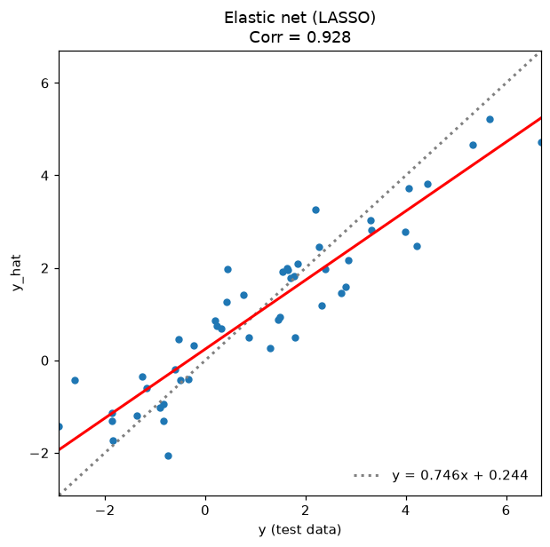

The classification path is the same call with `outcome_lv`, and it separates the kept terms from the dropped ones as clearly as the p-value did:

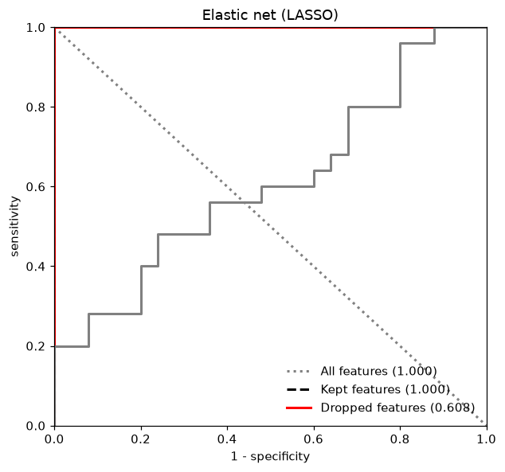

The terms LASSO kept reach 0.906 on the held-out half, the same as the full fit, and the ones it dropped reach 0.682.

### 21. Random forest

The first model with no coefficients. A forest holds hundreds of trees and their splits, not one effect per predictor, so `estimate` is **permutation importance** — `%IncMSE` for regression, `MeanDecreaseAccuracy` for classification — and the table is sorted by it, since that is the order worth reading first. `impurity` carries the other measure the same fit reports, because the two disagree in a way worth seeing: permutation is measured on out-of-bag rows, impurity on the splits themselves.

**Port note (§21):** CV folds match R's, but scikit-learn's tree splits differ from `randomForest()` — expect no numeric parity on importance or OOB metrics.

```python
rf = sa.fit_rf(
  data       = train_data,
  outcome    = sim_reg["args"]["outcome"],
  predictors = sim_reg["args"]["predictors"],
  mtry       = [2, 5, 8],
  ntree      = 500,
  cv         = True, cv_method = "repeated_kfold",
  n_fold     = 10, n_repeat = 3, seed = 2026
)

rf
sa.coef(rf)
```

```python
rf
```

```
    terms    estimate  impurity
1 x_cat_1  2.83479166 268.89580
2     x_7  2.70674308 420.78325
3     x_5  1.42927220 323.38487
4     x_8  0.95250001 252.16450
5     x_2  0.89647721 208.29766
6     x_1  0.64680537 174.57364
7     x_4 -0.02486564  95.13807
8     x_6 -0.09820752 156.14747
9     x_3 -0.14494930 120.42547
```

The three predictors at the bottom are **negative**, and that is an answer rather than a missing value: a predictor that carries nothing can do worse than its own permutation. All three are null, and the null `x_2` outranks the planted `x_1` on both measures, which is the 0.8 correlation between the two showing up a third time. Above that the two measures do not agree: `x_cat_1` leads on permutation and sits third on impurity, behind `x_7` and `x_5`.

Importance is not scaled by the between-tree standard deviation, which `randomForest::importance()` does by default. That ratio is referred to no distribution, so the mean loss itself is what the table carries.

`fit_stats` is out-of-bag rather than in-sample, and says so in its names: `oob_r_squared`, `oob_rmse`, `oob_mae`, and for classification `oob_accuracy`, `oob_kappa`, `oob_sensitivity` and `oob_specificity` against `outcome_lv[2]`. A third of the rows are out of bag for each tree and the forest has already predicted them from trees that never saw them, which is an honest held-out score for free. Here it is 3.06 against an in-sample RMSE that would flatter the fit.

A forest splits factors by level directly, so there is no dummy coding and `x_cat_1` is one term rather than two — unlike every other model in this part.

| Regression | Classification |
| --- | --- |
| 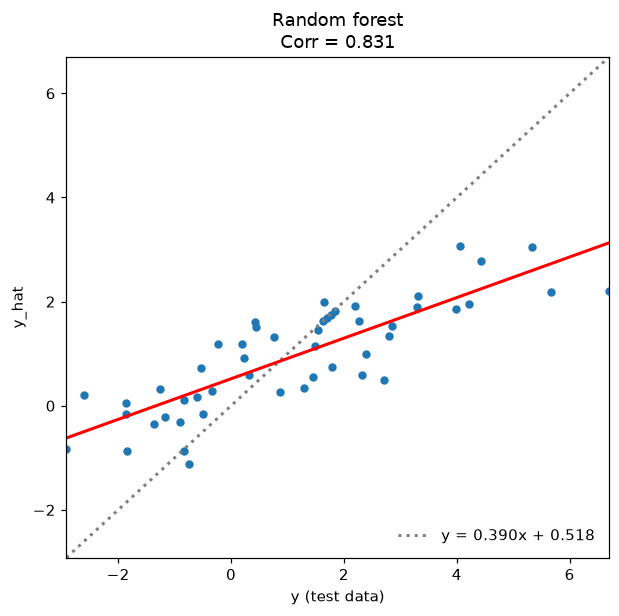 | 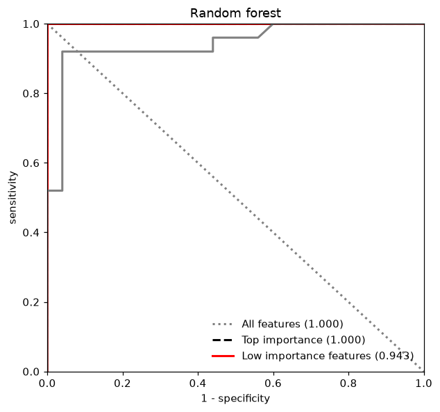 |

The forest is the weakest of the five on this data, at 0.747 held-out correlation and 0.841 AUC, which is what a flexible model costs on 152 rows with a mostly linear truth. Its top five and low five separate cleanly all the same: 0.833 against 0.624.

### 22. Support vector machine

The second model with no coefficients, for the opposite reason. A forest has too many numbers per predictor to report one; a radial kernel machine has **none** — it holds support vectors and their weights, which are points in the data rather than directions in the predictor space. So `estimate` is permutation importance again, measured in the metric the resampling tuned on, so the table and `performance` read in the same unit.

**Port note (§22):** Same R CV folds, but scikit-learn's SVC engine differs from `kernlab` — no numeric parity on importance or resampled scores.

```python
svm = sa.fit_svm(
  data       = train_data,
  outcome    = sim_reg["args"]["outcome"],
  predictors = sim_reg["args"]["predictors"],
  C=[0.5], sigma=[0.05],
  sigma      = None,           # read from the data by kernlab::sigest()
  cv         = True, cv_method = "repeated_kfold",
  n_fold     = 10, n_repeat = 3, seed = 2026
)

svm
list(sa.coef(svm).columns)
#> [1] "terms"    "estimate"
```

```python
svm
```

Unlike the forest, this importance is measured on the rows the machine was fitted to, because a machine sees every row at once and has no out-of-bag half to permute. A term fitted to noise therefore earns a little importance it could not have earned out of sample, and the numbers at the bottom of this table are small rather than negative for that reason. `sigma = NULL` reads the kernel width from the data as the median of `kernlab::sigest()`, and the predictors are centred and scaled before the kernel measures a distance, so `sigma` is a width on the standardised scale.

| Regression | Classification |
| --- | --- |
| 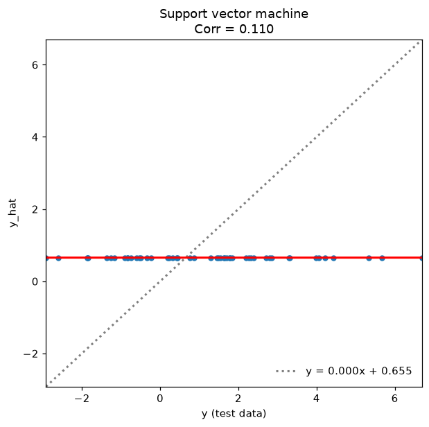 | 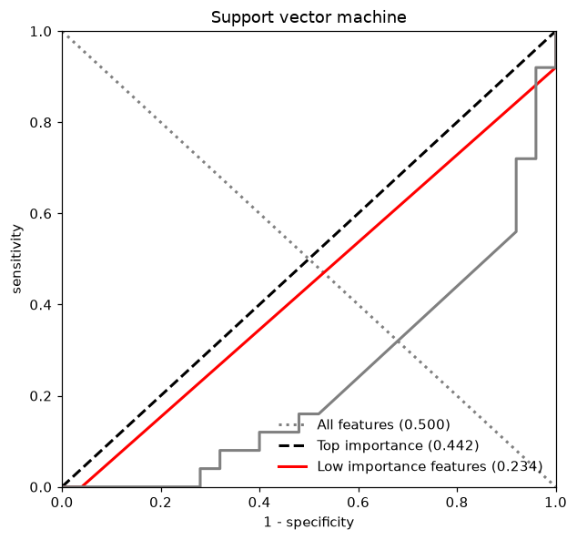 |

### 23. Score regression models on held-out rows

§16–§22 each scored themselves by hand — a correlation or an AUC beside a scatter or an ROC snippet. `evaluate_regression_models()` is the layer above `predict.sa_model()`: the same held-out rows for every model, one table of metrics and one of deltas against a baseline. Rows are the **intersection** of what every model could predict, not the union, because a delta only means something when the two numbers came from the same rows.

The predictors are chosen once by RFE on the training half, then every model is refit on that same set so the comparison is about engines rather than about which columns each engine saw:

```python
eval_rfe = sa.perform_rfe(
  data       = train_data,
  outcome    = sim_reg["args"]["outcome"],
  predictors = sim_reg["args"]["predictors"],
  seed       = 2026
)
eval_sel = eval_rfe.selected

eval_lin = sa.fit_linear_regression(
  data = train_data, outcome = sim_reg["args"]["outcome"],
  predictors = eval_sel, cv = True, cv_method = "repeated_kfold",
  n_fold = 10, n_repeat = 3, seed = 2026
)
eval_lasso = sa.fit_elastic_net(
  data = train_data, outcome = sim_reg["args"]["outcome"],
  predictors = eval_sel, penalty = "lasso",
  cv = True, cv_method = "repeated_kfold",
  n_fold = 10, n_repeat = 3, seed = 2026
)
eval_rf = sa.fit_rf(
  data = train_data, outcome = sim_reg["args"]["outcome"],
  predictors = eval_sel, cv = True, cv_method = "repeated_kfold",
  n_fold = 10, n_repeat = 3, seed = 2026
)
eval_svm = sa.fit_svm(
  data = train_data, outcome = sim_reg["args"]["outcome"],
  predictors = eval_sel, C=[2**i for i in range(-5, 11, 2)], sigma = None,
  cv = True, cv_method = "repeated_kfold",
  n_fold = 10, n_repeat = 3, seed = 2026
)

eval_reg = sa.evaluate_regression_models(
  baseline_model = eval_lin,
  new_models     = {"lasso": eval_lasso, "rf": eval_rf, "svm": eval_svm},
  newdata        = test_data,
  answer = test_data["y"],
  baseline_label = "linear"
)

eval_reg
eval_reg.metrics
eval_reg.comparisons
```

```python
eval_reg
```

```
   model n_used       cor r_squared     rmse      mae       bias calib_slope
1 linear     48 0.8276569 0.6801600 2.135962 1.665212 -0.1449732   0.7331519
2  lasso     48 0.8277140 0.6821956 2.129154 1.653141 -0.1599249   0.7128353
3     rf     48 0.7607476 0.5530111 2.525083 1.962046 -0.2248015   0.4654314
4    svm     48 0.8272403 0.6508357 2.231732 1.748396 -0.3199326   0.5501323
  calib_intercept
1    -0.001149596
2    -0.005151245
3     0.063315928
4    -0.077466584
```

```
  model     delta_cor delta_r_squared   delta_rmse   delta_mae
1 lasso  0.0000571794     0.002035625 -0.006808025 -0.01207140
2    rf -0.0669092668    -0.127148879  0.389120084  0.29683330
3   svm -0.0004165980    -0.029324210  0.095769772  0.08318366
```

There is no p-value beside the deltas: held-out error on rows the caller did not generate has no null the package can name. `cor` and `r_squared` sit together because their gap is what `calib_slope` and `calib_intercept` report — a slope under one is a model whose predictions are squeezed towards their own mean.

`draw_prediction_plot()` reads those calibration numbers rather than refitting, so the line and the table cannot drift apart. With more than one model, `type = "overlay"` and `points = FALSE` compares the calibration lines alone:

```python
sa.draw_prediction_plot(eval_reg, type="overlay", points=False)
```

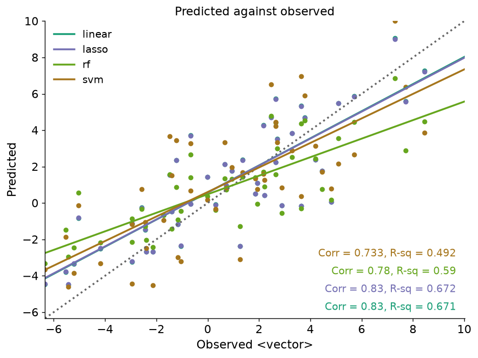

`plot()` on an `sa_performance` with `analysis = "regression_performance"` is the same function.

### 24. Score classification models on held-out rows

The same intersection rule and the same RFE-first pipeline, with logistic regression as the baseline. Here the comparisons add three paired questions beside `delta_auc`: DeLong's test on the ranks, the IDI on the probabilities, and the NRI on how often each probability moved the right way.

```python
eval_rfe_cls = sa.perform_rfe(
  data = cls_train, outcome = sim_cls["args"]["outcome"],
  predictors = sim_cls["args"]["predictors"],
  outcome_lv = sim_cls["args"]["outcome_lv"],
  control_label = "control", seed = 2026, model = "logistic"
)
eval_sel_cls = eval_rfe_cls.selected

eval_log = sa.fit_logistic_regression(
  data = cls_train, outcome = sim_cls["args"]["outcome"],
  predictors = eval_sel_cls, outcome_lv = sim_cls["args"]["outcome_lv"],
  control_label = "control",
  cv = True, cv_method = "repeated_kfold",
  n_fold = 10, n_repeat = 3, seed = 2026
)
eval_lasso_cls = sa.fit_elastic_net(
  data = cls_train, outcome = sim_cls["args"]["outcome"],
  predictors = eval_sel_cls, outcome_lv = sim_cls["args"]["outcome_lv"],
  penalty = "lasso", cv = True, cv_method = "repeated_kfold",
  n_fold = 10, n_repeat = 3, seed = 2026
)
eval_rf_cls = sa.fit_rf(
  data = cls_train, outcome = sim_cls["args"]["outcome"],
  predictors = eval_sel_cls, outcome_lv = sim_cls["args"]["outcome_lv"],
  cv = True, cv_method = "repeated_kfold",
  n_fold = 10, n_repeat = 3, seed = 2026
)
eval_svm_cls = sa.fit_svm(
  data = cls_train, outcome = sim_cls["args"]["outcome"],
  predictors = eval_sel_cls, outcome_lv = sim_cls["args"]["outcome_lv"],
  C=[2**i for i in range(-5, 11, 2)], sigma = None,
  cv = True, cv_method = "repeated_kfold",
  n_fold = 10, n_repeat = 3, seed = 2026
)

eval_cls = sa.evaluate_classification_models(
  baseline_model = eval_log,
  new_models = {
    "lasso": eval_lasso_cls, "rf": eval_rf_cls, "svm": eval_svm_cls
  },
  newdata        = cls_test,
  answer = cls_test["y"],
  outcome_lv     = sim_cls["args"]["outcome_lv"],
  control_label  = "control",
  baseline_label = "logistic"
)

eval_cls
eval_cls.comparisons
```

```python
eval_cls
```

```
  model   delta_auc delta_auc_lower_conf delta_auc_upper_conf delta_auc_pval
1 lasso -0.02494802          -0.06632472           0.01642867      0.2373018
2    rf -0.05821206          -0.15061219           0.03418807      0.2169136
3   svm -0.02079002          -0.10922284           0.06764280      0.6449596
          idi idi_lower_conf idi_upper_conf     idi_pval       nri  nri_event
1 -0.16683055     -0.2613504    -0.07231065 0.0005413859 -1.176715 -0.2307692
2 -0.13560688     -0.2438270    -0.02738675 0.0140507709 -1.422037 -0.6923077
3 -0.04127849     -0.1348295     0.05227251 0.3871400524 -1.268191 -0.5384615
  nri_nonevent nri_lower_conf nri_upper_conf     nri_pval
1   -0.9459459      -1.715864     -0.6375667 1.888282e-05
2   -0.7297297      -1.871932     -0.9721430 5.824685e-10
3   -0.7297297      -1.776480     -0.7599029 1.007561e-06
```

The logistic baseline's AUC of 0.911 is the same number §17 reached on the significant terms, now arrived at through one call. LASSO's AUC is lower but its IDI is significantly negative — probabilities moved the wrong way on average even when the ranks barely changed, which is why three statistics are reported rather than one.

```python
sa.draw_roc_curve(eval_cls, anno_auc = True)
```

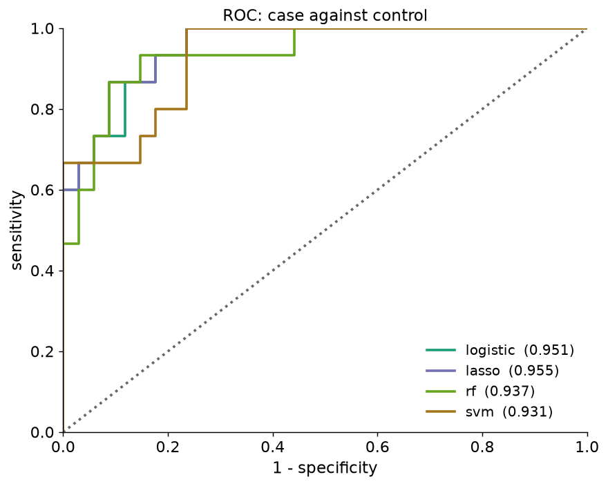

Every number is about the odds of `case`, because that is what the fitted models predict; `outcome_lv` and `control_label` are read as statements about what was already fit, not as knobs to turn after the fact.

### 25. Predict on held-out data

`predict()` goes to the **result**, not to `$fit`. The engine object knows only the column names it was handed: `glmnet` and `kernlab` were given a design matrix and read it by position, so a frame whose numeric columns are in a different order is multiplied by the wrong coefficients without any error, and a factor predictor is dropped from it entirely. The result object is the only thing that knows which columns were predictors and what the levels of a factor were, so one line covers all five models:

```python
sa.predict(lin,     newdata = test_data)                     # numeric
sa.predict(log_fit, newdata = cls_test, type = "raw")        # factor, outcome_lv
sa.predict(log_fit, newdata = cls_test, type = "prob")       # one column per class
sa.predict(log_fit, newdata = cls_test, type = "response")   # P(outcome_lv[2])
```

Extra columns in `newdata` are ignored, a missing one is an error that names it, and a level the training data never saw is an error that names both the column and the level. A level that is missing from `newdata` is not an error: its dummy column is simply zero, since the levels come from `design$predictor_lv` rather than from the new rows. One prediction comes back per row, and a row with a missing value in a predictor is `NA` rather than dropped, so the answer stays aligned with `newdata`.

---

# Part 3 — Unsupervised learning

Everything above had an answer to score against. These sections have none for the coordinates, and §27 has one for the labels when a grouping was known before any algorithm ran. §26 asks where each point lands when many features are pressed into two dimensions; the three functions answer differently on purpose: PCA is a rotation, so it is reversible and says which feature moved a point, but it only finds straight structure; t-SNE and UMAP find curved structure but cannot say which feature made it. §27 asks which points belong together on the same coordinates, using the same `points` axis the reductions use.

### 26. `perform_pca()`, `perform_tsne()` and `perform_umap()`

Three functions rather than one call with a `methods` argument, because they answer in coordinates that share no scale — nothing but `points` could be joined between them — and because `perplexity`, `n_neighbors` and `metric` each belong to exactly one of them. What makes them comparable is the input: all three read `data` the same way, so the same rows drop for the same reason.

`embedding_scale` chooses which margin becomes the points. The input is one row per sample as everywhere else in the package, and `design$point_type` reports which axis was embedded.

```python
red_cor = sa.make_block_cor(
  n_features = 8,
  blocks = [
    {"features": [1, 2], "cor": 0.8},
    {"features": [3, 4, 5], "cor": 0.5},
    {"features": [7, 8], "cor": 0.9},
  ]
)
red_data = sa.simulate_classification(cor_mat = red_cor, seed = 2026)["args"]["data"]

pca = sa.perform_pca(
  data            = red_data,
  feats           = [f"x_{i}" for i in range(1, 8 + 1)],
  embedding_scale = "features",
  center          = True,
  scale           = True
)

pca
pca.scores.iloc[:, 0:3]
```

```python
pca
``````
<sa_reduction> pca
  data     : 200 sample(s) x 8 feature(s)
  points   : 8 feature(s)
  scaling  : centred and scaled
  variance  : PC1 25.88%, PC2 24.46%, PC3 22.3%  (3 of 8 component(s), 72.64% cumulative)
```

```
  points        PC1      PC2
1    x_1 -1.1565840 9.030714
2    x_2  0.2042277 9.636624
3    x_3  9.9079045 4.897448
4    x_4  9.4190232 5.584413
5    x_5 10.1635916 3.756129
6    x_6 -3.0399404 1.583551
7    x_7 -7.8137355 8.413601
8    x_8 -7.0841229 8.507287
```

The three blocks come out as three groups and `x_6`, which belongs to none, sits on its own:

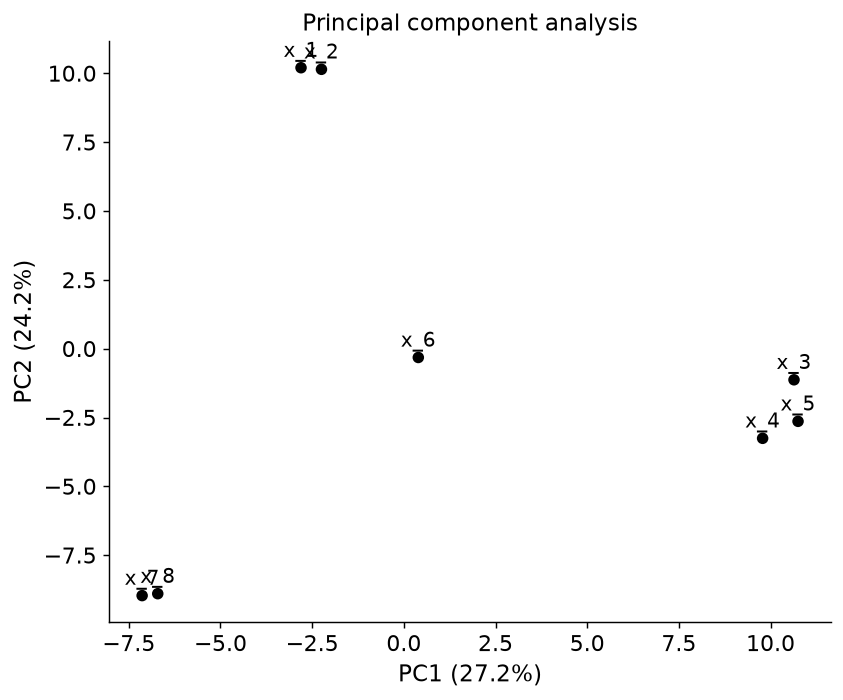

PCA is a singular value decomposition, so one fit answers both margins at once and the matrix is never turned around. `embedding_scale = "features"` rescales the rotation from unit length to variance-weighted length and puts the sample scale in `$loadings`; `$variance` and `$fit` are not touched, so the axis labels are the same either way.

```python
by_sample = sa.perform_pca(data = red_data, feats = [f"x_{i}" for i in range(1, 8 + 1)])
np.allclose(pca.variance, by_sample.variance)
#> [1] True
```

Transposing the input by hand instead is a **third** analysis, not the same one: `prcomp()` always centres and scales the columns it is given, so `perform_pca(t(data))` standardises samples rather than features. The shapes match, the picture reads, and the answer is to a different question. This is the one mistake in these three functions that produces a plot instead of an error, which is why all three document it.

`perform_tsne()` sees literally the same matrix `perform_pca()` did, which needs two of `Rtsne`'s defaults turned off: `normalize = TRUE` would overwrite the `center` and `scale` that were asked for, and `pca = TRUE` would show t-SNE a rotation rather than the matrix. Both overrides are recorded in `engine$overridden`.

```python
tsne = sa.perform_tsne(
  data            = red_data,
  feats           = [f"x_{i}" for i in range(1, 8 + 1)],
  embedding_scale = "features",
  center          = True,
  scale           = True,
  seed            = 2026
)
tsne
``````
<sa_reduction> tsne
  data     : 200 sample(s) x 8 feature(s)
  points   : 8 feature(s)
  scaling  : centred and scaled
  tsne     : 2 dimension(s), perplexity = 2, theta = 0.5  (seed = 2026)
```

```python
tsne
``````
<sa_reduction> tsne
  data     : 200 sample(s) x 8 feature(s)
  points   : 8 feature(s)
  scaling  : centred and scaled
  tsne     : 2 dimension(s), perplexity = 2, theta = 0.5  (seed = 2026)
```

`perform_umap()` is the one that standardises nothing by default, because `metric` is its own argument and `"cosine"` or `"pearson"` compares the shape of a row rather than its size, which already answers what standardising would. Both neighbourhood sizes are read from the engine's limits when they are `NULL`, and both are read from the number of **points** rather than the number of samples — with eight features that is small enough to be worth a message:

```python
umap_res = sa.perform_umap(
  data            = red_data,
  feats           = [f"x_{i}" for i in range(1, 8 + 1)],
  embedding_scale = "features",
  n_neighbors     = 3,
  center          = False,
  scale           = False,
  seed            = 2026
)
umap_res
#> Only 8 feature(s) to embed (n_neighbors = 3). This method describes a
#> neighbourhood, and below about 16 points there is not much of one to describe.
``````
<sa_reduction> umap
  data     : 200 sample(s) x 8 feature(s)
  points   : 8 feature(s)
  scaling  : none, values as they arrived
  umap     : 2 dimension(s), method = umap, n_neighbors = 3, min_dist = 0.1, euclidean  (seed = 2026)
```

```python
umap_res
``````
<sa_reduction> umap
  data     : 200 sample(s) x 8 feature(s)
  points   : 8 feature(s)
  scaling  : none, values as they arrived
  umap     : 2 dimension(s), method = umap, n_neighbors = 3, min_dist = 0.1, euclidean  (seed = 2026)
```

| t-SNE | UMAP |
| --- | --- |
| 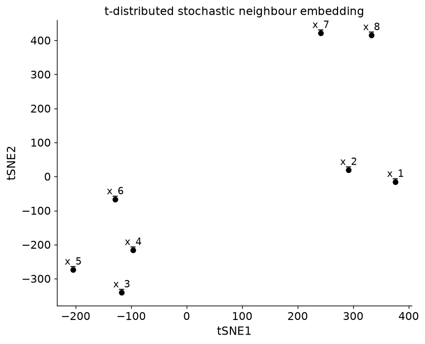 | 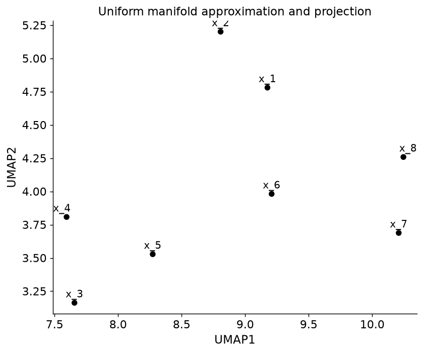 |

The coordinates are `$scores` in all three and the engine object is `$fit`. `seed` buys different things in the two stochastic methods: `umap` restores the random stream itself, so two seedless calls agree, while two seedless `Rtsne` calls do not.

### 27. Cluster on an embedding

The four `cluster_*()` functions read their input through the same path as the reductions, so a clustering and an embedding of the same frame are about the same rows. `sa_cluster` assigns every point a label — `0` is noise for the density methods — and `draw_dim_reduction_plot()` is where those labels meet the coordinates.

Colour and shape are two channels on purpose. A clustering is what the data was found to say; a `group` is what was known before either algorithm ran. One colour per shape is a clustering that recovered the groups; one shape split across colours is a group the data does not see as one thing.

```python
clust_sim = sa.simulate_two_groups(
  n_feats = 50, deg_log2fc = [5, 10], seed = 2026
)

clust_pca = sa.perform_pca(
  data            = clust_sim["args"]["data"],
  feats           = clust_sim["args"]["feats"],
  embedding_scale = "samples"
)

clust_km = sa.cluster_kmeans(
  data          = clust_pca.scores,
  feats         = ["PC1", "PC2"],
  cluster_scale = "samples",
  n_clust       = 2,
  seed          = 2026
)

clust_km
pd.crosstab(clust_sim["args"]["group"], clust_km.assignments["cluster"])
```

```python
clust_km
```

```
         cluster
group      1  2
  case     0 50
  control 50  0
```

Fifty features were moved up or down on a log2 scale of five to ten, embedded in the first two principal components of the samples, and cut into two clusters. Every control lands in cluster 1 and every case in cluster 2, which is the grouping that was planted — read through shape on the first plot and through colour on the second:

```python
sa.draw_dim_reduction_plot(
  clust_pca,
  group    = clust_sim["args"]["group"],
  group_lv = clust_sim["args"]["group_lv"],
  col      = ["black", "red3"]
)

sa.draw_dim_reduction_plot(
  clust_pca,
  cluster_result = clust_km,
  cluster_lv     = ["Cluster1", "Cluster2"]
)
```

| PCA, shape = known group | PCA, colour = k-means |
| --- | --- |
| 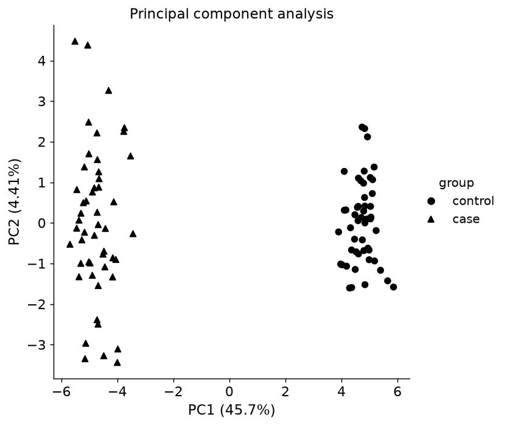 | 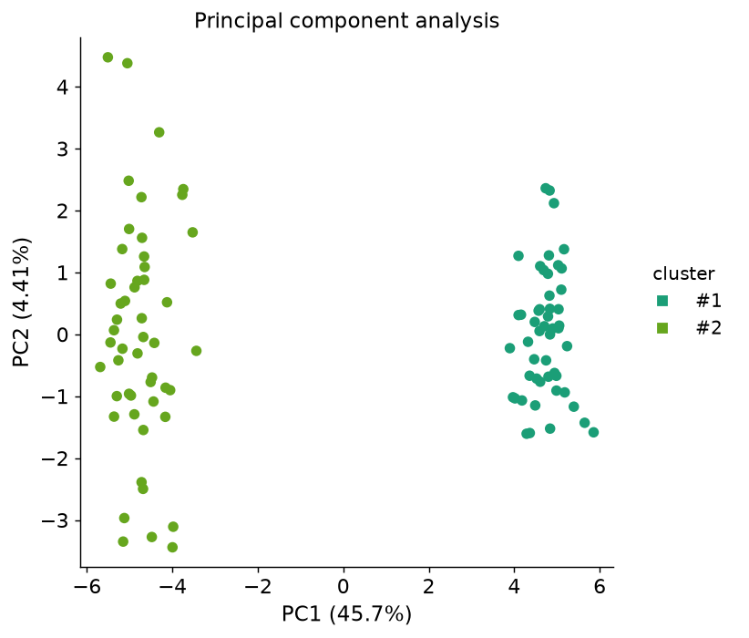 |

The same read on a UMAP of the samples rather than a PCA:

```python
clust_umap = sa.perform_umap(
  data            = clust_sim["args"]["data"],
  feats           = clust_sim["args"]["feats"],
  embedding_scale = "samples",
  seed            = 2026
)
clust_km_umap = sa.cluster_kmeans(
  data          = clust_umap.scores,
  feats         = ["UMAP1", "UMAP2"],
  cluster_scale = "samples",
  n_clust       = 2,
  seed          = 2026
)

sa.draw_dim_reduction_plot(
  clust_umap,
  group    = clust_sim["args"]["group"],
  group_lv = clust_sim["args"]["group_lv"],
  col      = ["black", "red3"]
)

sa.draw_dim_reduction_plot(
  clust_umap,
  cluster_result = clust_km_umap,
  cluster_lv     = ["Cluster1", "Cluster2"]
)
```

| UMAP, shape = known group | UMAP, colour = k-means |
| --- | --- |
| 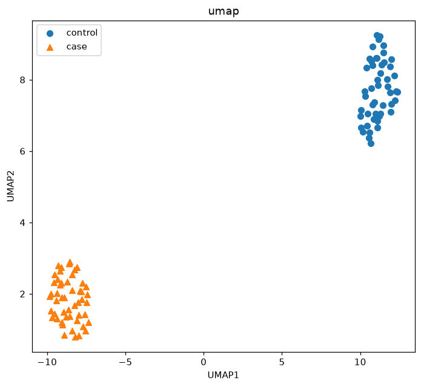 | 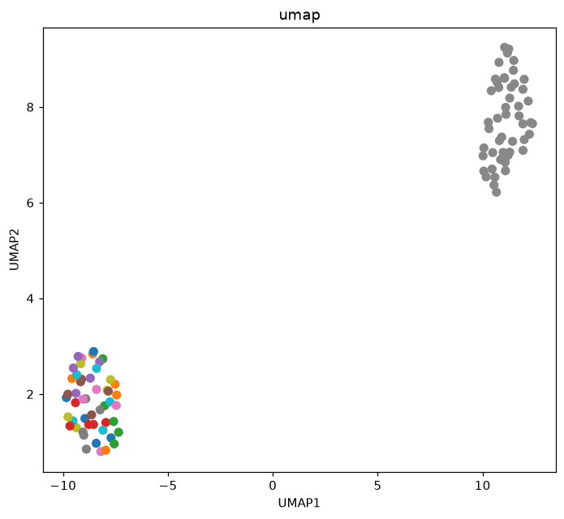 |

`plot()` on an `sa_reduction` is the same function. Noise from `cluster_dbscan()` or `cluster_snn()` is drawn grey rather than given a palette colour, because a point left out is the absence of a cluster rather than a cluster of its own.

---

## Main functions

| Function | Purpose |
| --- | --- |
| `compare_two_groups()` | Welch / Wilcoxon / robust tests plus fold change for two groups |
| `compare_multiple_groups()` | Four omnibus tests for three or more groups, each with its matching post-hoc stage; independent or repeated |
| `compare_factorial_groups()` | One two-way, three-way or factorial ANOVA for crossed factors, with an answer per model term and Tukey contrasts on the marginal means and inside each stratum |
| `compare_categorical_groups()` | Chi-square beside Fisher on two categorical variables, or McNemar / Cochran's Q on repeated binary conditions; `design$null` names the hypothesis the expected counts and residuals are read under, and the result is not an `sa_comparison` |
| `compare_one_sample()` | One-sample t, signed-rank and proportion tests against a hypothesised value |
| `diagnose_distribution()` | Normality, homogeneity of variance and outliers for a set of features |
| `screen_outliers()` | Flag observations by IQR fences, robust z or Grubbs, without removing them |
| `estimate_significance()` | Filter features by log2FC and p-value from any comparison result, over the omnibus test, one pairwise contrast at a time, or one model term at a time |
| `estimate_categorical_significance()` | The same verdict for a contingency table, read one cell at a time from `observed / expected` and the cell's standardized residual, or once for the table from an association measure and an omnibus p-value |
| `summarize_descriptive_stats()` | Feature-wise (and optional group-wise) descriptive table |
| `summarize_association_stats()` | Pearson, Spearman and Kendall on every pair of features, each as a square matrix of coefficients beside its p-values, the p-values adjusted across the pairs, and the observations the pair shared |
| `center_by_control()` | Remove the control group's centre from every feature, so each value reads as its distance from the control rather than as a measurement of its own |
| `draw_forest_plot()` | Forest plot of estimates, of pairwise contrasts, or of p-values; `plot()` on a `sa_comparison` calls it |
| `draw_volcano_plot()` | Volcano plot from `estimate_significance()` output, or one panel per model term from its `by = "term"` reading |
| `draw_grouped_boxplot()` | Boxplots for several features x group levels, or for a crossed design as one panel per feature with the remaining factors along the x axis and the primary factor the boxes, so an interaction is visible inside a panel (`panel_by = "factor"` transposes it) |
| `draw_grouped_barplot()` | One column of `summarize_descriptive_stats()` as clusters of bars, one cluster per feature and one bar per group level; `errorbar` is read under `mainbar`, so a mean takes a standard error, a standard deviation or Student's interval, a median takes the notch the boxplot notches with, and a count or a spread takes none |
| `draw_heatmap()` | Clustered heatmap of features x samples, with the sample groups annotated |
| `draw_corrplot()` | The correlation matrix as a heatmap: nothing standardised, the colours fixed at -1 to 1, one clustering shared by both axes so that the diagonal stays diagonal, and the pairs that did not clear their p-value drawn as blank cells |
| `draw_butterfly_hist()` | Back-to-back histogram, kernel density, or both, for exactly two groups |
| `draw_interaction_plot()` | Cell means of a crossed design joined across one factor, one line per level of another, in one pair of factors, every pair at once, or with a third factor kept in panels of its own |
| `draw_mosaic_plot()` | Mosaic of a contingency table, shaded by the residual of the null the result was tested against and marked where that null would have cut each strip; `plot()` on an `sa_categorical` calls it |
| `split_data()` | Train/test partition, stratified and leakage-aware through `id` |
| `fit_linear_regression()` | Linear model with coefficient inference and resampled performance |
| `fit_logistic_regression()` | Two-class logistic model with odds ratios and their intervals |
| `fit_elastic_net()` | LASSO, ridge or elastic net for either outcome type, with the selected terms |
| `fit_rf()` | Random forest with permutation and impurity importance and out-of-bag fit |
| `fit_svm()` | Radial-kernel support vector machine with permutation importance |
| `evaluate_regression_models()` | Score one or more fitted regressions on the same held-out rows, each against a baseline |
| `evaluate_classification_models()` | The same for a two-class outcome, with DeLong's test, the IDI and the NRI against the baseline |
| `draw_prediction_plot()` | Observed against predicted for a scored regression, with the identity line and the calibration line the metrics table already holds |
| `draw_roc_curve()` | ROC curves of the scored classifications, always overlaid; `plot()` on an `sa_performance` calls whichever of these two the result calls for |
| `perform_rfe()` | Recursive feature elimination inside the resampling, returning the predictors it kept, their ranking and the score at every subset size |
| `perform_stepwise()` | Stepwise search by AIC or BIC, returning the predictors it kept, what each one is worth to the criterion, and the path it walked |
| `perform_pca()` | Principal components of the samples or of the features, with loadings and variance |
| `perform_tsne()` | t-SNE embedding of either margin |
| `perform_umap()` | UMAP embedding of either margin |
| `cluster_hclust()` | Hierarchical clustering of the samples or of the features, returning the tree as well as the cut |
| `cluster_kmeans()` | k-means clustering of either margin, best of 25 starts |
| `cluster_dbscan()` | Density-based clustering, deriving the number of clusters and leaving sparse points as noise |
| `cluster_snn()` | Shared nearest neighbour clustering, which groups by how many neighbours two points have in common rather than by a radius |
| `draw_dim_reduction_plot()` | Two coordinates of a reduction as a scatter, coloured by a clustering of the same points and shaped by a grouping that was known already, so the two can be read against each other; `plot()` on an `sa_reduction` calls it |
| `simulate_two_groups()` | Two-group log2 expression data with the planted answer returned alongside it |
| `simulate_multiple_groups()` | One control and any number of treatment groups, scored per feature, per level and per contrast |
| `simulate_factorial_groups()` | Any number of crossed factors, each between subjects or within them, scored per model term as well as per cell and per contrast |
| `simulate_categorical_groups()` | A contingency table, or repeated binary conditions, with the planted association returned cell by cell, and the symmetric share as well for a matched pair |
| `simulate_regression()` | Continuous outcome from planted coefficients, with a correlation structure and the truth per predictor and per term |
| `simulate_classification()` | Two-class outcome at a chosen event rate from the same design |
| `make_block_cor()` | Block correlation matrix for the simulators, with `against` for the predictors of a block that move the other way, checked for positive definiteness |


---

## Python stack

| Role | Packages |
| --- | --- |
| Tests, distributions | SciPy, statsmodels |
| Models, CV, clustering | scikit-learn |
| Penalised regression | `utils/glmnet_r.py` over scikit-learn's coordinate descent |
| Resampling | `utils/rng_r.py`, `utils/caret_resample.py` |
| Plots | matplotlib |
| t-SNE / UMAP (optional) | openTSNE, umap-learn |

The two internal modules are there because a fold and a penalised path are the
places where "the same analysis" stops being the same numbers. `rng_r.py` is R's
Mersenne-Twister and its rounding, and `caret_resample.py` is
`caret::createFolds()` and `createMultiFolds()` on top of it, so a
cross-validated score can be compared with an R one row by row rather than only
on average. `glmnet_r.py` carries glmnet's own standardisation of both sides and
its scaling of lambda, which scikit-learn's arguments of the same names do not
mean.

## Testing

```bash
cd statassist-py
py -m pytest -v
```

Tests live in [`test/cursor_test/`](test/cursor_test/), one **`YYYY_MM_DD/`** subfolder per session (e.g. [`2026_08_17/`](test/cursor_test/2026_08_17/)). The parity tests read golden JSON exported from R by [`fixtures/export_golden.R`](test/cursor_test/fixtures/export_golden.R), so regenerating them needs R with `jsonlite`, `caret` and `glmnet`.

## Regenerating figures

```bash
cd statassist-py
py tools/render_readme_figures.py
```

## Port status

Known differences between this Python port and R STATassist v1.0.0:

- **§8 `compare_factorial_groups()`** — a repeated factor is an error, as it is in R: a within-subject term needs its own error stratum and this function fits one. Use `compare_multiple_groups(paired = True)` on the repeated factor alone.
- **§19 `perform_stepwise()`** — simplified backward search (not full R `stats::step()`).
- **§20 `fit_elastic_net()`** — coefficients agree with `glmnet` to about 5e-5 rather than exactly. glmnet stops its coordinate descent at `thresh = 1e-7` and the Python path runs to convergence; rerunning R at `thresh = 1e-16` closes the gap to 1e-10, so this is where the two engines stop rather than what they solve. A squared correlation on a heavily penalised fold magnifies that into its third decimal, since flattened predictions leave little to correlate.
- **§21/§22 `fit_rf()` / `fit_svm()`** — the folds are R's, but the numbers on them are not compared: no scikit-learn tree splits a factor on a subset of its levels the way `randomForest()` does, so a factor is passed as its level codes; SVC permutation importance uses the same folds but a different engine than `kernlab`.
- **`draw_grouped_boxplot()`** — crossed factorial layout not yet ported; README uses an ad-hoc render helper for that figure.
- **Plots** — matplotlib rather than base R graphics; no S3 `plot()` dispatch (call `draw_*()` explicitly).


---

## Author

**Wonseok Oh** ([ORCID: 0009-0002-0687-8466](https://orcid.org/0009-0002-0687-8466))

## License

MIT © 2026 Wonseok Oh. See [LICENSE.md](LICENSE.md) for details.
